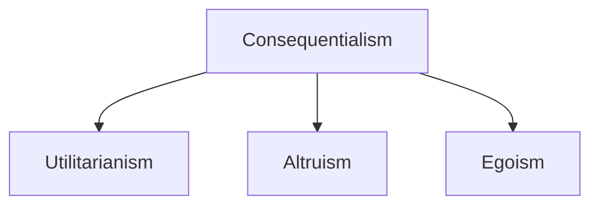

- Unlimited quest for that 1% more, adding more to the economy, more profitable company, endless consumerism has blinded us with the fact that life originated from survival.
- Man-made affairs and it's feud with itself has strayed us further away from the paradise that this Earth once was.
- And I can't seem to understand one thing, we already know that our civilisation's current way of living isn't sustainable. We don't know how to live peacefully, then why this commotion of becoming extra-terrestrial.
- Money as a value store of the world simply doesn't exhibit utilitarian nature, and the new world, that we are aiming to form on multiple planets in far future won't have a stronger bindings.

- A very simple example of this is the percentage of [wildlife cover](https://www.livelaw.in/top-stories/supreme-court-stays-tree-felling-in-kancha-gachibowli-land-in-hyderabad-288302) in a country. Our economically beneficial society isn't inclined towards a forest covered land. It brings no material value to governments, corporations which are the main drivers of incentives.
- Economically weaker section of a society is blinded by the dreams of a fulfilled life while people with money controls the incentives. This leads to a society where labour is cheap but survival isn't.
- Is capitalism good?
- How do you prevent abuse of power? 
- How to align incentives towards positive utilitarian future?

## References

- [Utilitarianism](https://en.wikipedia.org/wiki/Utilitarianism)
- [The History of Utilitarianism](https://plato.stanford.edu/entries/utilitarianism-history/)
- [Understanding Utilitarianism: A Guide](https://www.philosophos.org/ethics-utilitarianism)