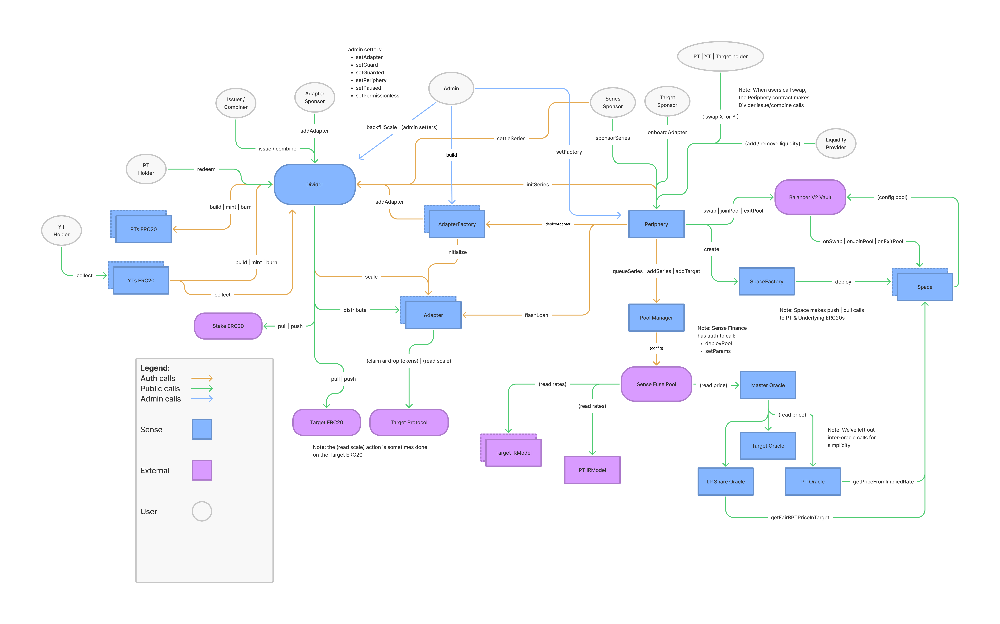

# Sense Implementation



## Space pool implementation

### SpaceFactory

storage:

```solidity
vault
divider
ts
g1
g2
mapping(adapter -> maturity -> poolAddress)
```

Functions:

```solidity
createPool
setPool
setParams
```

### Space

storage:

```solidity
adapter
maturity
pti     // Principal token index (basically token0 or token1)
ts      // timestamp used in invariant
g1      // fees based g, which is used in the invariant
g2

poolId
token0
token1
scalingFactorPT             // expressed as 10**18 - decimals(ptToken)
scalingFactorTarget         // 10**18 - decimals(targetToken)
vault                       // vault interface
protocolFeesCollector       // vault fees collector

initScale                   // adapter init scale ?
token{0,1}Reserves

oracleData
```

**Public Functions**:

`onJoinPool(bytes32 poolId, address sender, address recipient, uint256[] memory reserves, uint256 lastChangeBlock, uint256 protocolSwapFeePercentage, bytes memory userData)`

1. check `maturity`
2. get `reqAmountsIn` and `minBptOut` from `userData`
3. upscale `reserves` and `reqAmountsIn` to `18` decimals
4. check if `totalSupply == 0`
5. If true, then liq. getting added first time
   1. send minBpt to address(0)
   2. mint bptToken - minBpt to recipient
   3. downscale reqAmount
   4. cache reserves
6. If false,
    1. update oracle with upscaled reserves
    2. give fees to `protocolFeesCollector` by minting BPT tokens
    3. mint BPT tokens to recipient
    4. calculate `tokensInForBptOut`
    5. cacheReserves
    6. downscale reserves

`onExitPool(uint256 poolId, address sender, address recipient, uint256[] memory reserves, uint256 lastBlockChange, uint256 protocolSwapFeePercentage, bytes memory userData)`

1. upscale array `reserves`
2. update oracle
3. give fees to `protocolFeesCollector`
4. get bpt amount from user data
5. calculate token amounts out by rounding up
6. burn bpt
7. change reserves
8. cache reserves
9. downscale array amountsOut
10. return

`onSwap(SwapRequest request, uint256 reserveTokenIn, uint256 reserveTokenOut)`

1. check swap direction with variable `ptIn`
2. upscale `reservesToken{In,Out}`
3. update oracle if `msg.sender == vault`
4. calculate reserves as per the direction
   1. if ptIn, add virtual reserves as per yieldspace paper to *PT* and scale target according to adapter
   2. if targetIn, scale target and add virtual reserves to PT
5. check swap kind,
6. if `swapKind.GIVEN_IN`,
   1. upscale `request.amount` with `scalingFactorTokenIn`
   2. if in token not PT, mul `request.amount` with adapter
   3. get amountOut from `_onSwap`
   4. if outToken target, scale `amountOut` with adapter
   5. return amountOut
7. if `swapKind.GIVEN_OUT`,
   1. upscale request.amount with scalingFactorTokenOut
   2. if ptIn, scale `request.amount` with adapter
   3. calculate amountIn with _onSwap
   4. if not ptIn, scale `amountIn` with adapter
   5. return amountIn

#### **Internal Functions**

`_onSwap`: calculates amountIn or amountOut based on the direction using invariant calculation

`_tokensInForBptOut`: two cases, when no PTReserves and when reserves is present. No liq is possible when new pool or when PT is swapped out

1. when pt reserves 0, bptToMint = amountTargetIn scaled with adapter
2. else calculate bptToMint using both target and PT and use whichever's lesser

`_cacheReserves`: caches the reserve, if oracle enabled caches invariant as well

`_updateOracle`: updates oracle indexes on current timestamp

#### **Mocks/Test Utils**

**User** submits his liquidity to space using `join`, exits using `exit` and `swapIn`, `swapOut` for swapping PT/target tokens in the pool.

```solidity
join(reqPrincipalIn, reqTargetIn)
exit(bptAmountIn)
swapIn(principalIn, amountIn)
swapOut(principalIn, amountOut)
```

#### **Tests**

`testSimpleSwapIn`:

- join
- swap in with target to get PT out, but fails bc no PT in pool
- swap in with PT and get some target out
- assert PT and target balances in pool
- test swap full target
- now, swap in with target and get PT out

**Notes**:

- First join is always target-only, you can't `swapIn` using PT. So, `swapIn(false, amount)` doesn't work after first join.

---

## Sense

### Series

A series is a particular set of PTs and YTs with a specific target, adapter, and maturity.

Sense core contracts is based on hub and spoke model, where hub is the *Divider* contract and *spokes* are contracts that surround Divider like Adapters.

---

### AdapterFactory

BaseFactory -> CropFactory/CropsFactory

`BaseFactory`: `CropFactory` and `CropsFactory` are extensions used to deploy crop and crops respectively.

```solidity
address divider;                            // divider address
mapping(address => address) adapters;       // target -> adapter
struct FactoryParams {
  address oracle; // oracle address
  address stake; // token to stake at issuance
  uint256 stakeSize; // amount to stake at issuance
  uint256 minm; // min maturity (seconds after block.timstamp)
  uint256 maxm; // max maturity (seconds after block.timstamp)
  uint128 ifee; // issuance fee
  uint16 mode; // 0 for monthly, 1 for weekly
  uint64 tilt; // tilt
}
```

---

### Adapters

BaseAdapter -> Implementation (Compound, Fuse, Lido)

surround divider and holds logic for a particular application. For example, compound, fuse adapters are built and then different series can be created using these adapters.

`BaseAdapter` Parameters:

1. `target`
2. `underlying`
3. `oracle`
4. `stake`: token to stake at issuance
5. `stakeSize`: amount to stake at issuance
6. `minm`: minimum maturity
7. `maxm`
8. `mode`: maturity date type, 0 for monthly, 1 for weekly
9. `ifee`: issuance fee
10. `tilt`: principal set aside for YTs at maturity
11. `level`: feature access codes. <onRedeem(y/n)><collect(y/n)><combine(y/n)><issue(y/n)>. example: 0101

Every implementation has to inherit BaseAdapter and override these following functions:

1. `scale`: represents exchange price b/w target and underlying, is assosciated with each adapter and vary wrt to each adapter.
2. `getUnderlyingPrice`
3. `wrapUnderlying`
4. `unwrapTarget`

Other functions include:

1. `flashLoan`
2. `maxFlashLoan`
3. `onRedeem`: hook function when user redeems PT
4. `notify`: fn for airdrop tokens to distribute to user.

`Extensions`: Crop/Crops

1. `Crop` is utility for single airdrop token. to call notify and distribute. Similarily, `CropFactory` extends BaseFactory for airdrop tokens and set the airdrop token address.

2. `Crops`: is utility for multiple airdrop tokens. `CropsFactory` Sets multiple airdrop tokens addresses.

```solidity
address reward;       // rewarded token address
uint256 rewardBal;    // rewarded token amount distributed till now
uint256 share;        // ?
uint256 totalTarget;  // ? total target accumulated by all users
mapping(address => uint256) public tBalance;      // target balance per user
mapping(address => uint256) public rewardBalance;   // reward balance per user
```

Functions:

`notify(address usr, uint256 amt, bool join)`: update adapter values for rewarded tokens and distribute rewards to user.

---

### CAdapter: `crop`

`wrapUnderlying(uint256 uBal)`

### WstETHAdapter: `crop`

Target/Underlying: WstETH/WETH

`wrapUnderlying`: weth -> eth -> steth -> wsteth

- transfer weth from user
- convert to eth
- stake eth for steth
- convert steth to wsteth
- transfer back to user

`unwrapTarget`: wsteth -> steth -> eth -> weth

- transfer wsteth from user
- unstake to steth
- swap for eth on curve
- wrap to weth and transfer to user

### FAdapter: `crops`

`wrapUnderlying`

- get underlying from user
- if FETH, deposit weth to get ETH
- mint target accordingly, i.e ftoken or feth
- send to user

`unwrapTarget`

- get target from user
- redeem target for underlying
- if FETH, deposit feth underlying to WETH contract
- send underlying back to user by uBalAfter - uBalBefore

---

### Divider

*issue*/*combine* PTs and YTs, *redeem* and *collect* target.

```solidity
struct Series {
  address yt;
  uint48 issuance;
  address pt;
  uint96 tilt;        //  % of underlying principal initially reserved for Yield
  address sponsor;
  uint256 reward;
  uint256 iscale;
  uint256 mscale;
  uint256 maxscale;
}

struct AdapterMeta {
  uint256 id;
  bool enabled;
  uint256 guard;      // Max amount of target allowed to be issued
  uint256 level;      // adapter level (mentioned above)
}

// adapter -> maturity -> series;
mapping(address => mapping(uint256 => Series)) series;
// Adapter info
mapping(address => AdapterMeta) adapters;
// adapter -> maturity -> user -> lscale (last scales) ?
mapping(address => mapping(uint256 => mapping(address => uint256))) lscales;
```

#### Functions

`function issue(address adapter, uint256 maturity, uint256 tBal) returns (uint256 uBal)`

issuance scale is used

- basic checks: adapter valid, series exists, series not already settled
- check if adapter level authorises issuance
- get adapter ifee, target
- find $fee = tBal*ifee$ and get `tBalSubFee`
- add fee to series reward
- check adapter `guard` cap
- notify adapter and update values
- scale = series.iscale or adapter scale
- find $uBal = tBalSubFee * scale$
- update user lscale value, if first init then scale else harmonic mean
- mint PT and YT
- transfer target to divider

`function redeem(address adapter, uint256 maturity, uint256 uBal)`

scale is either mscale or maxscale depending on zshare

- mandatory checks: adapter valid, series settled
- check if redeem enabled
- burn PT
- convert uBal to tBal after checking `zShare = 1 - tilt`
- transfer target

`function combine(address adapter, uint256 maturity, uint256 uBal) returns (uint256 tBal)`

since this is before maturity, scale is either current scale or last scale

- check adapter, series
- burn pt
- get cscale as mscale
- collect extra YT
- if series not settled, burn YT as it won't burn in collect and change cscale to current
- get $tBal = uBal / cscale$
- transfer tBal target to msg.sender
- notify adapter
- update `tBal += collected` from YT _collect

`function collect(address adapter, uint256 maturity, uint256 uBal)`

-

---

### Periphery

```solidity
divider
BalanceVault balancerVault
PoolManager poolManager
SpaceFactoryLike spaceFactory
mapping(address => bool) factories
mapping(address => bool) verified;
```

`function swapTargetForPTs`
`function swapTargetForYTs`
`function swapUnderlyingForPTs`
`function swapUnderlyingForYTs`
`function swap`