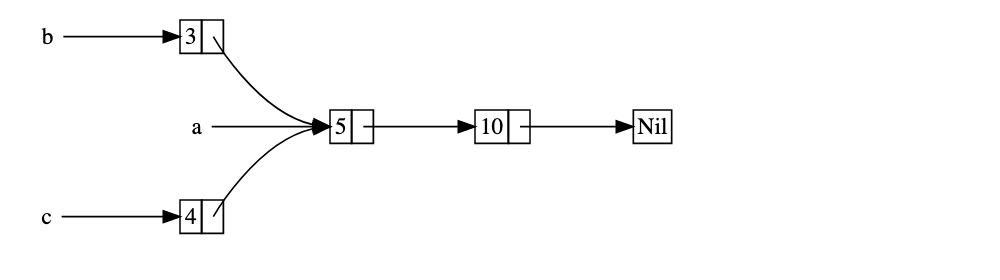

# Rust basics

`unwrap()` : unwrap `Result<T, E>` into T.

```rust
fn total_cost(input: String) -> Result<String, Error> {}

let cost = total_cost(input).unwrap();
```

`expect()` : catches an error and panic with that

```rust
let f = File::open("hello.txt").expect("File not found!");
```

`is_ok()` : returns bool whether returned val is Result Ok.

`parse()` : parses number to string

```rust
let cost = "8".parse::<i32>();
// OR
let cost: i32 = "8".parse();
```

`?` : when returning `Result<T, E>` type from a func, if want to return error as soon as you encounter it, use `?` .

```rust
// qty can be "hello", in which case it'll return error due to `?`
let qty = item_quantity.parse::<i32>()?;
Ok(qty * 2 * 3)
```

`::from()` : convert primitive type to custom type

`.into()` : converts custom to primitive type, reverse of `From`

> Every type whether primitive or custom have `traits` implemented. Each trait have different functions that the type uses.

Example: `println!` utilises `Display` trait for types like `i32` or `String`. Thus, these types need to implement the following traits in order to use `println!` like functions.

`Debug` trait implements `{:?}` functionality.
So, whenever you implement a function for a generic type,

`usize` : used as unsigned size type, basically `ui32`

`Deref` trait is used to enforce any smart pointer to have same functionality as a normal pointer.

```rust
use std::ops::Deref;

struct MyBox<T> (T);

impl<T> Deref for MyBox<T> {
    type Target = T;

    fn deref(&self) -> &Self::Target {
        &self.0
    }
}
```

`Box` : used to put items on heap rather than stack

```rust
enum List {
    Cons(i32, Box<List>),
    Nil,
}

use crate::List::{Cons, Nil};

fn main() {
    // gives error during compiling as its not possible to refer a
    // variable multiple times, as it will already be moved to b
    // when refering it in c.
    // Can use Rc<T> here.
    let a = Cons(5, Box::new(Cons(10, Box::new(Nil))));
    let b = Cons(3, Box::new(a));
    let c = Cons(4, Box::new(a));
}
```

used in cases when you don't know the space of the item being used and thus, `Box`
can be used to push it on the queue and store a reference in the stack.

`Rc<T>` : spelled as reference counter, multiple owners to one item,

increases the counter of the reference using `clone` and can be checked using `Rc::strong_count(&a)`.



```rust
use::rc::Rc;

enum List {
    Cons(i32, Rc<List>),
    Nil,
}

use crate::List::{Cons, Nil};

fn main() {
    let a = Cons(5, Rc::new(Cons(10, Rc::new(Nil))));
    let b = Cons(3, Rc::clone(&a));
    let c = Cons(4, Rc::clone(&a));
}
```

`RefCell<T>` : interior mutability using `Ref<T>` and `Refmut<T>` , manages during runtime the counter of `Ref` and `RefMut` active at the moment.

```rust
use std::cell:RefCell;

// messenger interface
pub trait Messenger {
    pub fn send(&self, msg: &str);
}

// tracker service
pub struct TrackerService<'a, T: Messenger> {
    messenger: &'a T,
    maxLimit: usize,
    curr: usize,
}

// implement struct methods
impl<'a, T> TrackerService<'a, T>
where T: Messenger {
    fn new(messenger: &'a T, max: usize) -> TrackerService<'a, T> {
        TrackerService {
            messenger,
            maxLimit: max,
            curr: 0,
        }
    }

    fn set_value(&mut self, value: usize) {
        self.value += value;

        if (self.value >= 1.0) {
            self.messenger.send("Limit exceeded");
        } else if (self.value >= 0.8) {
            self.messenger.send("You've exhausted 90% of your data");
        } else {
            self.messenger.send("You've used some of your data", )
        }
    }
}

#[cfg(test)]
mod tests {
    use super::*;

    struct MockMessenger {
        sent_messages: RefCell<Vec<String>>,
    }

    impl MockMessenger {
        fn new() -> Self {
            MockMessenger {
                sent_messeges: RefCell::new(vec![]),
            }
        }
    }

    impl Messenger for MockMessenger {
        fn send(&self, msg: &str) {
            self.sent_messges.borrow_mut().push(msg);
        }
    }

    #[test]
    fn test_newMesseges() {
        let mock_messenger = MockMessenger::new();
        let mut tracker_service = TrackerService::new(&mock_messenger, 100);

        tracker_service.set_value(0.9);

        assert_eq!(mock_messenger.messenger.borrow().len(), 1);
    }
}
```

`Arc` ?

## Lifetimes

Lifetimes are used in association with references to tell compiler how much you need a particular reference and should compiler keep it alive for that lifetime.

Very nice implementation of `StrSplit` by Jon Gjengset shows nice usage lifetimes, multiple lifetimes and generics.

```rust
// This is the struct with that lifetime, it has a remainder and delimiter.
// Note the usage of `'a` here, which is a lifetime used to tell the compiler
// the lifetime of a particular variable.
#[derive(Debug)]
pub struct StrSplit<'a, D> {
    remainder: Option<&'a str>,
    delimiter: D,
}

impl<'a, D> StrSplit<'a, D> {
    fn new(string: &'a str, delimiter: D) -> Self {
        StrSplit { remainder: Some(string), delimiter}
    }
}

impl<'a, D> Iterator for StrSplit<'a, D>
where
    D: Delimiter {
    type Item = &'a str;
    fn next(&mut self) -> Option<Self::Item> {
        if let Some(ref mut remainder) = self.remainder {
            if let Some((start, end)) = self.delimiter.find_next(remainder) {
                let res = &remainder[..start];
                *remainder = &remainder[end..];
                Some(res)
            } else {
                self.remainder.take()
            }
        } else {
            None
        }
    }
}

pub trait Delimiter {
    fn find_next(&self, s: &str) -> Option<(usize, usize)>;
}

impl Delimiter for &str {
    fn find_next(&self, s: &str) -> Option<(usize, usize)> {
        s.find(self).map(|start| (start, start + self.len()))
    }
}

impl Delimiter for char {
    fn find_next(&self, s: &str) -> Option<(usize, usize)> {
        s.char_indices().find(|(_, c)| c == self).map(|(start, _)| (start, start + self.len_utf8()))
    }
}

fn until_char(s: &str, c: char) -> &str {
    StrSplit::new(s, c).next().unwrap()
}

#[cfg(test)]
mod tests {
    use super::*;

    #[test]
    fn it_works_until_char() {
        assert_eq!(until_char("hello world", 'o'), "hell");
    }

    #[test]
    fn it_works() {
        let haystack = " a b c d e ";
        let letters: Vec<_> = StrSplit::new(haystack, " ").collect();
        assert_eq!(letters, vec!["", "a", "b", "c", "d", "e", ""]);
    }
}
```

## Generics

```rust
// Struct
struct GenVal<T> {
    gen_val: T,
}

// impl
impl<T> GenVal<T> {
    fn value(&self) -> &T {
        &self.gen_val
    }
}

// A trait generic over `T`.
trait DoubleDrop<T> {
    // Define a method on the caller type which takes an
    // additional single parameter `T` and does nothing with it.
    fn double_drop(self, _: T);
}
// Implement `DoubleDrop<T>` for any generic parameter `T` and
// caller `U`.
impl<T, U> DoubleDrop<T> for U {
    // This method takes ownership of both passed arguments,
    // deallocating both.
    fn double_drop(self, _: T) {}
}
```

Can define generic trait, then `impl` can be generic or concrete, and it can be further restricted with other traits.

```rust
// generic trait with T restricted in fn
pub trait Surtur<T> {
  fn sort(&self, slice: &mut [T]
  where
    T: Ord + Copy;
}

// unit struct
pub struct StdSort;

// generic trait impl for struct restricted at impl level
impl<T> Surtur<T> for StdSort
where
  T: Ord {

  fn sort(&self, slice: &mut [T]) {}
}

// Another unit struct
pub struct GenericSort;

// generic trait impl for struct restricted at fn level
impl<T> Surtur<T> for GenericSort {
  fn sort(&self, slice: &mut [T])
  where
    T: Ord + Copy {}
}
```

## Macro Rules

```rust
#[macro_export]
macro_rules! avec {
  ( $($x:expr),* ) => {
    {
      let mut _vec = Vec::with_capacity(avec![@COUNT; $($x),*]);
      $(_vec.push($x);)*
      _vec
    }
  };
  ( $($x:expr,)* ) => {
    avec![$($x),*]
  };
  ( $x:expr; $count:expr ) => {
    {
      let mut vs = Vec::new();
      vs.resize($count, $x);
      vs
    }
  };
  (@COUNT; $($x:expr),*) => {
    <[()]>::len(&[$(avec![@SUBST; $x]),*])
  };
  (@SUBST; $_:expr) => {()};
}

#[test]
fn it_works() {
  let x: Vec<i32> = avec![];
  assert!(x.is_empty());
  assert_eq!(avec![1, 2, 3,], vec![1, 2, 3]);
  assert_eq!(avec![1; 3], vec![1, 1, 1]);
}
```

### Iterators

```rust
trait IteratorExt
where
    Self: Iterator + Sized,
{
    fn flatten_ext(self) -> Flatten<Self>
    where
        Self::Item: IntoIterator;
}

impl<T> IteratorExt for T
where
    T: Iterator,
{
    fn flatten_ext(self) -> Flatten<Self>
    where
        Self::Item: IntoIterator,
    {
        flatten(self)
    }
}

// This is the main function flatten which takes any two level nested iterator and returns Flatten struct.
// Defined on generic `O` which has to implement `IntoIterator` and it's item also has to implement `IntoIterator`

fn flatten<O>(iter: O) -> Flatten<O::IntoIter>
where
    O: IntoIterator,
    O::Item: IntoIterator,
{
    Flatten::new(iter.into_iter())
}

// Struct which houses outer and inner iterators to move on the data structure.
// Is generic on `O` such that O has to iterator and O's item has to implement `IntoIterator`
struct Flatten<O>
where
    O: Iterator,
    O::Item: IntoIterator,
{
    outer: O,
    iter_next: Option<<O::Item as IntoIterator>::IntoIter>,
    iter_back: Option<<O::Item as IntoIterator>::IntoIter>,
}

// Constructor fn
impl<O> Flatten<O>
where
    O: Iterator,
    O::Item: IntoIterator,
{
    fn new(iter: O) -> Self {
        Flatten {
            outer: iter,
            iter_next: None,
            iter_back: None,
        }
    }
}

// Implements Iterator trait's next function for `Flatten` struct
impl<O> Iterator for Flatten<O>
where
    O: Iterator,
    O::Item: IntoIterator,
{
    type Item = <O::Item as IntoIterator>::Item;
    fn next(&mut self) -> Option<Self::Item> {
        loop {
            if let Some(ref mut inner_iter) = self.iter_next {
                if let Some(res) = inner_iter.next() {
                    return Some(res);
                }

                self.iter_next = None;
            }

            if let Some(next_inner) = self.outer.next() {
                self.iter_next = Some(next_inner.into_iter());
            } else {
                return self.iter_back.as_mut()?.next();
            }
        }
    }
}

// Implements DoubleEndedIterator's next_back fn for `Flatten` struct
impl<O> DoubleEndedIterator for Flatten<O>
where
    O: Iterator + DoubleEndedIterator,
    O::Item: IntoIterator,
    <O::Item as IntoIterator>::IntoIter: DoubleEndedIterator,
{
    fn next_back(&mut self) -> Option<Self::Item> {
        loop {
            if let Some(ref mut inner_iter) = self.iter_back {
                if let Some(res) = inner_iter.next_back() {
                    return Some(res);
                }

                self.iter_back = None
            }

            if let Some(next_back_inner) = self.outer.next_back() {
                self.iter_back = Some(next_back_inner.into_iter());
            } else {
                return self.iter_next.as_mut()?.next_back();
            }
        }
    }
}
```

## Articles

## Interior Mutability

- [Error Handling in Rust](https://blog.burntsushi.net/rust-error-handling/)
- [Error Handling In Rust - A Deep Dive | A learning journal](https://www.lpalmieri.com/posts/error-handling-rust/)
- [Why is recursion not suggested in Rust?](https://stackoverflow.com/questions/65948553/why-is-recursion-not-suggested-in-rust)
