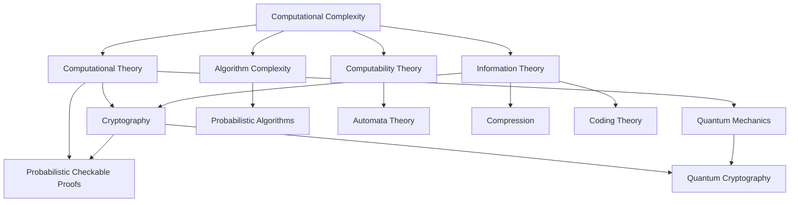

Notes from ["Computational Complexity: A Modern Approach"](https://theory.cs.princeton.edu/complexity/), [Sanjeev Arora](http://www.cs.princeton.edu/%7Earora/) and [Boaz Barak](http://www.boazbarak.org/).

> Computability v/s complexity: Both these terms although entangled but represents different branches of computation.

## Answers to expect from the book

- Can exhaustive search be replaced by more efficient algorithms?
- Can randomness be used to make some algorithms faster?
- Can approximation be used to solve some problems faster?
- Can computationally intractable problems lead to practical benefits like [[cryptography]]?
- Can faster computers be built using quantum mechanics?
- Can notion of proofs be upgraded from static mathematical proofs to something more [[proofs-args-and-zk|efficient]]?
- Can problems be classified into categories based on their memory, runtime, communication, randomness?
- How to classify problems into different categories?
- Can problems be *"reduced"*, where solution of one problems leads to solution of all other problems in that category?

## Prerequisites

- Decision Problems: A function mapping strings to strings with the output as single bit. These functions are called ***Languages*** or *Decision Problems* and identified as subset $\mathcal{L}_{f}=\left\{x:f(x)=1\right\}$. Act of computing $f$ can be classified as problem of deciding language $\mathcal{L}_{f}$ (given $x$, decide whether $x\in\mathcal{L}_{f}$).
- Search Problems:
- Optimisation problems:
- Counting Problems:

### Big-Oh Notation
- $\symcal{O}$: Use $f=\symcal{O}(g)$, where there exists $c>0$ such that $f(n)\leq c\cdot g(n)$
- $\Upomega$: $f=\Upomega(g) \implies g=\symcal{O}(f)$
- $\Theta$: $f=\Theta(g) \implies g=\symcal{f}\ \text{and}\ f=\symcal{O}(g)$
- $o,\omega$: there exists $\epsilon > 0$ such that $f(n) < \epsilon\cdot g(n) \implies \lim_{ n \to \infty }\frac{f}{g}=0$ 

## Chapter 1

> [!question] why do you even need a computational model?

Any computation is described and judged on it's efficiency, i.e. how efficient it is to compute it. To realise this, we need a machine that is able to simulate any *physically realisable* computational model with little loss of efficiency. And fortunately, we've already found one: *"Turing Machines"*.

### Turing Machines

### Complexity class of **P**

### Different models built upon Turing machines
- Non-deterministic
- Probabilistic
- Quantum Computation
- Boolean Circuits
- Parallel Computers
- Decision Trees
- Communication Games