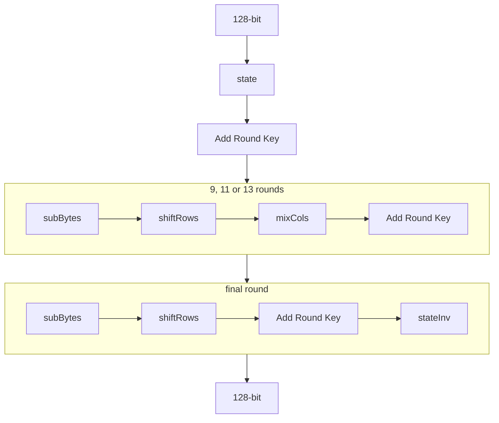

A good prerequisite to this would be understanding how [[des|DES]] works, and why it was broken, and what led to creation of AES.

[AES](https://en.wikipedia.org/wiki/Advanced_Encryption_Standard), also known as Advanced Encryption Standard is a symmetric encryption algorithm based on Rjindael Cipher that won the NIST contest in 2001.

Based on Substitution-Permutation network, works on message size of 128, 192 and 256 bits.

Let's talk about specific case of 128 bits:

- Message $m$ is acted upon in $4\times4$ matrix of bytes $b_{0},\dots,b_{15}$ with 1 byte in each cell
$$
\begin{bmatrix}
b_{0} &b_{4}&b_{8}&b_{12} \\
b_{1}&b_{5} & b_{9} & b_{13} \\
b_{2} & b_{6} & b_{10} & b_{14} \\
b_{3} & b_{7} & b_{11} & b_{15} \\
\end{bmatrix}
$$

- Operates on binary [[finite-fields|field]] extension of $\mathbb{F}_{2^{8}}$
- Round based cipher that vary on the basis of message length:
	- 128: 10 rounds
	- 192: 12 rounds
	- 256: 14 rounds

Let's talk about the algorithm:

## [[block-ciphers#Modes of Operation]]

- ECB: Electronic codebook
- CBC: Cipher Block Chaining
- CFB: Cipher Feedback
- OFB: Output Feedback
- CTR: Counter Mode
- GCM: Galois Counter Mode
- EAX

### CBC

### GCM

### Authenticated encryption with additional data (AEAD) modes

## References

- [The Rustaceans guide to the Advanced Encryption Standard](https://dkblackley.github.io/posts/rust-aes/)
- [docs.rs aes crate](https://docs.rs/aes/latest/aes/)
- [Lecture 8 on "Computer and Network Security" by Avi Kak](https://engineering.purdue.edu/kak/compsec/NewLectures/Lecture8.pdf)
- 
