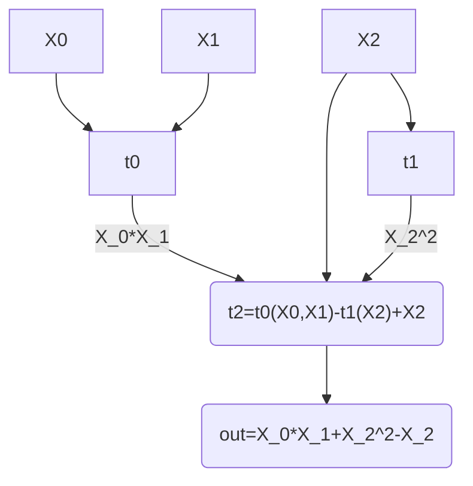

[[fri-pcs]]
[[thoughts/cryptography/starks]]
[[snark]]

Things needed in order to create a SNARK:

- field: binary fields
- pcs: small field polynomial commitment using concatenated codes
- arithmetisation: virtual polynomial construction in multilinear setting similar to hyperplonk

Let’s write what i think about binius, it’s use case, and the efficiency that it promises.

Historically, proof systems based on IOPs have gone through various changes:

- starting with GGPR13, pinocchio that introduced R1CS
- then, came the PCP world of Groth16 based on pairings, with one of most efficient verifier that I know of.
- Bulletproofs got introduced to the world that completely removed the use of trusted setups based PCS, field-agnostic, truly ZK, but with just one caveat: linear verifier
- Came the world of PLONK [GWC19], it’s arithmetisation, world of KZG10, it’s modularity and arithmetisation allowed so many additional things on top: custom gates, lookup tables
- On another side of the coin, there was brewing a wildly theoretical yet promising idea of STARKs (BBSHR18) with their own world of arithmetisation called AIR, although very similar to plonkish arithmetisation used in Halo2, with a completely separate idea of IOPP, i.e. proofs of proximity based on RS codes. Although proof sizes were large, mainly due to logarithmic size of merkle path proofs.

Binius main ace is using binary field extensions. [Arithmetic](https://sites.cs.ucsb.edu/~koclab/teaching/cren/docx/c04g2k.pdf) of binary fields is so rich and flexible, it’s addition is just XOR, and multiplication can be done efficiently using algorithm similar to karatsuba multiplication.

Let's start with understanding field used in binius and it's advantages over classical prime field and their extensions:

## Binary Fields

Now, binary fields are an interesting area of research in implementation phase because it has multiple ways of representation, and each representation has different arithmetic asymptotic complexity.

[[finite-fields|field]] $\mathbb{F}_{2}$:
- addition: XOR
- multiplication: for $\mathbb{F}_{2}$, it's just repeated xor. 
	- for extension fields, can be done efficiently using an algorithm similar to [[karatsuba-multiplication]]

Two ways of representing $\textsf{GF}(2^{k})$:

- univariate basis - two ways of representing in univariate basis as well, namely:
    - polynomial basis: elements are represented as degree k-1 polynomial $A_{k-1}\alpha^{k-1}+\dots+A_1\alpha+A_0$ by equivalence class $\mathbb{F}_2/f(x)$, where f(x) is any irreducible in the kth power.
    - normal basis: elements are represented as taking powers of an element from the field
- multilinear basis - there’s one other way of representing elements, i.e. Multilinear basis, where elements are represented by monomials: $1,X_0,X_1\cdot X_0,X_2\cdot X_1\cdot X_0,\dots,X_0\dots X_{l-1}$, with each coefficient in $\mathbb{F}_2$.

### Binary field towers

Binius realises binary extension field using towers formalised in [Weidemann et al.](https://www.fq.math.ca/Scanned/26-4/wiedemann.pdf).

Basic idea is to derive sequence of polynomial rings inductively

- start with $\tau_{0}=\mathbb{F}_{2}=\{ 0,1 \}$
- set $\tau_{1}=\tau_{0}[X_{0}]/(X_{0}^{2}+X_{0}+1)=\mathbb{F}_{2^{2}}$, namely $\{ 0,1,X_{0},1+X_{0} \}$.
- set $\tau_{2}=\tau_{1}[X_{1}]/(X_{1}^{2}+X_{0}X_{1}+1)=\mathbb{F}_{2^{2^{2}}}$
- continue this further with $\tau_{0}\subset \tau_{1}\subset\dots \subset \tau_{i-1}\subset \tau_{i}=\tau_{i-1}[X_{i-1}]/f_{i-1}(X_{i-1})$, where $f_{i-1}(X_{i-1})=X_{i-1}^{2}+X_{i-1}X_{i-2}+1$ is an irreducible in $\tau_{i}$

Weidemann showed that $f_{i-1}[X_{i-1}]$ is irreducible for each $i>1$, and $\tau_{i}$ form a field **isomorphic** to $\mathbb{F}_{2^{2^{i}}}$ and, by construction, $\tau_{i}=\tau_{i-1}[X_{i-1}]$, $\tau_{i-1}$ is a subfield of $\tau_{i}$ as constant polynomials (due to equivalence class). Ring construction for $\tau_{i}$ happens as:

$$
\begin{equation}
\tau_{i}=\mathbb{F}_{2}[X_{0},\dots,X_{i-1}]/(X_{0}^{2}+X_{0}+1,\dots,X_{i-1}^{2}+X_{i-1}X_{i-2}+1)
\end{equation}
$$

Notation used in binius: $\mathcal{T}_l:=\mathcal{T}_{\iota-1}[X_{\iota-1}]/X_{\iota-1}^2+X_{\iota-1}X_{\iota-2}+1$, with initial $\mathcal{T}_0:=\mathbb{F}_2$ and $\mathcal{T}_1:=\mathbb{F}_2[X_0]/X_0^2+X_0+1$. This gets us a tower construction where $\mathcal{T}_{\iota}$ is isomorphic to $\mathbb{F}_{2^{2^{\iota}}}$and $\mathcal{T}_0\subset \mathcal{T}_1 \subset \dots \mathcal{T}_{\iota}$. Monomials $1,X_{0},X_{0}\cdot X_{1},\dots,X_{0}\dots X_{\iota-1}$ represent the basis of $\mathcal{T}_{\iota}$ as $\mathbb{F}_{2}$ vector space, i.e. $\forall v\in \mathcal{B}_{\iota}$, thus, $v$ is represented as boolean vector $\{ v_{0},v_{1},\dots,v_{\iota-1} \}$, and give $\beta_{v}=\prod_{i=0}^{\iota-1}(v_{i}X_{i}+(1-v_{i}))$.

For example: take $\iota=3$, $v$ represents all the basis vector for monomials in multilinear basis of $\mathcal{T}_{l}$, i.e.
- $(0,0,0)\to 0$: $\beta_{0}=1$
- $(0,0,1)\to 1$: $\beta_{1}=X_{0}$
- …
- $(1,1,1)\to7$: $\beta_{7}=X_{0}X_{1}X_{2}$

Main advantage of Binary field extensions:
- efficient embeddings
- small-to-large multiplication: multiplying a $\mathcal{T}_{\iota}$ with $\mathcal{T_{\iota+k}}$ takes only $2^{k}\Uptheta(2^{\log 3\cdot \iota})$

Now, we have a field, using that we can derive polynomials in multilinear basis, let's understand PCS needed to commit to these polynomials:

## Error Correcting codes

- A code $[n,k,d]$ represents code of block length $n$ with message length $k$ such that any two code $v_{1},v_{2}$ are $d$ distant to each other.
- linear code over field $K$ is a *k-dimensional* linear subspace $C\subset K^{n}$
- $C's$ $m-$fold interleaved code for any $m\geq 1$, defined as subset $C^{m}\subset (K^{n})^{m}$
	- represents length-n block code over alphabet $K^{m}$, represented as rows of matrices in $K^{m\times n}$
- RS code: $RS_{K,S}[n,k]$, $S=\{ s_{0},s_{1},\dots,s_{n-1} \}\subset K$ where the code $C$ is defined as $\{ (p(s_{0}),p(s_{1}),\dots,p(s_{n-1}))|p(X)\in K[X]^{<K} \}$
- Problem with RS codes, is that it requires alphabet of large length
> [!question] why RS codes are not suitable for binary fields?

### Extension Code

let $C:=[n,k,d]\subset K^{n}$ be a code with generator matrix $M\in K^{n\times k}$, and a $K-$vector space $V$ over $K$. 

So, message space $\mathcal{M}$ for $C$ is a $K^{k}$ with alphabet in $K^{n}$. Representing a vector space $V$, containing each element as message from $C$. Extension code $\widehat{C}\subset V^{n}$ is the image of map $V^{k}\to V^{n}:t \mapsto M.t$. 

Let $\eta$ be the the dimension for $V$ over $K$, then an element in vector space $V^{k}$, can be defined as $\{ v_{0},v_{1},\dots,v_{\eta-1} \}$, where $v_{i}$ itself belongs to $\mathcal{M}_{C}$, and $\widehat{C}$ represents matrix multiplication of each element in $v_{i}$ to generator matrix of $C$.

## Basic PCS

consists of five methods: $\mathsf{Setup,Commit,Open,Prove,Verify}$:
- $\mathsf{Setup}(1^{\lambda},l,K)$: field $K$, choose $l=l_{0}+l_{1}$, write $m_{0}:=2^{l_{0}}$, and $m_{1}:=2^{l_{1}}$, return code $C:[n,m_{1},d]$ where $n=2^{\mathcal{O}(l)}$
- $\mathsf{Commit}(C,K,t)$: evaluate $t(X_{0},\dots,X_{l-1})$ at $\left\{0,1\right\}^{l}$ as lagrange basis coefficients: $t=(t_{0},\dots,t_{2^{l}-1})$. 
	- express $t_{i}$ into matrix of dimension: $m_{0}\times m_{1}$.
	- encode matrix $(m_{i})_{i=0}^{m_{0}-1}$ row wise into $(u_{i})_{i=0}^{m_{0}-1}$ with row length $\rho^{-1}m_{1}$
	- output a merkle root committing to each encoded column of matrix $(u_{i})_{i=0}^{m_{0}-1}$
- $\mathsf{Open}()$
- $\mathsf{Prove}(r=\{ r_{0},\dots,r_{l-1} \})$
- $\mathsf{Verify}(\pi)$

## Concatenated Codes

## small field PCS

## polynomial IOP

define Polynomial oracle:
- $\textsf{submit}(\boldsymbol{\iota},l,t)$: $\mathcal{P}$ submit a multilinear polynomial $t\in\mathcal{T}_{\iota}[X_{0},\dots,X_{l-1}]^{\leq 1}$, outputs $(\textsf{receipt},\iota,l,[t])$ to $\mathcal{P,V}$, where $[t]$ is a unique handle/identifier for polynomial $t$.
- $\textsf{query}([t],r)$: from $\mathcal{V}$, $r\in \mathcal{T}_{\iota}$, outputs $\textsf{evaluate}(t(r_{0},r_{1},\dots,r_{l-1}))$

define polynomial predicate as boolean valued function for a $\mu-$ary $l-$variate polynomial over $\mathcal{T}_{\iota}$: $\Upphi_{\iota,l}:\mathcal{T}_{\iota}[X_{0},X_{1},\dots,X_{l-1}]^{\mu}\to \{ 0,1 \}$

Uses hyperplonk's polynomial predicates as:
- $\textsf{Query}(\iota,l \in N,s \in \mathcal{T}_{\tau},r \in \mathcal{T}_{\tau}^{l}):T\mapsto T(r_{0},r_{1},\dots r_{l-1})=s$
- $\textsf{Sum}(e \in \mathcal{T}_{\iota}):T\mapsto T(v)_{v\in\mathcal{B_{l}}}=e$
- $\textsf{Zero}:T\mapsto \forall {v\in\mathcal{B}_{l}}:T(v)=0$, basically for all v in basis, T evaluates to 0.
- $\textsf{Product}(\iota,l):(T,U)\mapsto \prod_{v\in\mathcal{B_{l}}}T(v)=\prod_{v\in\mathcal{B_{l}}}U(v)$ conditioned on the rule that neither evaluates to zero on the basis.
- $\textsf{Multiset}(\mu)$: for $2.\mu-$ary multiset: $(T_{0},T_{1},\dots,T_{\mu-1},U_{0},U_{1},\dots,U_{\mu-1})\mapsto \{ (T_{0}(v),T_{1}(v),\dots,T_{\mu-1}(v))|v\in\mathcal{B_{l}} \}=\{ (U_{0}(v),U_{1}(v),\dots,U_{\mu-1}(v))|v\in\mathcal{B_{l}} \}$
- $\textsf{Permutation}(\mu,\sigma \in (\{ 0,\dots,\mu-1 \}\times \mathcal{B_{l}}))$: $\sigma$ is a bijection $\{ 0,\dots,\mu-1 \}\times \mathcal{B}_{l}\to \{ 0,\dots,\mu-1 \}\times \mathcal{B}_{l}$ such that $(T_{0},T_{1},\dots,T_{\mu-1}):T_{i'}(v')=T_{i}(v)$, where $\sigma(i,v)=(i',v')$
- $\textsf{Lookup}(T,U)\mapsto\forall v \in \mathcal{B_{l}}\exists v'\in \mathcal{B_{l}}:U(v)=T(v')$

**Virtual Polynomial**: an l-variate virtual polynomial contains a list of handles $[t_{0}],\dots,[t_{\mu-1}]$, each $t_{i}$ over $\mathcal{T}_{\iota}$, and an arithmetic circuit with gates representing $l_{i}-$ary gate $t_{i}(X_{0},\dots,X_{l_{l_{i}-1}})$. This means gates can have arity greater than 2.

For example: for a polynomial $T[X_{0},X_{1},X_{2}]$ containing three polynomials $t_{0},t_{1},t_{2}$, each having arity $l_{i}$. Let arity be:
- $t_{0}$: 2-ary gate: $t_{0}(X_{0},X_{1})=X_{0}\cdot X_{1}$
- $t_{1}$: 1-ary gate: $t_{1}(X_{0})=X_{0}^{2}$
- $t_{2}$: 3-ary gate: $t_{3}(X_{0},X_{1},X_{2})=X_{0}+X_{1}-X_{2}$

Now, putting these polynomials in an arithmetic circuit:

**Polynomial protocol**: takes list of virtual polynomials $[T_{0}],\dots,[T_{\mu-1}]$, and a $\mu-$ary predicate $\Upphi_{\iota,l}$

- evaluation protocol: $\Upphi$ as $\mathsf{Query}_{\iota,l}(r,s)$
- composition polynomial: take list of $l-$variate handles $[t_{0}],\dots,[t_{\mu-1}]$, and a $\mu$-variate composition polynomial $g\in\mathcal{T_{\iota}}[X_{0},\dots,X_{\mu-1}]$ such that $T:=g(t_{0}(X_{0},\dots,X_{l-1},\dots,t_{\mu-1}(X_{0},\dots,X_{l-1}))$.

## References

- [FRI](https://drops.dagstuhl.de/storage/00lipics/lipics-vol107-icalp2018/LIPIcs.ICALP.2018.14/LIPIcs.ICALP.2018.14.pdf)
- [STARKs](https://eprint.iacr.org/2018/046)
- [Binary extension fields]()
	- [Multiplication in Binary Fields](https://core.ac.uk/download/pdf/79110972.pdf)
	- [Bit-Serial and Bit-Parallel Montgomery Multiplication and Squaring over $GF(2^m)$](https://www.eng.uwo.ca/electrical/faculty/reyhani_a/docs/publications/HRM-TC-10-09.pdf)
	- 
- [Brakedown](https://eprint.iacr.org/2021/1043)
- [Linear codes]()
- [Hyperplonk](https://eprint.iacr.org/2022/1355)
- [Binius](https://eprint.iacr.org/2023/1784)
- [Vitalik's binius post](https://vitalik.eth.limo/general/2024/04/29/binius.html) and [implementation]()
