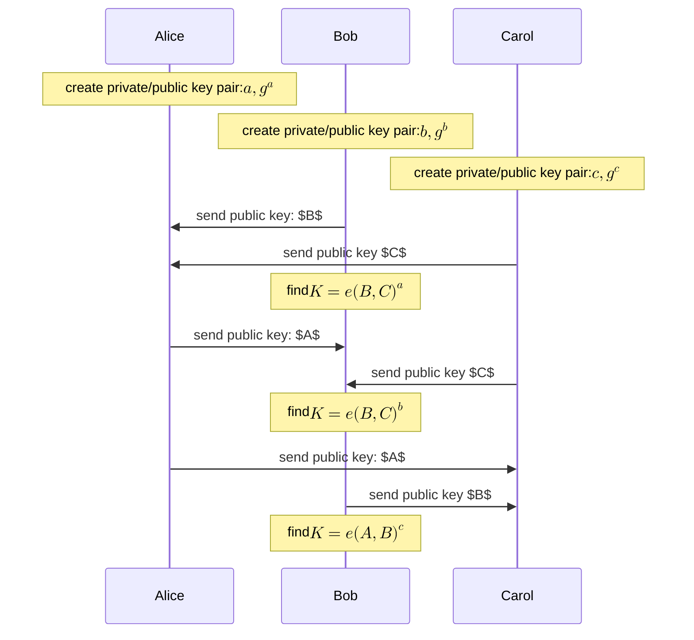
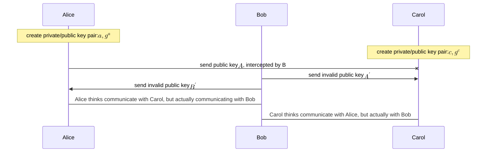

Introduced by [DH86](https://www.cs.jhu.edu/~rubin/courses/sp03/papers/diffie.hellman.pdf), was a groundbreaking paper that helped secret key cryptography flourish and finally be able to use for public use. Exchanging secret keys over an insecure channel unlocked a whole new realm of protocols which led to creation of RSA, [[elgamal-pke|EL-Gamal]], [[signatures]], etc. 


**Computational DH assumption**: computational hardness assumption on DH problem. depends on discrete logarithm assumption and states that: *In a cyclic group $G$ of order $q$ with a generator $g$, if an adversary knows: $g,g^{a},g^{b}$, then it's computationally impossible to know $g^{ab}$.*

**Decisional DH assumption**: computational hardness assumption on DH problem. depends on discrete logarithm assumption, states: *In a cyclic group $G$ of order $q$ with generator $g$, it's impossible to distinguish between $g,g^{a},g^{b},z$ and $g,g^{a},g^{b},g^{ab}$*.

$$\Pr[\mathcal{A}(\mathbb{G},q,g,g^{x},g^{y},g^{z})=1]-\Pr[\mathcal{A}(\mathbb{G},q,g,g^{x},g^{y},g^{xy})=1]\leq \text{negl}(n)$$

It's easier to solve DDH in certain groups but harder to solve DLP and thus, it's a stricter assumption that CDH.

> [!info] Key-Exchange experiment $\text{KE}_{\mathcal{A},\Pi}^{\textsf{eav}}$:
> - Two parties involved, with security parameter $1^{n}$. Messages exchanged are output as transcript, $\textsf{Trans}$, and a key $k$ is exchanged between the two.
> - $b\in\{ 0,1 \}$ is chosen. If $b=0\implies \hat{k}=k$, else $b=1\implies \hat{k}\leftarrow\{ 0,1 \}^{n}$
> - $\mathcal{A}$ is given transcript and $\hat{k}$, outputs a bit $b'$
> - experiment succeeds if $b'=b$, i.e. $\mathcal{A}$ succeeds in distinguishing real key.

$$\Pr[\text{KE}_{\mathcal{A},\Pi}^{\textsf{eav}}=1]\leq \frac{1}{2}+\text{negl}(n)$$

> [!note] security of DDH defines distinguishability on group elements rather than uniform n-bit strings, but Key-exchange experiment chooses $\hat{k}$ from $\{ 0,1 \}^{n}$. Usually cryptographic keys are created from strings, and not group elements.

> [!todo] Prove $\Pr[\text{KE}_{\mathcal{A},\Pi}^{\textsf{eav}}=1]\leq \text{negl}(n)$, if DDH assumption is hard.

[DFKE](https://www.gabriel.urdhr.fr/2021/10/19/diffie-hellman-intro/): allows two parties to share a secret over an unsecured channel. it's hardness is based upon DLP. 

```mermaid
sequenceDiagram
participant A as Alice
participant C as Carol
participant B as Bob
Note over A: create private/public key pair
Note over B: create private/public key pair
A->>B: send key $$k_{1}=K^{a}$$
Note over B: compute $$k_{ab}=k_{1}^{b}$$
B->>A: send key $$k_{2}=K^b$$
Note over A: compute $$k_{ab}=k_{2}^{a}$$
Note over C: knows $$k_{1},k_{2}$$ but can't compute $$k_{ab}$$ due to hardness of DLP
```

> [!question] does this extend to 3 or maybe n parties? if yes, how?
> yes, it can be easily extended to multiple parties but communication complexity is $\mathcal{O}(n^{2})$. can improve [complexity](https://en.wikipedia.org/wiki/Diffie%E2%80%93Hellman_key_exchange#Operation_with_more_than_two_parties) to $\log(n) + 1$ using divide and conquer approach.

There's certain groups which are believed to be secure against attacks like Babystep-Giantstep or Pohlig-Hellman, described in [RFC3526](https://datatracker.ietf.org/doc/html/rfc3526).

Anonymous DH uses ephemeral keys when communicating with any new party, i.e. a new key is generated for each party. When both parties use ephemeral keys it's called ***ephemeral-ephemeral DH***.
When one of the party uses same keys for all communication, it's called *static DH*.
- static-static DH
- ephemeral-static DH
- static-static DH

## ECDH (Elliptic curve Diffie-Hellman)

Diffie-Hellman key exchange based on [[elliptic-curves]], where the private key is generated randomly and public key is derived from generator of the multiplicative group of the curve. It's believed to have stronger security guarantees than FFDH (Finite Field Diffie-Hellman) as DLP is a harder problem in elliptic curves.

Tripartite DH: key exchange between three parties using *[[bilinear-pairings|pairing]]* based curves.



shared key: $K=e(A,B)^{c}=e(g^{a},g^{b})^{c}=e(g,g)^{abc}$ using bilinearity property of pairings. Thus, all three parties have same shared key and any adversary only has $A,B,C$ but can't derive $K$ using DLP assumption.

> [!note] $e(g,g)=1$ for any pairing and thus, distortion-map $\phi$ is used to map $e(g,\phi(g))$ to another r-torsion subgroup.

[Twin DH](https://eprint.iacr.org/2008/067.pdf)

> [!tldr] 
> Let there be two parties Alex and Alice,
> - Alex has $pk$: $x$, Alice has $pk$: $y$
> - Generate public keys: $P_{alex} = xG$, $P_{alice} = yG$
> - Send each other public keys
> - Calculate new public key $P_{s} = P_{alex} * y$ OR $P_{alice} * x$

## Attacks on DH

**Man in the middle attack**: anonymous (unauthenticated) DH is prone to man-in-the-middle attack where an adversary listens to communication between both parties and can change the contents of the message.



## References

- [DFKE lecture notes](https://www.cs.cornell.edu/courses/cs513/2006fa/lectures/lec05.html)
- [threshold signature on DH](https://www.esat.kuleuven.be/cosic/blog/twinkle-a-fully-adaptive-threshold-signature-from-ddh/)