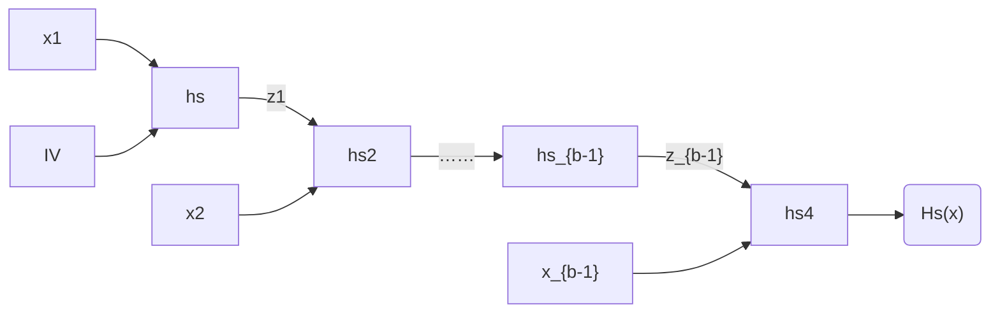
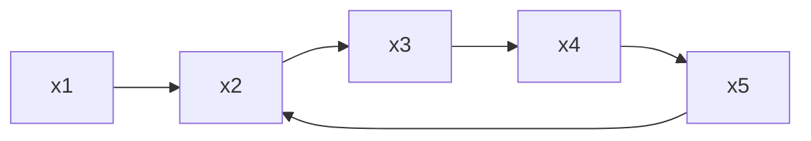

## Properties

Following are the desired properties of a strong hash function: $f$

1. Pre-image resistance: given $f(m)=h$, it is difficult to find the pre-image $m$ of the hash $h$.
2. Second pre-image resistance: given message $m_1$, it is difficult to find another message $m_2\neq m_{1}$ such that $f(m_1)=f(m_2)$.
3. Collision resistance: It is difficult to find two distinct messages $m_1$ and $m_2$ such that $f(m_1)=f(m_2)$.

> [!note] Collision resistance and Second pre-image resistance might seem similar but on closer look, Collision resistance hash-functions are more harder to construct as adversary has more control over choice of message $m_{1},m_{2}$.

collision resistance implies second pre-image resistance. Prove this. [^1]

Hash function $H$ is defined by two deterministic algorithms:
- $\textsf{Gen}(1^{n})\to s$: outputs key $s$. Note that $s$ is not secret here, and adversary has access to it.
- $\textsf{H}(s,x)\to \{ 0,1 \}^{l(n)}$: $x\in\{ 0,1 \}^{*}$, outputs a binary string of length $l(n)$.

When input length $l'(n)>l(n)$, then $H$ is called fixed-length hash function, and a *compression function* as well because collision resistance is achieved trivially by setting $H(x)=x$ if $l'<l$.

Define experiment $\text{Hash-Coll}_{\mathcal{A},H}(n)$:
- $s$ is generated by $\textsf{Gen}(1^{n})$
- $\mathcal{A}$ outputs $x,x'\in\{ 0,1 \}^{l'(n)}$
- output 1 if $x\neq x'$ and $H(s)=H(s')$

$$\Pr[\textsf{Hash-Coll}_{\mathcal{A},H}(n)=1]\leq \text{negl}(n)$$

## Merkle-Damgård Constructions

Used in MD5, SHA1, SHA2.

Construct a arbitrary length hash function from fixed length compression function, i.e. use $\textsf{Gen,h}$, where $h:\{ 0,1 \}^{n'}\times \{ 0,1 \}^{n}\to \{ 0,1 \}^{n}$ to create H such that $\{ 0,1 \}^{*}\to \{ 0,1 \}^{n}$.

Prove by reduction that this is collision resistant if $h$ is collision resistant.

## Sponge constructions

Used in SHA3 (Keccak).

## HAIFA construction

Used in Blake2.

## Birthday attack

According to literature, most symmetric cryptographic primitives like encryption, block ciphers, MAC need an $n-$bit secret keys to achieve security against attackers running in $2^{n}$ time. But using birthday attacks, a hash function with output size $n$ has $\mathcal{O}(2^{n})$ pre-image resistance, and second pre-image resistance and $\mathcal{O}(\sqrt{ 2^{n} })$ collision resistance.

Let $H:\{ 0,1 \}^{*}\to \{ 0,1 \}^{l}$ be a hash function. Most trivial attack to find collision is to take $2^{l}+1$ different strings and compute hash of all of those, can we find two $y_{i}$ that are equal? 

> [!info] **Birthday attacks** 
> if you have q inputs $x_{1},\dots,x_{q}$, then what is the probability that any two of $H(x_{1}),\dots,H(x_{q})$ are equal? Assume $H$ to be a random function (because this yields the worst-case probability and all other real-world functions are worse than this).

> [!todo] **explain** [birthday attack](https://cr0mll.github.io/cyberclopaedia/Cryptography/Hash%20Functions/Birthday%20Attacks.html) probability.

It is explained in above proof that any attacker can find a collision using $\Theta(2^{n/2})$ inputs with more than 1/2 probability, Putting commonly occurring 512 and 256 bits output size in the above statement: [^2]

- 512 bits output gives $512$ bits of pre-image resistance and $256$ bits of collision resistance
- 256 bits output gives $256$ bits of pre, and 128 bits of col.

Small-space birthday attack: label hash outputs in a graph, and then, it's the algorithm of finding node that forms cycle in a graph, can be done in $\Theta(2^{l/2})$ time and no extra memory.

Let there be a sequence of values: $x_{0},\dots,x_{q}$
- loop: $x=x_{0},x'=x_{0}$, and calculate $x=H(x),x'=H(H(x'))$. This means $x=H^{(i)}(x_{0}),x'=H^{(2i)}(x_{0})$
	- if $x=x'$, then there is a collision between $0,2i-1$
- again run a loop with $x=x_{0},x'=x_{i}$
	- check if $H(x)=H(x')$, if yes, output $x,x'$
	- else $x=H(x),x'=H(x')$

> [!note] Prove that first loop iteration halts, i.e. there exists i such that $x_{i}=x_{2i}$.
> since $x_{I}=x_{J}$, then cycle length: $l=J-I$, then let $i$ be a multiple of $l$, so, $x_{i}=x_{i+k\cdot l}$ such that $i>I,i<J$. 
> So, $x_{i}=x_{2i}$ if $2i=i+k.l\implies k=\frac{i}{l}$.

We can use **small-space birthday attacks** to find meaningful collisions in a set of two different strings, by extending the $l-$bit string to $l+1$, where first bit defines string belongs to which set. Then, we can find a collision in the set, so $x\neq x'$ such that $H(x)=H(x')$, and $x,x'$ belong to different set with probability 1/2.

### Inverting hash function with time/space tradeoff

let $H:\{ 0,1 \}^{*}\to \{ 0,1 \}^{l}$ be a hash function mapping to $l-$bit outputs, such that length of range = $2^{l}=N$.

> [!hint]  Basic idea is to generate a sequence of $x_{0},H(x_{0}),\dots,H^{(i)}(x_{0})$ and then, distribute the sequence into a table of $\sqrt{ N }\times \sqrt{ N }$ independent elements. Store $SP^{(0)}_{i},SP^{(t)}_{i}=EP_{i}$. 
> Now, to find pre-image of $y$, just calculate $y,H(y),\dots,H^{(t)}(y)$. If one of these equal end point of a tuple, then calculate $SP_{i}$ and x where $y=H(x)$ should lie in that sequence.

This is done more effectively by choosing two parameters $s,t$ and choosing the starting points uniformly. But there are two problems:
- possibility of sequence $y,H(y),\dots,H^{(i)}(y)$ lying in none of the row of $s.t$ element table.
- false positive: where one of $H^{(i)}(y)$ lies in one of the row but $H^{(i-1)}(y)$ doesn't. This can be estimated by probability that a point in a sequence equal some point in the table: $\mathcal{O}\left( \frac{st^{2}}{N} \right)$.
	- False positives can be mediated by running the check of finding $y$ in a sequence that matches each i,j in $H^{(j)}(y)=EP_{i}$.
- To estimate lower bound whether $x=H^{-1}(y)$ lies in the table:
	- estimate probability of finding mutually exclusive elements in the table. So, a row's starting should be new and subsequent hash of row's starting element should be new.
	- This comes out to be $\sum_{i=1}^{s}\sum_{j=0}^{t-1}\Pr[H^{(j)}(\textsf{SP}_{i}) \space \text{is new}]\geq\frac{st}{2}$
	- Thus, the probability that element $x$ lies in the table = $\frac{st}{2N}=\frac{1}{4t}$ when $st^{2}=\frac{N}{2}$.
	- So, almost 4t independent tables need to be generated in order have higher probability of generating a table that contains x.

## RO model

[[random-oracle-model]]

## ZK Friendly hash functions

It's natural to put cryptographic hash functions on protocols that boasts ZK properties like SNARKs or STARKs.

- Poseidon
- Rescue Prime
- Vision

## Questions

6.1
- TODO: prove that if H is second-preimage, then $H$ is preimage resistant.
- can be given by again creating a reduction proof and proving that probability calculated of $\mathcal{A}$ breaking pre-image resistant means $\mathcal{A}'$ breaking second-preimage, but since prob of latter is negligible, former's prob is also negligible.

6.4: model two PPT adversaries $\mathcal{A},\mathcal{A}'$ where $\mathcal{A}$ attacks H, and $\mathcal{A}'$ attacks h. $\mathcal{A}'$ is running $\mathcal{A}$ as a subroutine and assumes that $\mathcal{A}'$ can break $H$, then after querying for $y$, receives $x,x'$. Using this, and a similar logic used in the Theorem 6.4, can prove that $\mathcal{A}$ would succeed in breaking collision resistance of $h$, but since this isn't possible, $\mathcal{H}$ is collision resistant.

6.5: two questions: what should be key length? is any padding needed? what if we keep key length as n, and k bit as input. then, the proof can be formulated similar to 6.4.

6.7: let h be such that $h(0^{n},0^{n'})=0^{n}$, then take two inputs $x=1$ and $x'=0^{n}\lVert 1$.

6.8: design a non-collision resistant hash function using a collision resistant hash function such that $h(0\lVert x)=\hat{h}(x)\lVert 0$ and $h(1\lVert x)=1^{n}$, where $x\in\{ 0,1 \}^{2n-1}$. TODO, didn't understand the solution from manual.

6.9,6.10: 

- design a reduction proof that allows to break $h$'s preimage, and second-preimage resistance using $\mathcal{A}$'s attack on $H$.
- Correction, assumption was wrong. both these statements are actually false.
- 

## Resources

- [Intro to Modern Cryptography: Chapter 6](https://www.cs.umd.edu/~jkatz/imc.html)
- [A graduate course in applied cryptography by Dan Boneh, Victor Shoup: Chapter 8](https://toc.cryptobook.us/)
- [ZK friendly hash functions](https://www.zellic.io/blog/zk-friendly-hash-functions)
- [Ingonyama's ZK friendly hash functions](https://github.com/ingonyama-zk/papers/blob/main/sok_zk_friendly_hashes.pdf)

[^1]: [Second pre-image resistance vs Collision resistance](https://crypto.stackexchange.com/questions/20997/second-pre-image-resistance-vs-collision-resistance)
[^2]: [512 bits vs 256 bits](https://crypto.stackexchange.com/questions/83199/is-512-bits-a-more-secure-hashing-than-256-bits?rq=1)