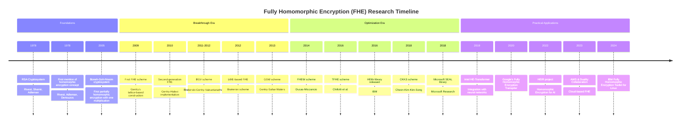

How to start:
- Learn about BFV, BGV scheme.
- implement them in rust
- Look at some small libraries, and how they implement it.

[The Beginner’s Textbook for Fully Homomorphic Encryption](https://arxiv.org/pdf/2503.05136)
[\[2205.03511v1\] Lattices, Homomorphic Encryption, and CKKS](https://arxiv.org/abs/2205.03511v1)
[\[2208.08125\] A Tutorial Introduction to Lattice-based Cryptography and Homomorphic Encryption](https://arxiv.org/abs/2208.08125)
[Homomorphic Encryption References](https://people.csail.mit.edu/vinodv/FHE/FHE-refs.html)
[FHE](https://cseweb.ucsd.edu/~daniele/LatticeLinks/FHE.html)
[A Guide to Fully Homomorphic Encryption](https://eprint.iacr.org/2015/1192)
[Survey on Fully Homomorphic Encryption, Theory, and Applications](https://eprint.iacr.org/2022/1602)
[he-chapter.pdf](https://shaih.github.io/pubs/he-chapter.pdf)
[Chen18.pdf](https://thomas-plantard.github.io/pdf/Chen18.pdf)
[Threshold (Fully) Homomorphic Encryption](https://eprint.iacr.org/2025/699)
[SoK: New Insights into Fully Homomorphic Encryption Libraries via Standardized Benchmarks](https://eprint.iacr.org/2022/425)

Libraries:
- SEAL
- HElib
- tfhe-rs

Start with:
- intense introdcution to cryptography lec 16-17

**Questions**:
- Why is CCA security not possible for FHE?

> [!info] PHE Definition
> Let $\mathcal{F}=\cup \mathcal{F}_{l}$ be a binary function family, where $f\in \mathcal{F}_{l}:\{ 0,1 \}^{l}\to \{ 0,1 \}$. An $\mathcal{F}-$homomorphic public-key encryption scheme is CPA secure

## BGV
FHE over integers

## BFV
FHE over integers

<https://github.com/AI-Tech-Research-Lab/Introduction-to-BFV-HE-ML/blob/main/BFV_theory/BFV_theory.ipynb>

## CKSS
FHE over real numbers

## FHEW/TFHE
FHE over boolean circuits

## HE-GPU
[\[2410.05934v1\] Chameleon: An Efficient FHE Scheme Switching Acceleration on GPUs](https://arxiv.org/abs/2410.05934v1)

## Resources
- ["Easy-FHE", Craig Gentry](https://crypto.stanford.edu/craig/easy-fhe.pdf)
- ["Fully homomorphic encryption using ideal lattices", Craig Gentry PhD Thesis](https://crypto.stanford.edu/craig/)
- 