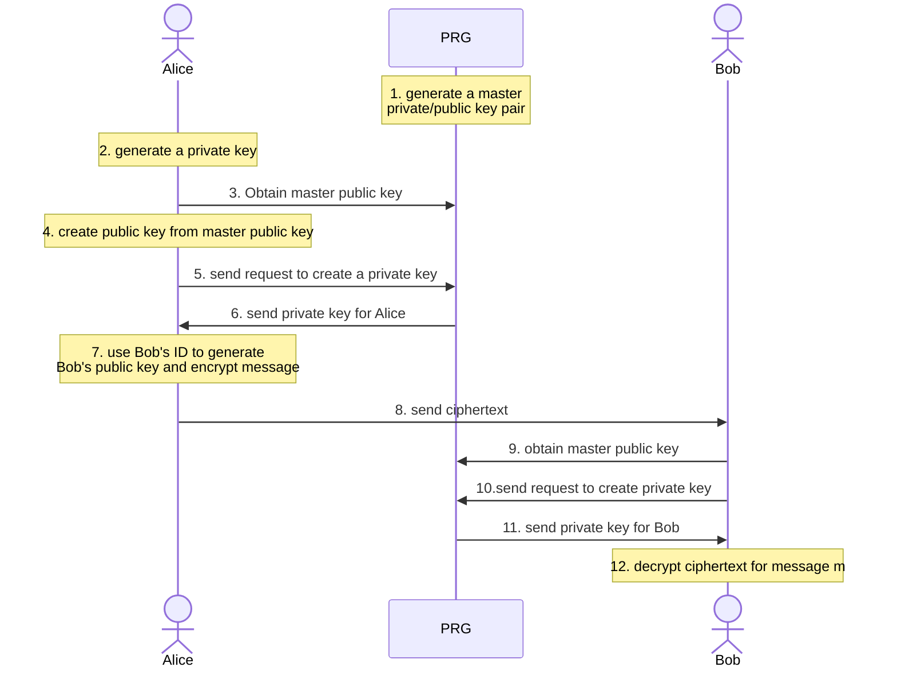

a form of public-key encryption, where sender can use public parameters of an entity to encrypt a message which can be decrypted only by a private key that is generated by a central authority.

> [!question] then it's not that beneficial, right? you have to trust a central authority which can be adversary itself?

Third party entity called PRG (Private Key Generator) is responsible for creating public and private keys and assigning them to participants. PRG has a master private/public key pair which it uses to create new public/private key pair for any other participant. Any public entity can contact PRG to create a private key pair for itself and public key can be generated by combining master public key and self's public ID.

> [!question] so PRG is a single point of failure. PRG can't get compromised. also how does PRG at the time generating the private key authenticates identity of the entity?
> It's mentioned in the wikipedia [article](https://en.wikipedia.org/wiki/Identity-based_encryption) that IBE doesn't concern with the need of security (integrity, authentication, confidentiality)

Formal Protocol:

- $\textsf{Setup}(1^{\lambda})\to \mathcal{P},K_{m}$: takes security parameter and outputs public parameters (message space $\mathcal{M}$ and ciphertext space $\mathcal{C}$), and master key $K_{m}$.
- $\textsf{Extract}(\mathcal{P},K_{m},\mathsf{ID}\in\left\{0,1\right\}^{*})\to d$: generates user's private key. takes public parameter, master key, user public ID and outputs user private key $d$.
- $\textsf{Encrypt}(\mathcal{P},m\in\mathcal{M},\mathsf{ID})\to c\in\mathcal{C}$: encrypts a message $m$ to ciphertext $c$.
- $\textsf{Decrypt}(\mathcal{P},c\in\mathcal{C},d)\to m\in\mathcal{M}$: decrypts a message encrypted by user's public key using private key as decryption key.

$$
\begin{equation}
\forall m \in \mathcal{M},\mathsf{ID}\in\left\{0,1\right\} ^{*}:\mathsf{Decrypt}(\mathsf{Extract},\mathcal{P},\mathsf{Encrypt})=m
\end{equation}
$$

## Practical Protocols:

Boneh-Franklin scheme

Assume existence of hash function $H$ that can map element to $\mathbb{G}$.

- $\textsf{Setup}(1^{\lambda})$$: sample a bilinear group $\mathcal{P}:\mathbb{G},p,g,e$, $K_{m}=x$, an element $s \xleftarrow{\$}\mathbb{Z}_{p}$ and $pk:(\mathcal{P},h=g^{x})$.
- $\textsf{Extract}(\mathcal{P},K_{m},\textsf{ID})$: output $sk\textsf{(ID)}=H(\textsf{ID})^{x}$
- $\textsf{Encrypt}(\mathcal{P},\textsf{ID},m)$: samples $r\xleftarrow{\$}\mathbb{Z}_{p}$, computes $u=g^{r}$ and $v=m\times e(H(\textsf{ID}),u)$. $c=(u,v)$
- $\textsf{Decrypt}(\mathcal{P},c,\textsf{sk}_{\textsf{ID}})$: parse $(u,v)\leftarrow c$, computes $z=e(sk(\textsf{ID}),u)$, outputs $m=v/z$.

> [!info] things that I am liking about [IBE](https://crypto.stanford.edu/ibe/):
> - in a network where key escrows are necessary, it's perfect use case for setting up PKI.
> - doesn't require bootstrapping of public key infrastructure
> - sender can control the properties of ciphertext. For example: can encode expiration in public key identifier like `bob@hotmail.com || current-year`, which PRG can use to deny private key generation for the receiver.
> - PRG can control entities inside the system using expiration of keys. can produce static or ephemeral keys.
> 
> A corporation PKI is perfect use case for IBE.

## Security

- PKG is a single point of failure, as if it gets compromised, all the keys being used in the system are compromised and adversary can spoof anyone.

> [!question] Is standard public-key encryption (PKE) [semantic security](https://crypto.stanford.edu/cs355/23sp/CS_335__L07.pdf) enough?
> what's the meaning of semantic security? if the notion of semantic security is satisfied even when encryption algorithm ignores identities and everyone has same secret key, then what is it use case because obviously, stricter algorithm will satisfy it as well, i.e. everyone having different secret keys?

Security of any public key encryption scheme is based on the notion of semantic security wherein an adversary $\mathcal{A}$ knowing the public key $\mathsf{pk}$ cannot tell the difference between $m_{0},m_{1}$ for message of its own choice.

Security which is considered for IBE, will allow $\mathcal{A}$ to obtain secret keys of $\mathsf{ID_{1},ID_{2},\dots,ID_{k}}$ and has to break semantic security for $\mathsf{ID}^{*}$. Let's define an attack game between challenger and adversary $\mathcal{A}$:

- $\mathsf{Setup}(1^{\lambda})$: outputs $\mathcal{P}$ and $pk$ is given to $\mathcal{A}$.
- $\mathcal{A}$ samples secret key queries for any identity $id_{i}$ and get $sk\leftarrow \mathsf{Extract}(\mathcal{P},\mathsf{ID},K_{m})$
- $\mathcal{A}$ outputs challenge id $\mathsf{ID^{*}}$ and messages $m_{0},m_{1}$ and get $c\leftarrow \mathsf{Encrypt}(\mathcal{P},\mathsf{ID},m_{b})$.
- $\mathcal{A}$ can sample additional secret key queries.
- $\mathcal{A}$ has to output $i$ for message $m_{i}$ that was chosen for encryption.

$\mathcal{A}$ wins if $m_{i}=m_{b}$ and $\mathcal{A}$ never queries for secret key of $\mathsf{ID}^{*}$. An IBE scheme is deemed secure if for any PPT adversary, $\mathsf{Pr_{\mathcal{A}}}(m_{i}=m_{b})\geq \frac{1}{2}+\mathsf{negl}(\lambda)$

Let's define other variations of IBE with varying security guarantees:

- Adaptively secure IBE: adversary can make series of queries to challenger, queries being key queries or encryption query. at the end of game, adversary has to output bit $\hat{b}\in\left\{0,1\right\}$.
- Private IBE (anonymous IBE): stricter assumption, an eavesdropper who has $mpk$ and $c\xleftarrow{R}E(mpk,id,m)$ cannot learn the identity of the target recipient. 
	- the attack game is modified where in encryption query, adversary $\mathcal{A}$ sends: tuple: $(\mathsf{ID}_{0},m_{0}),(\mathsf{ID}_{1},m_{1})$.
	- In the end, adversary has to output bit $\hat{b}\in\left\{0,1\right\}$ such that $c\leftarrow E(mpk,\mathsf{ID_{b}},m_{b})$.
- Selectively secure IBE: weaker notion of IBE security where adversary needs to select challenge identity $\mathsf{ID}$ before key queries.
	- to model the security proof, we first select a hash function $H:\mathsf{ID}'\to \mathsf{ID}$ which will be modelled as a random oracle.
	- choose an adversary $\mathcal{B}$ that will wrap around adversary $\mathcal{A}$ and play the attack game with the challenger.
	- $\mathcal{A}$ can at most make $Q_{RO}$ random oracle queries for $\mathsf{ID}$ and $Q_{S}$ key queries.
	- $\mathcal{B}$ chooses a $\omega \xleftarrow{\$}\left\{1,\dots,Q_{RO}+1\right\}$, and a random $\mathsf{ID}_{ch}\xleftarrow{\$}\mathcal{ID}$. sends $\mathsf{ID}_{ch}$ to challenger as challenge identity and gets back $mpk$ for $\mathcal{E}'_{id}$.
	- Now, $\mathcal{A}$ starts querying random oracle of $\mathsf{ID}_{j}$ and $\mathcal{B}$ maps each query to random identity in $\mathcal{ID}$ and sends value of $H(\mathsf{ID}'_{j})$. for query number $\omega$, it maps that to $\mathsf{ID}_{ch}$ that it sent to challenger.
	- then, $\mathcal{A}$ starts key queries. for jth query, if $H(\mathsf{ID}_{j})\neq \mathsf{ID}_{ch}$ then $\mathcal{B}$  sends the key query to challenger and send response back to $\mathcal{A}$. if it's equal to $\mathsf{ID}_{ch}$, then $\mathcal{B}$ can't send to challenger and aborts with random bit.
	- $\mathcal{A}$ issues its single encryption query for $(\mathsf{ID}',m_{0},m_{1})$, $\mathcal{B}$ first checks if $H(\mathsf{ID}')=\mathsf{ID}_{ch}$, if its not, sends the query to challenger, gets $c$ and send that to $\mathcal{A}$, for which $\mathcal{A}$ outputs the bit $\hat{b}$. if $H(\mathsf{ID}')=\mathsf{ID}_{ch}$, then $\mathcal{B}$ aborts with random bit.

> [!question] Some questions regarding the security of this scheme:
> - why $\mathcal{E}_{id}(S,G,E,D)$ is modified to $\mathcal{E}_{id}'(S,G',E',D)$?
> - why use a hash function to map $H:\mathcal{ID}\to \mathcal{ID'}$?

### Security of Boneh-Franklin scheme

TODO

## Resources

- [CS355 Lecture 7: IBE](https://crypto.stanford.edu/cs355/23sp/CS_335__L07.pdf)
- [CS355 Spring'14: IBE](https://crypto.stanford.edu/~dabo/courses/cs355_spring14/lectures/IBE.pdf)
- [Boneh-Shoup book Section 15.6](https://toc.cryptobook.us/book.pdf#page=659.35)
