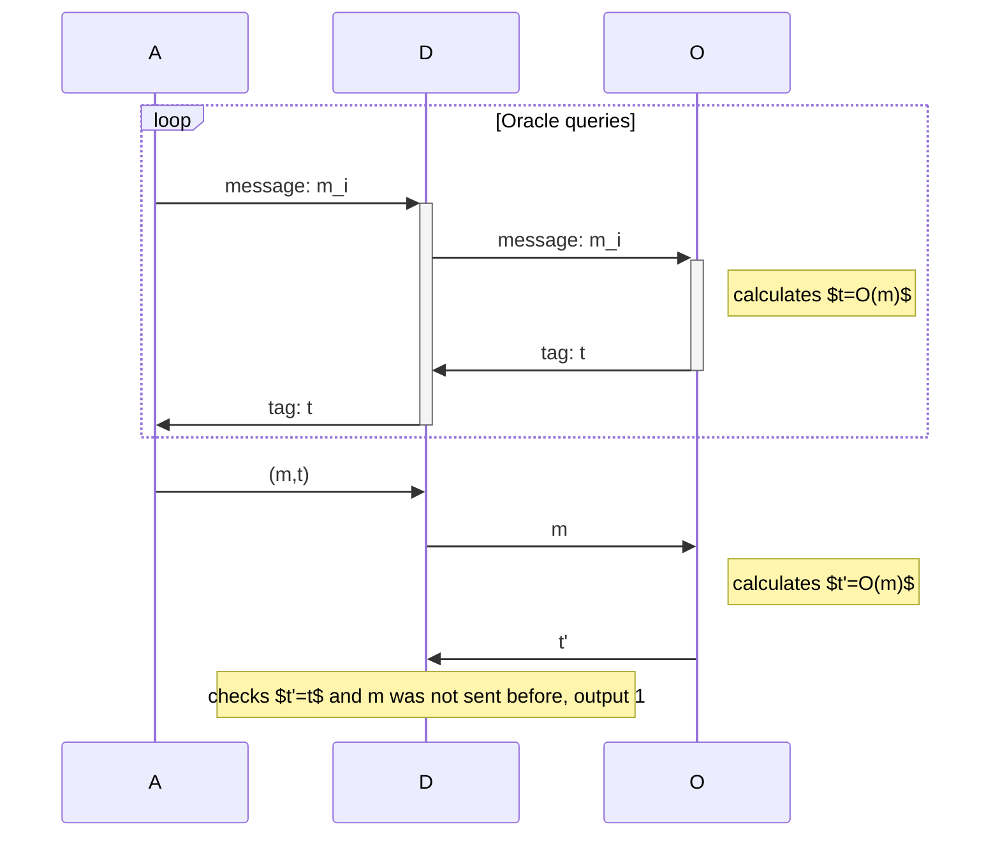

Message authentication codes provide message integrity by appending a checksum to the message which receiver on decryption calculates again and verify whether message was tampered or not. Provides 2 properties:
- Authentication: Message was really created by sender
- Integrity: Message was not tempered during transmission.

> [!question] But any middle man can create a new message with a new MAC, how does receiver know whether it's sent by original sender or adversary?
> Nope, as you study further, you discover that MAC is actually realised using a *tag* whose only requirement is that it can only be generated with a secret key.

> [!question] how is MAC different from signatures?

- consists of following algorithms:
	- $\text{KeyGen}(1^{n})\to k$
	- $\text{MAC}(k,m\in \mathcal{M})\to t$
	- $\text{Vrfy}_{k}(m,t)\to b$
- Canonical Verification: when receiver computes $\tilde{t}:=\text{Mac}_{k}(m)$ and verifies that $\tilde{t}=t$.
- MAC's, $\Pi:=(\text{KeyGen,Mac,Vrfy})$ security definition: adversary should be able to verify MAC of message that it doesn't have, i.e. **forgery** of MAC happens when adversary can produce valid MAC tag.
	- $\text{Mac-forge}_{\mathcal{A},\Pi}(n)$: PPT adversary $\mathcal{A}$ has access to oracle $\text{Mac}_{k}(\cdot)$, and can request tag t for any message of its choice.
	- $\mathcal{O}$ maintains a set $\mathcal{Q}$ of messages $M\in \{ m_{0},m_{1},\dots \}$ containing all previously queries messages.
	- $\mathcal{A}$ succeeds if it can produce forgery of MAC, i.e. produces valid $(m,t)$, where tag for $m$ wasn't requested previously, and when $(m,t)$ is given to a third party, $\text{Vrfy}$ succeeds.
	- Mac which has no efficient adversary is said to be ==***existentially unforgeable under an adaptive chosen-message attack***==.
	- $\Pr[\text{Mac-Forge}_{\mathcal{A,\Pi}(n)}=1]\leq \text{negl}(n)$
- Strength of definition: for most scenarios, this definition of MAC seems too strong, because even though adversary can request tag for messages of its choice any number of times, it still can't forge a new tag for unauthenticated message.

> [!info] Examples
> Browser Cookies: stored user side in browser to authenticate a user in a session.
> TCP handshake: calculated server side during second TCP syn+ack to authenticate the user. 
> - **2FA & TOTP**: timed one-time passwords are an excellent example of real-world usage of MACs. user calculate mac $t:=\text{Mac}_{k}(m\parallel T)$, sends $m,t$ to server, and server verifies with key, $\text{Vrfy}_{k}(m \parallel T)$. 

- **Replay attacks**: Mac doesn't provide replay attack prevention guarantees, i.e. adversary can send same (message, tag) and receiver won't be able to detect whether this message has been sent previously or not. 
	- This is done to ensure usability of MACs in different scenarios and should be handled by higher-level application.
- Strong security: $\mathcal{A}$ forges $t'\neq t$ for MAC $(m,t)$ where $m\in \mathcal{Q}$. 
	- Denote $\Pr[\text{Mac-sforge}_{\mathcal{A},\Pi}=1]\leq \text{negl}(n)$. Now, $\mathcal{O}$ maintains tuple of $(m,t)$ in set $\mathcal{Q}$.
	- Prove: secure MAC with canonical verification is strongly secure.
- Timing attacks: side channel attacks which can determine value of mac using timing attacks on verification oracle.

## Secure-MAC using PRF

- Construct a MAC using PRF where $t:=\text{Mac}_{k}(m)=F_{k}(m)$, where $F_{k}$ is a PRF, and canonical verification happens using $t':=\text{Vrfy}_{k}(m)\space;\space t'\xlongequal{?}t$.
- Prove: $\Pr[\text{Mac-forge}_{\mathcal{A,\Pi}}(n)=1]-\Pr[Mac-forge_{\mathcal{A,\Pi}}=1]\leq \text{negl}(n)$
	- To prove above construction is secure, create a Polynomial-time distinguisher $D$ that is given oracle access to $\mathcal{O}$, and needs to determine whether $\mathcal{O}$ is PRF or not.
	- $D$ simulates message authentication experiment for adversary $\mathcal{A}$ by answering $\text{Mac}$ queries and returning $t:=\mathcal{O}(m)$ to $\mathcal{A}$.
	- After all queries, $\mathcal{A}$ outputs $(m,t)$. $D$ queries $t':=\mathcal{O}(m)$, and obtain $t'$.
	- If $t'=t$ and $m\not\in\mathcal{Q}$, $D$ outputs 1.

- Now, when $\mathcal{O}$ is a PRF, then adversary's view is equal to $\mathcal{A}$ in $\text{Mac-forge}_{\mathcal{A,\Pi}}(n)$ experiment, thus, $\Pr[D^{F_{k}(\cdot)}(1^{n})=1]=\Pr[\text{Mac-forge}_{\mathcal{A,\Pi}}(n)=1]$.
- Similarly, when $\mathcal{O}$ is uniform random function: $\Pr[D^{f(\cdot)}(1^{n})=1]=\Pr[\text{Mac-forge}_{\mathcal{A,\widetilde{\Pi}}}(n)=1]$
- Next prove that: $\Pr[\text{Mac-forge}_{\mathcal{A},\Pi}(n)=1]\leq 2^{-n}+\text{negl}(n)$

## MAC for arbitrary length messages

- Construct a simple mac for arbitrary length message by dividing $m=(m_{1},m_{2},\dots )$ and computing $\text{Mac}'_{k}(r\parallel l \parallel i \parallel m_{i})$. 
- Construction: let $\Pi'=(\text{Mac}',\text{Vrfy}')$ be fixed length MAC of length $n$, then
	- $\textsf{Mac}$: On input of key $k\in\{ 0,1 \}^{n}$ message $m\in\{ 0,1 \}^{*}$, parse $m=(m_{1},\dots,m_{d})$ of length $\frac{n}{4}$ and choose a uniform $r\in\{ 0,1 \}^{n/4}$. Compute $\forall i \in [1,d];\space t_{i}\leftarrow\mathsf{Mac}'(r\parallel l \parallel i \parallel m_{i})$. Output $\langle r,t_{1},\dots,t_{d} \rangle$.
	- $\textsf{Vrfy}$: On input key $k\in \{ 0,1 \}^{n}$, a message $m\in\{ 0,1 \}^{*}$ and tag $t$, output $\forall i \in [1,d];\space t_{i}=\textsf{Vrfy}'(r\parallel l \parallel i \parallel m_{i})$.C
- **Prove** this is secure MAC.
	- Basic idea is to prove $\Pr[\text{Mac-forge}_{\mathcal{A},\Pi}=1]$ by proving two events:
		- $\textsf{repeat}$: $r$ is used for some other message during oracle queries
		- $\textsf{NewBlock}$: $\mathcal{A}$ tries to forge a block $r\parallel l \parallel i \parallel m_{i}$ which was authenticated by $\textsf{Mac}'$ before during answering $\mathcal{A}'s$ queries to oracle.
	- So, $\Pr[\text{Mac-forge}_{\mathcal{A},\Pi}]\leq\Pr[\textsf{repeat}]+\Pr[\text{Mac-forge} \wedge \overline{{\textsf{repeat}}} \wedge \textsf{NewBlock}]+\Pr[\text{Mac-forge} \wedge \overline{{\textsf{repeat}}} \wedge \overline{\textsf{NewBlock}}]$.

### CBC-MAC

- constructing a MAC using pseudorandom function $F_{k}$ for $k\in\{ 0,1 \}^{n}$ and length function $l(n)>n$, and message length $l(n)\cdot n$.
	- $\textsf{Mac}$: parse m as $m_{1},\dots,m_{l}$ and $t_{0}=\{ 0 \}^{n}$, then $t_{i}=F_{k}(t_{i-1}\oplus m_{i})$.
	- $\textsf{Vrfy}$: output 1 if $t \xlongequal{?}\textsf{Mac}_{k}(m)$.
- Prove this is a secure Mac.

## Mac from difference-universal function
Let $h:\mathcal{K}_{n}\times \mathcal{M}_{n}\to \mathcal{T}_{n}$ be a keyed function where $k\in\mathcal{K}_{n}$ and message $m\in\mathcal{M}_{n}$ and output $t\in\mathcal{T}_{n}$, where $\mathcal{T}_{n}$ is a group. For $h$ to be $\varepsilon-$difference universal function, take $m,m'\in\mathcal{M}_{n}$ and any $\Updelta\in\mathcal{T}_{n}$ such that $\Pr[h_{k}(m)-h_{k}(m')=\Updelta]\leq \varepsilon(n)$, where $\varepsilon(n)\geq \frac{1}{|\mathcal{T}_{n}|}$.

Let's construct a MAC from DUF, take $h$ to be $\varepsilon-$DUF and $F$ to be a PRF, then following is a strongly secure MAC for messages in $\mathcal{M}_{n}$:
- $\textsf{Gen}$: output key $k_{h}\in\mathcal{K}_{n}$ and $k_{F}\in\{ 0,1 \}^{n}$.
- $\textsf{Mac}$: for key, $m\in\mathcal{M}_{n}$, choose uniform $r\in\{ 0,1 \}^{n}$, output $t=\langle r,h_{k_{h}}(m)+F_{k_{F}}(r)\rangle$
- $\textsf{Vrfy}$: for key, $m\in\mathcal{M}_{n}$, parse $t=(r,s)$, output 1 if $s \xlongequal{?}h_{k_{h}}(m)+F_{k_{F}}(r)$

Prove that above construction is strongly secure MAC, $\Pr[\text{Mac-sforge}_{\mathcal{A},\Pi}=1]-\Pr[\text{Mac-sforge}_{\mathcal{A},\widetilde{\Pi}}]\leq \text{negl}(n)$
- take two events required to model the security:
	- $\textsf{repeat}$: $r$ is not repeated by $\mathcal{O}$ in any of the oracle queries by $\mathcal{A}$.
	- $\textsf{new-r}$: $\mathcal{A}$ outputs $\langle m,(r,s) \rangle$ where $r$ was not used in any of the previous oracle query.
- study for uniform function first, i.e. $\Pr[\text{Mac-sforge}_{\mathcal{A},\widetilde{\Pi}}]=\Pr[\textsf{repeat}]+\Pr[\text{Mac}=1 \wedge \textsf{new-r}]+\Pr[\text{Mac}=1 \wedge \overline{\textsf{repeat}} \wedge \overline{\textsf{new-r}}]$.
	- probability of repeat is $\frac{q(n)^{2}}{2^{n+1}}$
	- Probability of new-r is $\frac{1}{|\mathcal{T}_{n}|}$ because $f$ is a uniform function is $\mathcal{A}$'s view.
	- prob of neither repeat, nor r-new is $\leq \varepsilon(n)$ by taking two distinct $(r,s),(r,s_{i})$, where $m_{i}$ was ith oracle query and their $r's$ match (because new-r doesn't occur) and equating their $s$
- a common DUF is taking a finite field $F_{q}$, $k_{h}$ to be a point in $F$, and $m\in F[X]^{<l}$ is a polynomial of degree < l (constant) in $F$. Now, $h_{k}(m)=m(k)$, i.e. evaluation of $m$ on $k$. This is $\frac{l}{|F|}$-DUF.
- 
### GMAC
TODO
### Poly1305
TODO
## Information-Theoretic MACs

- until now all MAC constructions are computational secure, i.e. efficient adversary that runs in polynomial time, and thus, we need a security parameter $n$ that is used to model the asymptotic behaviour of both the construction and the adversary.
- Now, we look at conditions that are required to create MAC that are secure for unbounded adversary, i.e. Information Theoretic MAC
- Max probability that we can reach for an unbounded adversary to correctly output a tag that works is $\max\left( \frac{1}{|\mathcal{K}|}, \frac{1}{|\mathcal{T}|} \right)$, and only restriction on adversary is number of times it can access the oracle.
- Construct a **one-time MAC**:
	- A gives $m'$ and gets $t'=\text{Mac}_{k}(m')$
	- A outputs $(m,t)$, output 1 if $\textsf{Vrfy}_{k}(m,t)=1$ and $m\neq m'$.
- $\Pr[\text{Mac-forge}_{\mathcal{A},\Pi}^{\textsf{1-time}}]\leq \varepsilon$
- **Strongly universal functions (SUF)**: or also called pairwise independent functions. Function $h:\mathcal{K}\times \mathcal{M}\to \mathcal{T}$, where $m,m'\in\mathcal{M}$ and $t,t'\in \mathcal{T}$, such that $\Pr[h_{k}(m)=t \wedge h_{k}(m')=t']=\frac{1}{|\mathcal{T}|^{2}}$.
- Construct **MAC using SUF**: simply output $t:=\textsf{Mac}_{k}(m)$, and output 1 if $\textsf{Vrfy}(m,t):=t';\space t \xlongequal{?}t'$.
- Prove above construction is $\frac{1}{|\mathcal{T}|}$ secure MAC.
- A simple example of SUF is $h_{a,b}(m)=a\cdot m+b \mod{p}$
- One-time MAC from DUF: can be constructed as simply taking $k\in\mathcal{K}$ and $r\in \mathcal{T}$ and $\text{Mac}(m)=h_{k}(m)+r$.

## Mac using [[hash-functions|hash functions]]

Let $H^{s}=(\textsf{Gen},H)$ be a arbitrary length hash function

Hash-and-MAC: $t\leftarrow \text{Mac}_{K_{m}}(H^{s}(m))$, and verify using $\text{Vrfy}_{K_{m}}(H^{s}(m),t)\xlongequal{?}1$.
- This can be proven as secure MAC by modelling two adversaries, i.e. $\Pr[\text{Mac-forge}_{\mathcal{A}',\Pi'}=1]=\Pr[\text{Mac-forge}_{\mathcal{A}',\Pi'}\wedge \textsf{coll}]+\Pr[\text{Mac-forge}_{\mathcal{A}',\Pi'}\wedge \overline{\textsf{coll}}]$. Now, prove that both terms are negligible.
	- first can be proven secure by formulating a reduction proof on collision resistance property of $H^{s}$ with adversary $\mathcal{A}$ that attacks $\Pi'$ and $\mathcal{C}$ attacking $H^{s}$.
	- second is secure using secure MAC

HMAC: $\text{Mac(m)}:t\leftarrow H^{s}((k \oplus \textsf{opad})\lVert H^{s}((k \oplus \textsf{ipad}) \lVert m))$, and verified using $\text{Vrfy}(m,t): H^{s}((k \oplus \textsf{opad})\lVert H^{s}((k \oplus \textsf{ipad}) \lVert m))\xlongequal{?}t$.
- can be seen as Hash-and-MAC approach where inner pad is used to hash mac to $n'$ length string $\hat{m}$
- and $\hat{m}$ again hashed with outer pad to create a tag $t$.
- and $k_{in},k_{out}$ are generated using a pseudorandom generator

> [!note] one question that arises is why ipad and opad is needed at all? why can't you just use $k$ to generate a pseudorandom string of $k_{in}\lVert k_{out}$?
> This is because $|k|$ is typically less than $n'$, and IV is concatenated with $k_{in} \oplus \textsf{ipad}$ to increase key length. Moreover, $k_{in},k_{out}$ need to be uniform, thus, a PRG is used to decrease key length to $|k|$ and derive two pseudorandom keys from that.

## Questions

- 4.1: adversary's success remains same, and canonical verification MAC will always satisfy this.
- 4.2: can i use a MAC that doesn't use canonical verification? so just use vrfy oracle to determine a pair (m,t) and then output that pair.
- 4.3: if secure MAC uses canonical verification that it's easy to see that its also strongly secure because adversary won't be able to forge a tag with substantial probability.
- 4.4: 

## References

- [Intro to Modern Cryptography: Chapter 4](https://www.cs.umd.edu/~jkatz/imc.html)
- [A graduate course in applied cryptography by Dan Boneh, Victor Shoup: Chapter 6](https://toc.cryptobook.us/)
- [Joy of Cryptography: Chapter 10](https://joyofcryptography.com)