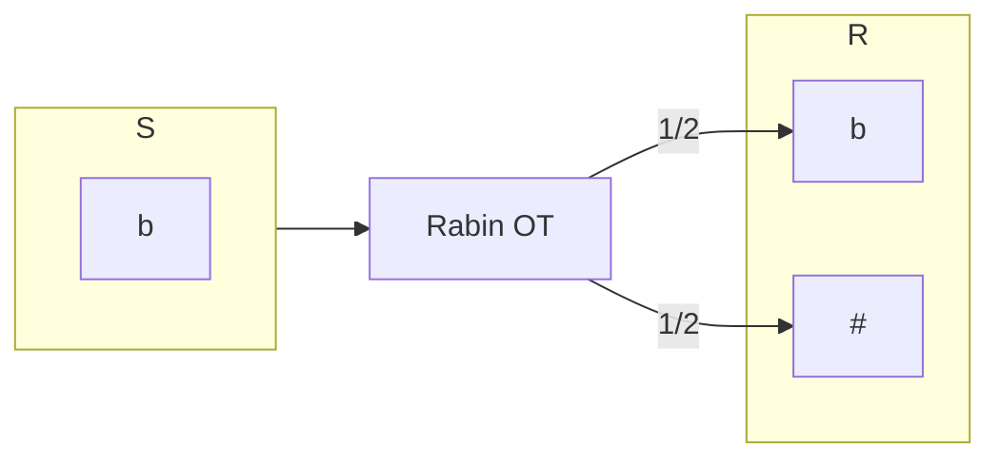
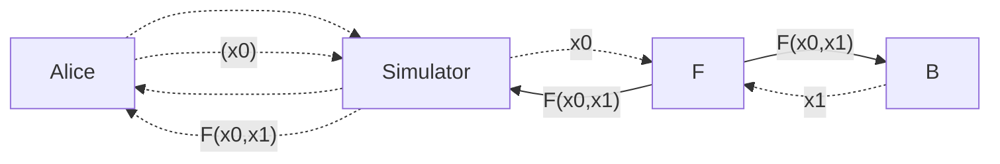

Main motivation that blew my mind when started learning about OT was that it could be used by multiple parties to compute arbitrary functions. It's one of the most basic primitive in [[mpc]] that allows building [[gc]], [[pir]],
 
Oblivious transfer: Alice and Bob are two parties allowed to participate. Alice has access to message: $m_{0},m_{1}\in\{ 0,1 \}^{k}$, and Bob wants to know $m_{b}$, where $b\in\{0,1\}$ of its choice. Alice wants to ensure that $m_{1-b}$ remains hidden in the process.

## $\frac{1}{2}-OT$

[Originally](https://en.wikipedia.org/wiki/Oblivious_transfer) introduced by [Rab81][rab81], where sender can send the message with probability 1/2, and thus, it's name as $\frac{1}{2}-OT$.[^1]
- run $\textsf{GenModulus}\to(N,p,q)$ such that $N=pq$ and $p,q$ are prime.
- receiver choose $x\xleftarrow{\$}\{ 1,\dots,N-1 \}$, where $\gcd(x,N)=1$, compute $t=x^2 \mod{N}$.
- Sender knowing, $p,q$ computes $s=\sqrt{ t }$, and send to R.
	- Note: there are four values possible for $t$, i.e. $\pm x,\pm y$. Sender chooses 1 out of 4 randomly.
- Receiver factors $N$, if $t=\pm y$ as $\gcd(N,x+s)$ OR $\gcd(N,x-s)$.
- $\Pr[t=\pm y]=\frac{1}{2}$.

$\frac{1}{2}-OT$ implies $\left(\array{2\\1}  \right)-OT$: Proven in [Cre87][cre87].

## OT variations

Simple 1-2 OT: sender has two messages, and receiver receives 1 out of 2 messages. Mainly used for secure evaluation of [[gc|GC]].

> [!info] Oblivious Key Generation:[^2]
> Apart from the 3 PKE method: $\textsf{Gen,Enc,Dec}$, introduce a new $\textsf{OGen}(r)\to pk$. For $\textsf{OGen}$ to be secure, it needs to have 3 properties:
> -  No efficient adversary $\mathcal{D}$ such that $\mathcal{D}(pk_{b})\to b$, where $pk_{0}\leftarrow\textsf{Gen}(\cdot)\enspace;\enspace pk_{1}\leftarrow\textsf{OGen}(\cdot)$.
> - A preimage sampling algorithm $\textsf{OGen}^{-1}$ such that $pk\leftarrow\textsf{OGen}(r),r'\leftarrow \textsf{OGen}^{-1}(pk)$, then $\textsf{OGen(r')}=pk$, and $r'$ is uniformly distributed.
> - CPA security of $pk\leftarrow\textsf{OGen}(\cdot)$.
> 
> These can be used to prove 2 properties:
> - no efficient $\mathcal{A}$ exists such that $sk\leftarrow\mathcal{A}(r)$, where $\textsf{Gen}(sk)=\textsf{OGen}(r)$.
> - No efficient $\mathcal{D}$ such that $\Pr[\mathcal{D}(r,\textsf{Enc}(pk,m_{0}))=b]$ is noticeable, i.e. no PPT distinguisher that can distinguish between $c_{0},c_{1}$.

Let's consider a simple 1-2 OT using [[elgamal-pke]] (Ideally, any CPA secure PKE, with Oblivious Key Generation (OKE) can be used):
- Two parties involved are Alice, Bob. Alice has two messages $m_{0},m_{1}$, and Bob wants to know one of both.
- Bob generates two keys: Run ElGamal *KeyGen* to generate a public, private key pair: $(pk_{b},sk)\leftarrow\textsf{Gen}(1^{n})$, and choose another public key uniformly: $pk_{1-b}\xleftarrow{\$}\textsf{OGen}(r)$. Send $pk_{0},pk_{1}$ to Alice.
- Alice encrypts both messages: $c_{0}:=\text{Enc}_{pk_{0}}(m_{0}),c_{1}:=\text{Enc}_{pk_{1}}(m_{1})$. Send $c_{0},c_{1}$ to Bob.
- Bob decrypts $m_{b}:=\text{Dec}_{sk_{b}}(c_{b})$.

> [!question] Prove receiver's security for unbounded sender.
> Here, $\textsf{Samp}$ is a oblivious samplable public key, and both $\textsf{Gen,Samp}$ is identically distributed, it means Sender's view is identical with respect to a simulator that samples a public private key pair for $pk_{1-b}$.

> [!question] Prove sender's security for *computationally bounded semi-honest receiver*.
> Since CPA secure PKE is used to encrypt both messages, a receiver on getting $c_{0},c_{1}$ is able to know both $m_{0},m_{1}$ with probability $\frac{1}{2}+\text{negl}(n)$, where $n$ is the security parameter. To prove this, run a reduction proof with adversary $\mathcal{A}'$ that is able to break CPA security of ElGamal PKE, by running adversary $\mathcal{A}$ as a subroutine and simulating honest OT sender.
> Note that if receiver is malicious than it could generate $pk_{1-b}$ such that it knows the secret key, and then, can decrypt $c_{1-b}$.

Above construction is secure in the Ideal-world model, if no malicious adversary exists. So, let's consider a protocol secure in real-world model.

- [RSA](https://en.wikipedia.org/wiki/Oblivious_transfer)
- Bellare-Micali OT
- Naor-Pinkas OT

**1-N OT:** sender has N messages, $m_{1},\dots,m_{n}$, and receiver receives 1 out of N message of its choice. Mainly used in [[pir|PIR]].

**k-N OT**: sender has N messages $m_{1},\dots,m_{N}$, and receiver wants to receive k out of N message of its choice. Mainly used in [[psi|PSI]].

## [OT Extensions](https://nishkum.github.io/files/OT_extension.pdf)

Generally, OT is performed in batches with multiple $m$ OTs for $l-$bit strings represented as $OT^{l}_{m}$. Extension protocols were developed analogous to Hybrid protocols in [[pk-encryption|PK cryptography]]. So, less OTs have to be performed and keys shared are extended using symmetric cryptographic primitives.

- random OT (ROT): functionality samples two strings for sender: $r_{0},r_{1}\in\{ 0,1 \}^{l}$, with receiver bit as $b$. after the protocol, sender receives $r_{0},r_{1}$ while receiver gets $r_{b}$.
	- With ROT, $ROT_{l}^{m}\to OT_{l}^{m}$ by $\mathcal{S}$ sending $x_{0}^{i} \oplus r_{0}^{i},x_{1}^{i} \oplus r_{1}^{i}$ to receiver
	- Same can be done, if receiver chooses another bit for message.
- correlated OT (COT): Let's say the difference between both messages is $x_{0}\oplus x_{1}=\Delta$.
	- $S\to COT: \Delta$ while $R\to COT: r_{b}$
	- $COT\to S:(r,r \oplus \Delta);COT\to R:(r \oplus b \Delta)$.
	- Using this, $ROT_{l}^{m}\to COT_{k}^{m}$, i.e. output of COT can be extended to $l-$bit strings using [[random-oracle-model|random oracle]].

## Practical Protocols

Let's review [CO15][CO15] protocol that uses 1-N $OT_{l}^{m}$ using $ROT_{l}^{m}$ extension:
- Work in set $S$, and group $G:(\mathbb{G},B,p,+)$
- Use a hash function: $H:(\mathbb{G}\times \mathbb{G})\times \mathbb{G}\to \{ 0,1 \}^{k}$ to derive a k bit key from group element.
- want to implement m $(\array{n\\1})-OT$ for $l-$bit messages.
- Receiver $\mathcal{R}$ has indices $(c^{1},\dots,c^{m})\in[n]^{m}$, i.e. vector of length $m$ with each value in $[0,n-1]$
- Sender $\mathcal{S}$ has n-length vector of l-bit messages $\{ (M_{0}^{i},M_{1}^{i},\dots,M_{n-1}^{i}) \}_{i\in[m]}$.
- At the end, $\mathcal{R}$ receives m-length vector of l-bit strings $(z^{1},\dots,z^{m})$ such that $z^{i}=M^{i}_{c^{i}}$.
- first they use Random OT to share keys between sender and receiver.
	- **Setup**: $y\leftarrow\mathbb{Z}_{p}$, calculate $S=y\cdot g,T=y\cdot S$, send $S$ to $\mathcal{R}$.
	- **Choose**: Receiver samples $\forall i\in [m]:x^{i}\leftarrow\mathbb{Z}_{p}$, compute $R^{i}=c^{i}S+x^{i}B$, and send $R^{i}$ to $\mathcal{S}$.
	- **Key Derivation**: 
		- $\mathcal{S}$ computes $\forall i\in[m],\forall j\in[n] k_{i}^{j}=H_{(S,R^{i})}(yR^{i}-jT)$
		- $\mathcal{R}$ computes $\forall i\in[m],\forall j\in[n]:H_{(S,R^{i})}(x^{i}S)$
	- at the end of the protocol, $k^{i}_{R}=k^{i}_{c^{i}}$, i.e. both $\mathcal{S,R}$ has same keys for required indices, and it's impossible for any $\mathcal{S}^{*}$ to guess $c^{i}$.
- `ROT -> SOT`: add a transfer phase to the protocol. $\mathcal{S}$ sends encryption of messages to receiver
- **Transfer**: $\mathcal{S}$ compute encryption for all messages: $\forall i\in [m],\forall j\in [n]:e^{i}_{j}=E(k^{i}_{j},M^{i}_{j})$ and sends to $\mathcal{R}$
- **Retrieve**: $\mathcal{R}$ decrypts chosen messages: $\forall i\in[m]: z^{i}=D(k^{i},e^{i}_{c^{i}})$

Questions:
- how to realise H?
- how to realise symmetric encryption E?

Let's review Naor-Pinkas OT:
- introduced 1-out-of-N protocol using [[prg,prf,prp#Pseudorandom functions]] and 1-2 OT. Provides security against semi-honest receiver.

[IKNP03][IKNP03]:
- 

## SFE

Let's look at how to evaluate functions securely using OT. Since, OT is a complete protocol, it can be used to do secure 2PC for any function.

### XOR
our aim is to evaluate $a\oplus b$.
- any participating party will know about the contents of the other party, thus, it's possible to just share the bits between the two to compute xor.

- To prove that protocol is secure, then there should exists simulator for both parties that **simulates real world** for semi-honest adversary in ideal-world model $\widehat{Alice},\widehat{Bob}$.
> [!note] $\widehat{P}$ is used to denote semi-honest adversary, and $P$ is an honest adversary.
- So, the simulator will do bogus communication with adversary to satisfy the transcript, then it'll extract bit $x_{0}$ from the transcript, and send to $F$ functionality, which computes $F(x_{0},x_{1})$ and sends to simulator.
- Simulator forwards this to adversary.
- The protocol is secure, if view of adversary is indistinguishable from real world protocol.
$$
\exists \space\text{S s.t. (View}_{\widehat{P}_{1_{real}}},\text{Selection}_{P_{2_{real}}})\approx(\text{View}_{\widehat{P}_{2_{ideal}}},\text{Selection}_{P_{1_{ideal}}})
$$
- To prove that computation of XOR is secure, consider real world protocol, where A sends $a$ to B, and B sends $b$ to A.
- Now, in real world, let's consider a simulator for $A$, that extracts $a$ from transcript, sends to $F_{\textsf{XOR}}$, gets back $a\oplus b$, computes $a\oplus a\oplus b$, sends $b$ to $A$.
- Observe that view of $\widehat{A}_{ideal}$ with $S$ is indistinguishable from $\widehat{A}_{real}$, and $\text{output}_{B_{ideal}}\sim \text{output}_{B_{real}}$.

### AND: $a \wedge b$
- For AND, it's not possible to just share the bits, as the other party can't compute $b$ from $a,a \wedge b$.
- Let's first create the ideal world $F_{AND}$ functionality:
	- gets $a$ from $A$, and $b$ from B.
	- compute $a \land b$, sends to $A,B$.
- Real world functionality:
	- Alice calculates $a \wedge 0,a \land 1$, sends to i**deal-world** $F_{\array{1\\2}OT}$.
	- gets $b$ from $B$, sends $a \land b$ to $B$.
	- B sends $a \wedge b$ to A.
- Let's consider a simulator $S_{1}$ for A in ideal world.
	- $S_{1}$ can extract $a$ from $a \land 0, a \land 1$ in the transcript.
	- sends to $F_{AND}$, gets $a \land b$.
	- sends back to $A$. $B$'s simulator acts similarly.
- from $A$'s perspective, $\widehat{A}_{real}\sim \widehat{A}_{ideal}$ and $\text{output}_{{B}_{real}}\sim \text{output}_{B_{ideal}}$.

> [!info] Composability: Use of 1-2 ideal world OT in previous protocol for real-world protocol is called Composability, where an already 2PC secure protocol can be substituted.

### Arbitrary Computation

For doing any arbitrary computation on boolean circuits, 2-2 secret sharing is used to split the shares of boolean bit, so that no intermediate value of a gate can be used to infer input values.[^3] 
- To split a bit $b$, choose a random $r$, send $r \oplus b$ to $A$, $r$ to B.

Suppose $A$ has $a_{1},a_{2}$, and $B$ has $b_{1},b_{2}$
- XOR: compute $(a_{1}\oplus b_{1})\oplus(a_{2}\oplus b_{2})$
	- take individual shares and compute xor, i..e $a_{1}\oplus a_{2}$, $b_{1}\oplus b_{2}$
	- share the results with other party.
- AND: compute $(a_{1}\oplus b_{1})\land(a_{2}\oplus b_{2})$, 
	- distribute
	- perform $F_{AND}$ on $a_{1}\land b_{2},a_{2}\land b_{1}$

## References

- [CS598DK: Special Topics in Cryptography](https://courses.grainger.illinois.edu/cs598dk/fa2019/Files/lecture07.pdf)
- [Don’t overextend your Oblivious Transfer](https://blog.trailofbits.com/2023/09/20/dont-overextend-your-oblivious-transfer/)
- [Secure Computation Lecture Series](https://www.youtube.com/watch?v=idxotQw27RU&list=PLgMDNELGJ1Ca3l-xioOzN86BIZ2a0N8Ds&index=49)
- [Actively Secure 1-out-of-N OT Extension with Application to Private Set Intersection](https://eprint.iacr.org/2016/933.pdf)
- [A simple generic construction to build oblivious transfer protocols from homomorphic encryption schemes](https://eprint.iacr.org/2020/647)
- [Efficient Batched Oblivious PRF with Applications to Private Set Intersection](https://eprint.iacr.org/2016/799)
- [EMP-OT](https://github.com/emp-toolkit/emp-ot)
- [Ferret: Fast Extension for coRRElated oT with small communication](https://eprint.iacr.org/2020/924.pdf)
- [Actively Secure OT Extension with Optimal Overhead](https://eprint.iacr.org/2015/546.pdf)
- [Supersonic OT: Fast Unconditionally Secure Oblivious Transfer](https://eprint.iacr.org/2024/1012.pdf)
- [A Survey of Oblivious Transfer Protocol](https://www.jiit.ac.in/dvv-naac/Criteria-3-DVVs/3.4.6/CS_IT/21VIASCSIJ01.pdf)
- Post Quantum OT:
	- [Endemic Oblivious Transfer](https://eprint.iacr.org/2019/706.pdf)
- [sdiehl: OT](https://github.com/sdiehl/oblivious-transfer)
- [OSU-Crypto: libOTe](https://github.com/osu-crypto/libOTe)

[RC99]: <https://link.springer.com/article/10.1007/s001459910006>
[IKNP03]: <https://iacr.org/archive/crypto2003/27290145/27290145.pdf>
[CO15]: <https://eprint.iacr.org/2015/267.pdf>
[ALSZ16]: <https://eprint.iacr.org/2016/602.pdf>
[KOS15]: <https://eprint.iacr.org/2015/546.pdf>
[RAB81]: <https://eprint.iacr.org/2005/187.pdf>
[Cre87]: <https://link.springer.com/chapter/10.1007/3-540-48184-2_30>

[^1]: <https://www.cs.jhu.edu/~susan/600.641/scribes/lecture13.pdf>
[^2]: <https://users-cs.au.dk/orlandi/crycom/4-ObliviousTransfer-Passive.pdf>
[^3]: <https://web.cs.ucla.edu/~rafail/Lecture10.pdf>