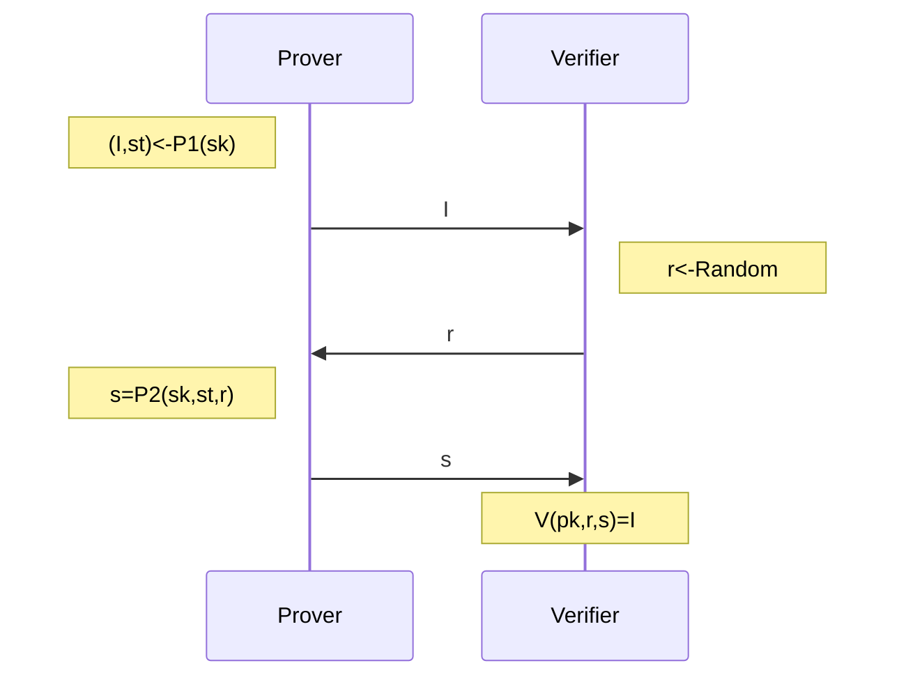

## Identification protocol

Identification protocol is different than signature scheme as identification protocol is used to identify that prover holds the private while signature scheme is used to verify that the holder indeed used the private key to sign the message and generate the signature.

Steps followed in schnorr identification protocol:

### Properties
- **Correctness**: Honest Prover should be able to convince a Honest verifier that it knows the secret.
- **Soundness**: Malicious Prover (doesn't know secret) shouldn't be able to convince a Honest verifier with non-negligible probability.
- **Non-Degeneracy**: there should be enough initial values $I$ or in other words, for a fixed $sk$ and $I$, $\Pr[\mathcal{P}_{1}(sk)\to I]\leq \text{negl}(n)$.

> [!info] Identification Experiment $\textsf{Ident}_{\mathcal{A},\Pi}(n)$:
> - $\textsf{Gen}(1^{n})\to(pk,sk)$.
> - $\mathcal{A}$ is given $pk$ and given access to a $\textsf{Trans}(\cdot)$ oracle that can give transcript $(I,r,s)$ of an honest execution of the protocol.
> - $\mathcal{A}$ outputs $I$, and is given a uniform $r\leftarrow \Omega_{pk}$ to which $\mathcal{A}$ responds with $s$.
> - experiment succeeds if $\mathcal{V}(pk,r,s)=I$.

$$\Pr[\textsf{Ident}_{\mathcal{A},\Pi}(n)=1]\leq \text{negl}(n)$$

Not feasible, requires interaction from *verifier*. Also not publicly verifiable as both parties have to be involved.

[FS86](https://link.springer.com/chapter/10.1007/3-540-47721-7_12) introduced [[fiat-shamir|Fiat-Shamir]] which transforms identification protocols to signatures. Later, it was recognised by [PS96](https://link.springer.com/chapter/10.1007/3-540-68339-9_33) that this can be generalised to any interactive protocol with negligible soundness to turn it into non-interactive protocol.

> [!question] Prove any signature scheme instantiated from an identification scheme and Fiat-Shamir transcript is secure if underlying identification scheme is secure.

## Schnorr Digital Signature

Schnorr's Identification Scheme $\Pi=(\textsf{Gen},\mathcal{P_{1},P_{2},V})$. Let there be two parties $A$ (Prover) and $B$ (Verifier):
1. A runs $\textsf{Gen}(1^{n})\to (pk,sk)$. Let private key be $x$ and public key = $Gx (mod N)$
2. Generates random value using $\mathcal{P}_{1}$, $Y = Gy (mod N)$
3. $Y$ is sent to B
4. B generates random challenge $c$, and send to A
5. A sends back: $z = y + xc$
6. B verifies: $z.G = y.G + c.x.G = Y + c.PK$

Security of Schnorr's identification scheme depends on [[dlp|Discrete Logarithm Problem]]. So, if an adversary is able to forge a signature, it can also break DLP.

> [!question] Passive adversarial approach doesn't work, i.e. access to honest transcript is of no use. Why?

Used to implement ==*Proof of Knowledge*==. Used in cryptography to prove to verifier that prover knows some value $x$. Verifier gets convinced that they are communicating with the prover without verifier’s knowledge of private key and prover is in fact, right about his private key.

Features:

1. faster than ECDSA as doesn’t have to calculate $1/s$
2. linear

But this also proposes other disadvantages that this signature scheme can’t be used for aggregation and multi-sigs due to its linearity.

> Non-interactive Schnorr identification protocol also exists using Fiat-Shamir transformation where challenge $c$ is not generated by verifier but $c = H(g, q, h, u)$ where g: generator, q: prime number, h: public key, u: public key of random nonce

### Proving Schnorr Signatures Are Zero-knowledge

Proving **completeness** is the easiest part in protocol, i.e. if the prover performs protocol honestly, verifier is able to verify it by just substituting g in schnorr signatures.

**Soundness** is done through another algorithm called ***extractor*** which is able to extract secret of the prover by tricking it. Note: it doesn’t actually reveal the secret but only proving that extractor can extract the secret by duping prover. Done through [[forking-lemma|replay attack]] on schnorr protocol.

> [!note] Construct an algorithm $\mathcal{A}'$ running $\mathcal{A}$ attacking Identification scheme $\Pi$ as subroutine.
>  - Answers $\textsf{Trans}$ queries of $\mathcal{A}$ uniformly.
>  - $\mathcal{A}$ outputs $I$. $\mathcal{A}'$ chooses $r_{1}$ uniformly, sends to $\mathcal{A}$ which outputs $s_{1}$.
>  - Rewinds $\mathcal{A}$ to challenge generation point with same randomness. Returns $r_{2}$ and gets $s_{2}$ as response from $\mathcal{A}$.
>  - if $r_{1}\neq r_{2}$ and $g^{s_{1}}\cdot h^{-r_{1}}=I=g^{s_{2}}\cdot h^{-r_{2}}$, then calculates secret key as $[(s_{1}-s_{2})\cdot(r_{1}-r_{2})^{-1}\mod{q}]$.
> Reason why Probability is negligible.

**Zero-Knowledgness** is proven through a *simulator* which has no knowledge of the the secret and yet it is able to convince every verifier into believing that the statement is true. This has an assumption that *verifier* is **honest**, i.e. **HVZK**. Done through rewinding a verifier so that prover knows challenge $c$ and forging false signature on the basis of it.

## references

- [Schnorr's identification protocol](https://www.zkdocs.com/docs/zkdocs/zero-knowledge-protocols/schnorr/)
- [Introduction to Schnorr Signatures](https://tlu.tarilabs.com/cryptography/introduction-schnorr-signatures)
- [CS355: Lecture 5](https://crypto.stanford.edu/cs355/19sp/lec5.pdf)