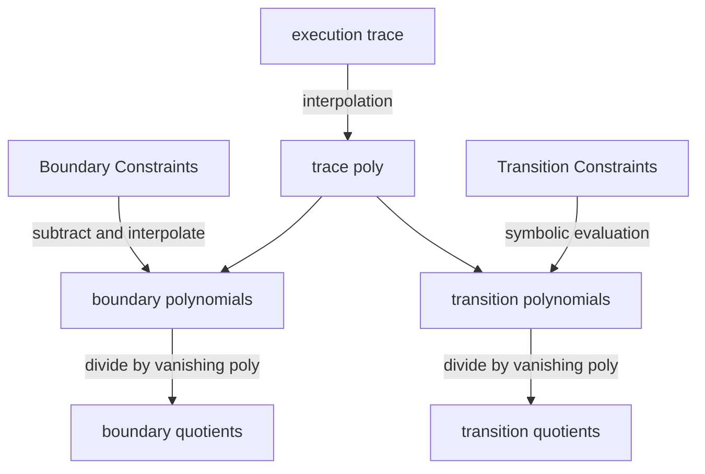

## AIR **(Arithmetic Intermediate Representation)**

arithmetic because execution trace is list of rows $T$, and columns $\textsf{w}$, where value in each cell is finite field element, and constraints can be expressed as a **low-degree polynomial**. It’s an intermediate representation in the process of converting a computation to **IOP** which is then proven using any polynomial commitment scheme, in case of STARKs, is [[fri-pcs|FRI]].

**AET (Algebraic Execution Trace)** consists of $T\times \textsf{w}$ where $T$ is number of cycles in the computation and $\textsf{w}$ stands for total different registers involved in state transitions.

state transition function: $f: \mathbb{F}_p^{\textsf{w}} \times \mathbb{F}_p^{\textsf{w}}$, represents state at next cycle as a function of state at previous cycle

boundary conditions: $\mathcal{B} \subseteq \mathbb{Z}_T \times \mathbb{Z}_\mathsf{w} \times \mathbb{F}_p$, enforces correct values in registers

Computational integrity claim: state transition function and boundary conditions

AET, $W$: witness to claim. claim is true if witness $W$:

- satisfies state transition for every cycle: $\forall i \in {0, \ldots, T-2}: f(W_{[i,:]}) = W_{[i+1,:]}$
- satisfies boundary conditions: $\forall(i,w,e)\in \mathcal{B}\cdot W_{[i,w]} = e$

state transition function is encoded as a list of polynomials: $\mathbf{p}(X_0, \ldots, X_{\mathsf{w}-1}, Y_{0}, \ldots, Y_{ \mathsf{w}-1})$ such that $f(x) = y \iff p(x,y)=0$. Let’s say there are $r$ **state transition verification poly**, then transition constraints are added as:

$$\forall i \in [0,T-2] \cdot \forall j \in [0,r-1] \cdot p_{j}(W_{[i,0]},\ldots,W_{[i,\textsf{w}-1]},W_{[i+1,0]},W_{[i+1,\textsf{w}-1]})=0$$

these can be used to convert any high degree state transition poly to low degree state transition verification poly. In below example: state transition poly is represented as $f(x) = x^{p-2}$ but state verification poly can be represented as $p(x,y)=(x(xy-1),y(xy-1))$ which is of degree 2 only.

$$ x \mapsto \left\lbrace \begin{array}{cl}x^{-1} & \Leftarrow x \neq 0 \\0 & \Leftarrow x = 0 \end{array} \right.$$

### Interpolation

To prove compuational integrity as per the claim described above, we need to convert constraints into polynomials.

evaluation domain: $\omega \in \mathbb{F}_p$, generator of root of unity in the field. it’s this size which is smaller than FRI evaluation domain by blowup factor $\rho^{-1}$.

Trace polynomials: $t(X) \in (\mathbb{F}_{p}[X])^{w}$, list of $\textsf{w}$ univariate polynomials such that $\forall i \in [0,T]: t_w(\omega^i) = W[i,w]$

These trace poly satisfies computational integrity through:

- boundary constraints: $\forall (i, w, e) \in \mathcal{B} \, . \, t_w(\omicron^i) = e$
- transition constraints: $\forall i \in { 0, \ldots, T-2 } \cdot \forall j \in { 0, \ldots, r-1 } \cdot p_j(t_0(\omega^i), \ldots,t_{\mathsf{w}-1} (\omega^i), t_0(\omega^{i+1}), \ldots, t_{\mathsf{w}-1}(\omega^{i+1})) = 0$



Prover doesn’t need to commit to trace polynomials because what prover actually is proving is the relationship between boundary quotients and transition quotients.

> Traveling from the boundary quotients to the transition quotients, and performing the indicated arithmetic along the way, establishes this link.

transition constraint is a multivariate polynomial, evaluated symbolically at trace polynomials to get transition polynomials. let’s take example of rescue-prime hash stark to see how transition constraints are created:

### Adding zero knowledge

To add zero knowledge to IOP, we need two things:

- FRI degree bound proof is randomised by adding a randomised codeword to non-linear combination. sampled by generating coefficients of polynomial randomly and then evaluating on fri domain.
- Linking part between boundary quotients and transition quotients. To randomise this, trace for every registered is extended with 4s uniformly random field elements, where s stands for number of colinearity check queries.
    > The two values of the transition quotient codeword need to be linked two four values of the boundary quotient codewords.
    don’t understand this
Now, to create a poly iop:

Prover:

- interpolate the execution trace to get trace polynomials
- get boundary interpolants from boundary points
- subtract boundary interpolants from trace polynomials to get boundary polynomials
- divide by vanishing poly to get boundary quotient, commit to quotients
- get $r$ from verifier and combine all transition constraints into one master constraint
- take transition constrains and symbolically evaluate them in trace polynomials to get transition polynomials
- divide by vanishing poly to get quotients
- commit to randomiser polynomial
- sample random weights for non linear combination
- create non linear combination of transition quotient, boundary quotient and randomiser polynomial with weights sampled randomly
    

- prove low degree using fri for combination codeword
    - run fri on all committed polys: boundary quotient, transition quotient, transition zerofier
- commit to zerofier
- give merkle roots and authentication paths to verifier
    - for boundary quotients
    - for randomiser polynomial

Verifier (not entirely clear to me):

- Read the commitments to the boundary quotients.
- Supply the random coefficients for the master transition constraint.
- Read the commitment to the transition quotient.
- Run the FRI verifier.
- Verify the link between boundary quotients and transition quotient. To do this:
    - For all points of the transition quotient codeword that were queried in the first round of FRI do:
        - Let the point be (x,y).
        - Query the matching points on the boundary quotient codewords. Note that there are two of them, x and ο⋅x, indicating points “one cycle apart”.
        - Multiply the y-coordinates of these points by the zerofiers’ values in x and ο⋅x.
        - Add the boundary interpolants’ values.
        - Evaluate the master transition constraint in this point.
        - Divide by the value of the transition zerofier in x.
        - Verify that the resulting value equals y.

## Open questions from FRI & STARK IOP

- what is the need of the offset for coset-FRI?
- what is the meaning of index folding? why folding phase is more secure when codewords are folded at particular index rather than random index at each step?
- when simulating a PCS from FRI: anatomy tutorial creates a new polynomial $g(X) = f(X) + X^{2^k-d-1}f(X)$, and then prove that $deg(g(X)) < 2^k$. Why another polynomial g(X) is required? why specifically 2^k?
    - Maybe because proving low-degree of a polynomial of 2th power is easier than some arbitrary number.

### IOP

- how does transition polynomials look like?
    - in the arithmetization example: fibonacci, or square, or collatz sequence, composition polynomial consisted of boundary polynomials and transition polynomials could be combined in one single poly, but only one transition polynomial was there.
- how does symbolic evaluation takes place?
    ```python
    # symbolically evaluate transition constraints
    point = [Polynomial([self.field.zero(), self.field.one()])] + trace_polynomials + [tp.scale(self.omicron) for tp in trace_polynomials]
    transition_polynomials = [a.evaluate_symbolic(point) for a in transition_constraints]
    ```
    > don’t know
    - why transition constraints are evaluated at trace polynomials to get transition polynomials?
        > don’t know exact answer, but can anticipate that its because $r$ transition polynomials are calculated by evaluating transition constraint at trace polynomials like this: $p_j(t_0(X), \ldots, t_{\mathsf{w}-1}(X), t_0(\omicron \cdot X), \ldots, t_{\mathsf{w}-1}(\omicron \cdot X))$
    - Why is point calculated this way?
        > because transition function is defined in following manner: $p_j(t_0(\omega^i), \ldots,t_{\mathsf{w}-1} (\omega^i), t_0(\omega^{i+1}), \ldots, t_{\mathsf{w}-1}(\omega^{i+1})) = 0$
    - why a `x` polynomial is being added and why another shifted `trace_polynomials` is being added?
        > Another difference is that the transition constraints have $2\textsf{w}+1$ variables rather than $2\textsf{w}$. The extra variable takes the value of the evaluation domain over which the execution trace is interpolated. This feature anticipates constraints that depend on the cycle, for instance to evaluate a hash function that uses round constants that are different in each round.
- why `duplicated_indices` is being created to evaluate boundary quotient at random indices?
    ```python
    duplicated_indices = [i for i in indices]+ [(i + self.expansion_factor) % self.fri.domain_length for i in indices]
    ```
    > find answer to this

### Successors

DEEP-FRI

ALI: algebraic linking

DEEP-ALI
