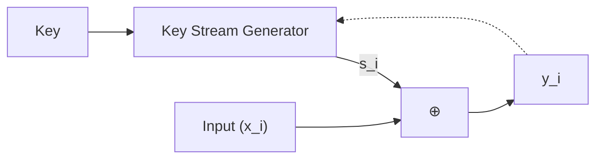

stream ciphers are symmetric encryption cryptography primitives that works on digits, often bits, rather than fixed-size blocks as in [[block-ciphers]].

$$
\begin{align}
\text{Enc}(s,m)=c=G(s)\oplus m \\
\text{Dec}(s,c)=m=c \oplus G(s)
\end{align}
$$

- Plaintext digits can be of any size, as cipher works on bits, i.e. $c,m\in \{ 0,1 \}^{L}$
- $G$ is a PRG that generatoes **Keystream** which is a pseudorandom digit stream that is combined with plaintext to obtain ciphertext.
- Keystream is generated using a seed value using **shift registers**.
- **Seed** is the key value required for decrypting ciphertext.
- Can be approximated as one-time pad (OTP), where keystream is used only once.
- Keystream has to be updated for every new plaintext bit encrypted. Updation of keystream can depend on plaintext or can happen independent of it.
- Types of stream ciphers:
	- Synchronous: when keystream is updated independent of plaintext or ciphertext and depends only on key.
	- Self-synchronizing: uses previous ciphertext digits to update keystream



Notation:
- $x_{i}\in \{ 0,1 \}$ denotes plaintext
- $y_{i}\in \{ 0,1 \}$ denotes ciphertext
- $s_{i}\in \{ 0,1 \}$ denotes keystream

Now, encryption in stream ciphers is just XOR operation, i.e. $y_{i}=x_{i} \oplus s_{i}$. Due to this, encryption and decryption is the same function which. Then, comes the major question:

- why XOR is enough for encrypting?
	- probability of guessing operand $x_{i}$ from $y_{i}$ is exactly 50%, and that's evident from xor's truth table

| x   | xor | y   |
| --- | --- | --- |
| 0   | 0   | 0   |
| 0   | 1   | 1   |
| 1   | 0   | 1   |
| 1   | 1   | 0   |

- how keystream is created?
	- keystream should be completely random to prevent any cryptanalysis attacks and it's the main security talking point in any stream cipher.

- true random number generator
- pseudo random number generator: $s_{0}=\text{seed}\space;\space s_{i+1}=f(s_{i})$, often $f=a\cdot s_{i}+b \mod m$
- cryptographically secure random number generator: additional property that given bits $s_{i},s_{i+1},\dots,s_{i+n-1}$, next subsequent bits are unpredictable, i.e. no polynomial time algorithm exist that has probability > 50% to detect next bit.
- unconditional security: attacker can't break the algorithm even with infinite computation resources
- stream ciphers using PRNGs are insecure due to linearity of the algorithm used, and if the attacker knows some initial ciphertext and plaintext bits, which can be used to derive next set of keys in PRNGs.

## Linear Feedback Shift Registers (LFSR)

Stream ciphers mainly rely on generating long pseudorandom sequences of keystream, which can be made possible using shift registers.

- LFSR consists of flip-flops and feedback path
- degree of LFSR = number of flip-flops

- a simple example from [Understanding Cryptography textbook][uct], degree of LFSR = 3, as it has 3 flip flops namely, $FF_{0},FF_{1},FF_{2}$.
	
- initialised with state: $s_{0},s_{1},s_{2}$, with next state calculated as: $s_{3}=s_{1}+s_{0} \mod{2}$, or more generally, $s_{i+3}=s_{i}+s_{i+1} \mod{2}$
- this form a cycle of some length, in this example, it forms a cycle of length 6.

A more general $m-$degree LFSR includes *feedback coefficients* $p_{0},\dots,p_{m-1}$, $m$ flip-flops, with initial state $s_{0},s_{1},\dots,s_{m-1}$:

$$
s_{m}\equiv s_{m-1}p_{m-1}+\dots+s_{1}p_{1}+s_{0}p_{0} \mod{2}
$$

and next state calculated as:

$$
s_{i+m}\equiv \sum_{j=0}^{m-1}p_{j}s_{i+j}\mod{2};\qquad s_{i},p_{j}\in\{ 0,1 \};\space \forall i\in\{ 0,1,\dots \}
$$

- maximum period length: $2^{m}-1$, where $-1$ comes from the exclusion of state when all state is 0.
- maximum state period length comes when feedback coefficients form a irreducible polynomial of degree $m$.
- an attacker can plan known-plaintext attack against single LFSR when she knows $2m$ plaintext and ciphertext bits by forming m linear equations with $p_{i}$ as unknown variables.

## Trivium

Trivium diagram taken from [Understanding Cryptography textbook][uct]


- consists of 3 shift registers with combined state of 288-bits, $A,B,C$ each with $93,84,111$ bits of state
- output of one is input of the other.
- specifications is based on 4 things:
	- number of registers
	- feedback bit
	- feedforward bit
	- 2 and-bit
- input of each register is based on xor of feedback bit and output of previous register
- output of each register is based on xor of:
	- and bits
	- last bit
	- feedforward bit
- initial state is initialised based on initialisation vector 80-bit $IV$ and 80-bit key $k$
- feedforward bit provides the non-linearity in the cipher
- IV is loaded in leftmost 80 bits of $A$, key is loaded in leftmost 80 bits of $B$
- warm up phase runs 4*288=1152 times.

> [!question] 
> - which bit is selected for and, feedforward and feedback bits? what criteria is used for security purposes?
> - how IV and key bit length are chosen?
> - 

Initialisation vector are usually called nonces (number used once), and they are just bits that are used to randomise the internal state of the cipher so that even with same key, cipher doesn't output the same key stream.

## [Salsa][salsa]/[ChaCha][chacha]

- ChaCha's core is a permutation $P$ that operates on 512-bit strings
- operates on ARX based design: add, rotate, xor. all of these operations are done 32-bit integers
- $P$ is supposed to be secure instantiation of *random permutation* and constructions based on $P$ are analysed in *random-permutation* model.
- using permutation $P$, a pseudorandom function $F$ is constructed that takes a 256 bit key and 128-bit input to 512-bit output with a 128-bit *constant*.

$$
F_{k}(x)\xlongequal{def} P(\text{const} \parallel k \parallel x)\boxplus \text{const} \parallel k \parallel x
$$

Then, chacha stream cipher's internal state is defined using $F$ with a 256-bit seed $s$ and 64-bit initialisation vector $IV$ and 64-bit nonce that is used only once for a seed. Often defined as a 4x4 matrix with each cell containing 4 bytes:

|         |         |        |        |
| ------- | ------- | ------ | ------ |
| "expa"  | "nd 3"  | "2-by" | "te k" |
| Key     | Key     | Key    | Key    |
| Key     | Key     | Key    | Key    |
| Counter | Counter | Nonce  | Nonce  |


Let's define what happens inside $F$, it runs a quarter round that takes as input 4 4-byte input and apply constant time ARX operations:

```
a += b; d ^= a; d <<<= 16; 
c += d; b ^= c; b <<<= 12; 
a += b; d ^= a; d <<<= 8; 
c += d; b ^= c; b <<<= 7;
```

quarter round is run 4 times, for each column and 4 times for each diagonal. ChaCha added diagonal rounds from row rounds in Salsa for better implementation in software. Quarter round by itself, is an invertible transformation, to prevent this, ChaCha adds initial state back to the quarter-round outputs.

This completes 1 round of block scrambling and as implied in the name, ChaCha20 does this for 20 similar rounds. [ChaCha family][chacha-family] proposes different variants with different rounds, namely ChaCha8, ChaCha12.

Nonce can be increased to 96 bits, by using 3 nonce cells. [XChaCha][xchacha] takes this a step further and allows for 192-bit nonces.

```
#define ROT_L32(x, n) x = (x << n) | (x >> (32 - n))
#define QUARTERROUND(a, b, c, d)       \
    a += b;  d ^= a;  ROT_L32(d, 16);  \
    c += d;  b ^= c;  ROT_L32(b, 12);  \
    a += b;  d ^= a;  ROT_L32(d,  8);  \
    c += d;  b ^= c;  ROT_L32(b,  7)

// Save the block in a temporary buffer
uint32_t tmp[16];
for (int i = 0; i < 16; i++) {
    tmp[i] = block[i];
}

// Scramble the block
for (int i = 0; i < 10; i++) { // 20 rounds, 2 rounds per loop.
    QUARTERROUND(block[0], block[4], block[ 8], block[12]); // column 0
    QUARTERROUND(block[1], block[5], block[ 9], block[13]); // column 1
    QUARTERROUND(block[2], block[6], block[10], block[14]); // column 2
    QUARTERROUND(block[3], block[7], block[11], block[15]); // column 3
    QUARTERROUND(block[0], block[5], block[10], block[15]); // diagonal 1
    QUARTERROUND(block[1], block[6], block[11], block[12]); // diagonal 2
    QUARTERROUND(block[2], block[7], block[ 8], block[13]); // diagonal 3
    QUARTERROUND(block[3], block[4], block[ 9], block[14]); // diagonal 4
}

// Add the unscrambled block to the scrambled block
for (int i = 0; i < 16; i++) {
    block[i] += tmp[i];
}
```

Reason for constants:
- prevents zero block during cipher scrambling
- attacker can only control 25% of the block, when given access to counter as nonce as well.

During initial round, counters are initialised to 0, and for next rounds, increase the counter as 64-bit little-endian integer and scramble the block again. Thus, ChaCha can encrypt a maximum of $2^{64}$ 64-byte message. This is so huge, that we'll never ever require to transmit this many amount of data. [IETF][ietf] variant of ChaCha only has one cell of nonce, i.e. 32 bits, and thus, can encrypt a message of $2^{32}$ 64-byte length, i.e. 256 GB. 

Successors:

- XChaCha20
- Authenticated encryption using Poly1305

## references

- [ChaCha](https://cr.yp.to/chacha.html)
- [Salsa](https://cr.yp.to/snuffle.html)
- [Salsa family](https://cr.yp.to/snuffle/salsafamily-20071225.pdf)
- [Cloudflare: Do the ChaCha: better mobile performance with cryptography](https://blog.cloudflare.com/do-the-chacha-better-mobile-performance-with-cryptography/)
- [ChaCha20-design](https://loup-vaillant.fr/tutorials/chacha20-design)
- [Exploring the ChaCha stream cipher](https://musigma.blog/2021/02/06/chacha.html)
- [Too Much Crypto](https://eprint.iacr.org/2019/1492)
- [Lecture Notes on Stream Ciphers and RC4](https://rickwash.com/papers/stream.pdf)

[uct]: <https://www.cryptography-textbook.com/book/>
[ietf]: <https://datatracker.ietf.org/doc/html/rfc8439>
[xchacha]: <https://www.cryptopp.com/wiki/XChaCha20>
[salsa]: <https://cr.yp.to/snuffle.html>
[chacha]: <https://cr.yp.to/chacha.html>
[chacha-family]: <https://cr.yp.to/chacha/chacha-20080128.pdf>