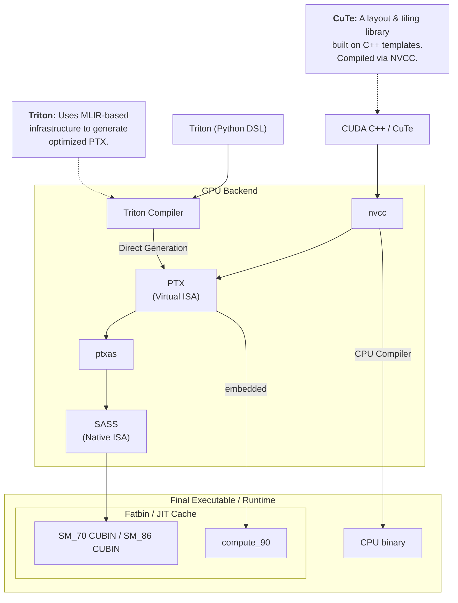

# 1 GPU Design

- Latency vs Throughput oriented design
- SIMT architecture

# 2 Part 1

## 2.1 CUDA

- Kernel: functions executed on the GPU. each warp executes one kernel.
- Grid: multidimensional array of blocks coalescing threads together.
- Block: multidimensional (1D-3D) array of threads. indexed using `blockIdx`
	- \# threads ≤ 1024
	- \# threads = 32x (multiple of 32) due to warp size
	- controlled by `blockDim` variable. set as `dim4 blockDim(256)` or `dim3 blockDim(32, 8)`
- Shared Memory: each block has access to common memory shared between threads inside the block.
- Warp: execution unit containing constant 32 threads. Think of them as SIMD register executing same instruction. GPU *schedules* warps, and not threads.
	> [!question] Why is 32 constant?
	- 32 seems to be a sweet spot for sufficient parallelism and power consumption. This dictates how instruction scheduling, register file design, memory accesses (cache line of 32 x 4 = 128B), power usage.
- Thread: Execution unit with its own register, program counter. Each thread has a unique `threadIdx`

<p align="center"></p>

> [!question] Why is blockDim useful? Why not go with 1D every time?
- Natural thread indexing depending on data geometry. Data that is inherently 2D, will be less error prone, if block dimension is also 2D.
- Memory accesses

<p align="center">
  
</p>

*<center>CUDA thread hierarchy [^1]</center>*

### 2.1.1 CUDA Scheduling Hierarchy


*<center>Minimal GPU architecture [^1]</center>*

Let's go through a typical SM workflow during warp scheduling, but first, we should look at the numbers:

| GPU                     | V100      | A100       | H100       |
| ----------------------- | --------- | ---------- | ---------- |
| Threads/Warp            | 32        | 32         | 32         |
| Max Warps/SM            | 64        | 64         | 64         |
| Max thread blocks/SM    | 32        | 32         | 32         |
| Max 32-bit registers/SM | 65536     | 65536      | 65536      |
| Max registers/thread    | 255       | 255        | 255        |
| Max thread block size   | 1024      | 1024       | 1024       |
| FP32 cores/SM           | 64        | 64         | 128        |
| Shared memory size/SM   | upto 96KB | upto 164KB | upto 228KB |
*Compute capability.[^2]*

So, now let's go through the SM scheduler:
1. Kernel is launched, and grid of blocks is created.
2. Thread blocks are distributed among SMs.
	1. Before becoming a *resident*, an SM check its resources (registers, max warp limit, Shared memory) required for that block.
3. Each *resident* thread block is partitioned into warps.
4. *Ready* state warps are picked up by warp scheduler.
5. SM's warp scheduler loads the program counter. Threads are indexed via predicate masks with the same PC.
6. Registers are populated according the kernel instructions as generated by the compiler.
7. On a LOAD instruction, data is fetched from shared memory/L1.
	1. If the thread is waiting for data from L2/DRAM, SM instantly switches to a different warp. This is where **Latency Hiding** happens.
8. SIMT instruction issued to the whole warp is executed by INT32, FP32, Tensor, SFU (special function units) cores.
9. Output is written back through the cache hierarchy for the STORE instruction.

This thread hierarchy of `thread -> blocks -> grid` makes it easier to abstract the core execution unit, and data distribution across large number of parallel execution units (warps), without worrying about each thread individually. Maximum theoretical parallelism for a typical data centre GPU, say H100, is **294,912** `(144 SMs * 64 warps/SM * 32 threads/warp)`.


```
+--------------------------------------------------+
|       Simplified SM (Hopper architecture)        |
|                                                  |
|             Warp Schedulers (4–8)                |
|                     ↓                           |
|  +--------------------------------------------+  |
|  |   Instruction Dispatch & Issue             |  |
|  +--------------------------------------------+  |
|                     ↓                           |
|  +------------+  +------------+  +------------+  |
|  | FP32 Cores |  | TensorCore |  | FP64 Units |  |
|  | 128 total  |  | 4 per SM   |  |            |  |
|  +------------+  +------------+  +------------+  |
|                                                  |
| +---------------------------------------------+  |
|  Registers (64K × 32-bit)                        |
| +---------------------------------------------+  |
|  L1 Cache / Shared Memory (configurable)         |
|     up to ~228 KB total                          |
+--------------------------------------------------+
```

> [!question] Probable questions
> 1. What are resident thread blocks?
> 2. How is data saved to DRAM? and how is data accessed by each SM per block?
> 3. How does shared memory is used across SMs and blocks in that SM?
> 4. What's the difference between L1 cache and shared memory in an SM?
> 5. What role does L2 cache play since it's commonly distributed across all SMs? How many times is the data refilled, and evicted?
> 6. Can it be possible that some thread in a warp takes more time due to an if branch?
> 	1. If yes, does a warp wait for that thread to complete to execute next instruction?

Let's answer each of these:
1. Thread blocks, before moving to ready state need to be checked for resource acquisition in the SM. Only after sufficient resources (registers, shared memory, max warp per SM limit) is checked, can a block become *resident*.
2. Stored to DRAM by the STORE instruction through the cache hierarchy (shared memory -> L1 -> L2 -> HBM (DRAM)). Accesses also follow the same pattern as CPU, i.e. first caches are checked, on misses, data is fetched from the next memory system.
	1. **Memory coalescing** is one of the ways data locality is achieved for a warp, because, then data is fetched from consecutive chunk of memory, and the hardware doesn't have to break down the request into multiple transactions.
3. Each resident block receives a partition of the shared memory, and every thread inside the block can access that allocated shared memory. It's the canonical way to *communicate* between threads in a block.
4. Shared Memory is declared, and managed by the programmer using `__shared__ float a[64];` while L1 cache is hardware managed to reduce latency of fetched addresses from larger memory system.
5. L2 cache is a much larger (~80MB in H100) and the primary way to communicate between SMs.
6. Due to SIMT architecture for a warp, in an `if/else` branching, thread **divergence** masks some threads to execute no-op, and only the remaining threads execute the instruction.
	1. Yes, since a warp is the execution unit inside an SM, and every thread inside the warp is executing same instruction, all threads essentially executes the last instruction simultaneously.

Next let's understand these:
- memory latency in terms of cycles
- different cores in an SM
- occupancy

## 2.2 Starter Kernels

Let's write some kernels to understand all of the above, and go through the basics of CUDA kernel implementations. I will add a template and kernel functions later with a description of the problem.

You'll learn about following [CUDA runtime API](https://docs.nvidia.com/cuda/cuda-runtime-api/index.html).

Functions:
- `cudaMalloc`: synchronous function that allocates memory on the device from host.
- `cudaMemcpy`
- `cudaFree`
- `kernel<<<gridDim, blockDim>>>(...)`
- Qualifiers:
	- `__global__`: called from host, run on device, must return `void`
	- `__device__`: called from device, runs on device
	- `__host__`: called from host, executes on host

Variables qualifiers:
- `__device__`: stored in global memory (HBM), any variables allocated using `cudaMalloc`. Accessible by all threads.
- `__shared__`: stored in shared memory for each block, very low latency, accessible by all thread in a **block**.
- `__constant__`: constant read-only memory generally stored in L1 cache per thread block in SM.
- `__local__`

### 2.2.1 Basic Template

This template can be modified to be used by any other kernel by modifying the constants, data placeholders, and data handling between host and device.

```cpp
#include <iostream.h>
#include <cuda_runtime.h>

// kernel goes here
__global__ void my_kernel() {
}

int main() {
	// define constants
	int m = 384;
	int n = 128;
	int k = 256;
	
	// define and allocate data placeholders
	float* h_A, h_B;
	h_A = (float*)malloc(m * sizeof(float));
	h_B = (float*)malloc(m * sizeof(float));
	
	// generate random data
	for (int i = 0 ; i < m ; i++) {
		h_A[i] = rand() / (float)RAND_MAX;
	}
	
	// define and allocate the device memory
	float* d_A, d_B;
	cudaMalloc((void**)&d_A, m * sizeof(float));
	cudaMalloc((void**)&d_B, m * sizeof(float));
	
	// only copy the data required for input in the kernel to the device
	cudaMemcpy(d_A, h_A, m * sizeof(float), cudaMemcpyHostToDevice);
	
	// run the kernel
	dim3 blockDim(20,20);
	my_kernel<<<1, blockDim>>>(d_A, d_B, m);

	// copy the result back to host
	cudaMemcpy(h_B, d_B, m * sizeof(float), cudaMemcpyDeviceToHost);
	
	// output the result
	std::cout << "Result of kernel execution:\n";
	for (i = 0 ; i < n ; i++) {
		std::cout << i << " " << h_B[i] << "\n";
	}
	
	// cleanup
	free(h_A);
	free(h_B);
	cudaFree(d_A);
	cudaFree(d_B);
	
	// finish
	return 0;
}
```

<p align="center">
  
</p>
*<center>3D grid hierarchy [^3]</center>*

Kernels are executed on a particular thread, and to access the data for that thread, we need to index the thread according to the block dimension. To understand grid -> block -> thread dimensions hierarchy:
- `x` measures column, `y` measures the row, and `z` measures the height.
- `gridDim.{x,y,z}` represents number of blocks in a grid.
- `blockDim.{x,y,z}` represents number of threads in a block, indexed using `blockIdx.{x,y,z}`.
- `threadIdx.{x,y,z}` is used to index a particular thread in a block.

> [!note] All `__global__` and `__device__` functions have access to these variables.

### 2.2.2 Map2D

Problem: Given input array A, compute A + 10 and write to output array B. 2D block dimension. Number of threads in a block >= array size.

```cpp
__global__ void map2d(float* a, float* b, int width) {
	int row = threadIdx.y;
	int col = threadIdx.x;
	if (row < width && col < width) {
		b[row * width + col] = a[row * width + col] + 10;
	}
}
```

### 2.2.3 MatrixAdd2D

Problem: Given input square matrix A and B, write sum of inidividual elements to output matrix C. 2D grid dimension, 2D block dimension. Number of threads <= array size.
```cpp
__global__ void matrix_add(float *A, float *B, float *C, int M, int N) {
	int row = blockDim.y * blockIdx.y + threadIdx.y;
	int col = blockDim.x * blockIdx.x + threadIdx.x;
	
	if (row < M && col < N) {
		C[row * N + col] = A[row * N + col] + B[row * N + col];
	}
}

int main() {
	// allocation and data generation...
	int m = 400;
	int n = 400;

	// run the kernel with 32(columns)x8(row) block size (wider block)
	dim3 blockDim(32,8);
	dim3 gridDim((n + blockDim.x - 1)/blockDim.x, (m + blockDim.y - 1)/blockDim.y);
	matrix_add<<<gridDim, blockDim>>>(d_A, d_B, d_C, m, n);
	
	// result copied back and memory free
}
```

- Grid dimension = `((n + blockDim.x - 1) / blockDim.x, (m + blockDim.y - 1) / blockDim.y)` = (13, 50)
- Block dimension = (32, 8).

Each block will be divided into 8 warps with each thread accessing the matrices in row-major fashion. Total amount of unused threads = $(13 * 50 * 32 * 8)-(400 * 400)=6400$.

Note that this kernel has coalesced memory accesses. Every thread in a warp will be assigned to a cell in a row, and `3 matrices * 4 byte per float * 32 threads = 384B` data will be moved per transaction in a warp.

### 2.2.4 Matrix Transpose

We're now going to write a more realistic kernel, one that combines our previous learnings:
- Grid and block dimensions
- Coalesced memory accesses
- Shared memory

Problem: Given a matrix A of size MxN, output the transpose of the matrix to output B.

```cpp
#define TILE_DIM = 32

// A = M(m, n) and B = M(n, m)
__global__ void smem_matrix_transpose(float* A, float* B, int M, int N) {
	__shared__ float tile[TILE_DIM][TILE_DIM];
	
	// + 1 is added to prevent bank conflicts
	// __shared__ float tile[TILE_DIM][TILE_DIM+1];
	
	const int row = TILE_DIM * blockIdx.y + threadIdx.y;
	const int col = TILE_DIM * blockIdx.x + threadIdx.x;

	// reads to input matrix A are coalesced
	if (row < M && col < N) {	
		tile[threadIdx.y][threadIdx.x] = A[row * N + col];
	}

	// wait for all threads to perform writes to shared memory before reading to prevent data race
	__syncthreads();

	// place the tile on correct block in the output matrix
	const int transposed_row = TILE_DIM * blockIdx.x + threadIdx.y;
	const int transposed_col = TILE_DIM * blockIdx.y + threadIdx.x;
	if (transposed_row < N && transposed_col < M) {
		B[transposed_row * M + transposed_col] = tile[threadIdx.x][threadIdx.y];
	}
}

int main() {
	int m = 400;
	int n = 500;
	
	// data allocation and generation ...
	
	// run the kernel
	dim3 threadsPerBlock(32, 32);
	dim3 numBlocks((n + threadPerBlock.x - 1)/threadPerBlock.x, (m + threadsPerBlock.y - 1)/threadPerBlock.y);
	matrix_transpose<<<numBlocks, threadPerBlock>>>(d_A, d_B, m, n);
	
	// result and free memory
}
```

We have used a 2D 32x32 tile based shared memory, where input matrix A is copied as-is to the shared memory, and at the time of writing output, we read the tile in transpose manner (column-major).

**Bank conflicts**

You will observe two different tile structures, one with 32x32 and other with 32x33 size. When measured on a consumer grade GPU, the latter is ~20% faster. and the reason stems from how the shared memory stores data for maximum warp access efficiency.

To allow parallel access across all threads in a warp, Shared memory in GPUs consists of 32 banks such that successive 32-bit words in memory map to successive banks.
- Multiple threads accessing different element in a bank are serialized, i.e. if 4 threads are accessing different byte address from same bank, 4 clock cycles are utilised to return values.
- Bank is calculated using `(address / 4) % 32`.
- When reading same address from multiple threads, broadcast is performed on all threads.
	- Writes to same address also doesn't result in conflict, but is undefined, i.e. no guarantee is provided to a particular thread.

$$
\underbrace{
\begin{bmatrix}
\color{red}{0} & 1 & 2 & \cdots & 31 \\
\color{red}{0} & 1 & 2 & \cdots & 31 \\
\vdots & \vdots & \vdots & \ddots & \vdots
\end{bmatrix}
}_{\text{No padding}}
\qquad
\underbrace{
\begin{bmatrix}
0 & 1 & 2 & \cdots & 31 & 0 \\
1 & 2 & 3 & \cdots & 0 & 1 \\
\vdots & \vdots & \vdots & \ddots & \vdots & \vdots
\end{bmatrix}
}_{\text{With } +1 \text{ padding}}
$$

Without padding, for every read from shared memory during writing to output matrix, all thread access the same bank, leading to a 32x slowdown. Adding 1 to the tile row, changes all column banks, aligning the columns for parallel shared memory accesses. To read more about bank conflicts and shared memory swizzling, take a look at the blog by [Lei Mao](https://leimao.github.io/blog/CUDA-Shared-Memory-Swizzling/). I haven't implemented swizzling yet, and may come back to it later. It definitely is more compact and space efficient than padding, but dealing with indices makes it more complicated. [More](https://feldmann.nyc/blog/smem-microbenchmarks) about shared memory banks.

> [!todo] Make the kernel generic on tile capacity and experiment with swizzling.

### 2.2.5 Prefix Scan

For an input array A, output array B such that $B[i] = \bigoplus_{k=1}^{n-1}A[k]$ (exclusive), where $\bigoplus$ is a binary associative operator (assume addition), with identity element 0.

We'll implemented segmented scan as described in PMPP Chapter 11 in three kernels. [^4]

1. Implement two main section-wise parallel algorithms: Kogge-Stone and Brent-Kung
2. Scan the segmented sections to find the final prefix sum for each section.
3. Add the section scan result to the final output.

**Kogge-Stone**: Main idea is to divide the input into block addressable `SECTIONS`, prefix scan kernel performs the computation on this section. We later accumulate these partials sums of each section and update each section.

PMPP[^4] has a really nice explanation of the algorithm along with examples and diagrams. So, I insist that the reader refer the excellent resource. I'll analyze the work and compute efficiency of the kernel to find out further optimizations and compare it with Brent-Kung. ==TODO: add link to the kernel from github.==

```cpp
// Performs section-wise prefix scan using Kogge-Stone algorithm
__global__ void section_prefix_scan_kogge_stone(float *A, float *B, float *AUX, int M) {
	int tid = threadIdx.x;
	int idx = blockDim.x * blockIdx.x + tid;

	// create a dynamic shared memory (length: BLOCK_SIZE) to copy value from input
	extern __shared__ float smem[];
	smem[tid] = idx < M ? A[idx] : 0.0f;

	__syncthreads();

	// run kogge-stone stride based segmented scan
	for (unsigned int stride = 1 ; stride < blockDim.x ; stride <<= 1) {
		float temp = 0; // temporary array to store the sum
		if (tid >= stride) temp = smem[tid] + smem[tid - stride];
		__syncthreads(); // prevent read-after-write hazard in previous step
		if (tid >= stride) smem[tid] = temp;
		__syncthreads(); // prevent read-before-write or write-before-read hazard in next iteration
	}

	// write output to global memory
	if (idx < M) B[idx] = smem[tid];

	// write output of last element in the section to AUX[block index]
	// AUX is scanned once again and then added to every element of next section
	if (tid == blockDim.x - 1) AUX[blockIdx.x] = smem[tid];
}
```

Work analysis:
- Total execution units = P
- Total steps: logN
- Work done per step: `N - stride`
- Total work done: $\sum_{s=1}^{N/2} N-s$ where `s` is the stride length = $N*\log N-(N-1)=\mathcal{O}(N\log N)$
- Work efficiency over sequential algorithm = `N * logN / P`.
	- For P = 32, and N = 1024, total steps = `1024*10/32 = 320` and efficiency = `1024/320` = ~3.5x. Not much speedup over sequential algorithm.

Conclusion: Kogge-stone is not work efficient for large input sizes or when computing resources are limited. So, it's optimal for mid-sized (~1024) inputs.

**Brent-Kung**: Algorithm is divided into 2 phases:
- Upsweep: use binary reduction tree to calculate partial sums of a section in logN time units.
- Downsweep: Propagate these sums by updating the positions that were used in the reduction phase.

Since reduction is performed in a binary tree, number of elements required = 2\*width = 2\*threads. Thus, **SECTION SIZE = 2\*number of threads in the block**.

```tikz
\usetikzlibrary{arrows.meta}
\usetikzlibrary{decorations.pathreplacing}
\begin{document}
\colorlet{HighlightGreen}{green!60!black}
\begin{tikzpicture}[
    x=0.75cm, y=1.2cm,
    box/.style={minimum width=0.6cm, minimum height=0.4cm, font=\tiny, inner sep=0pt},
    overviewbox/.style={minimum width=1.45cm, minimum height=0.5cm, font=\tiny, inner sep=0pt},
    arrow/.style={-Stealth, thick, opacity=0.6},
    warp0/.style={gray!80},
    warp1/.style={red!70},
    warp2/.style={green!70},
    warp3/.style={blue!70},
    label node/.style={font=\sffamily\scriptsize\bfseries}
  ]

  % --- 1. OVERVIEW (128 elements) ---
  \node[label node, anchor=east] at (-0.8, 2) {Global Memory:};
  \begin{scope}[shift={(0, 2)}]
    % Draw contiguous memory block for Global Memory (0 to 16 units)
    \draw (0, -0.25) rectangle (16, 0.25);
    \foreach \k in {1,...,7} {
        \draw (\k*2, -0.25) -- (\k*2, 0.25);
      }
    \foreach \s in {0,...,7} {
        \pgfmathtruncatemacro{\startidx}{\s*16}
        \pgfmathtruncatemacro{\endidx}{(\s+1)*16-1}
        \node[overviewbox] (gm-\s) at (\s*2 + 1, 0) {$x_{\startidx} \dots x_{\endidx}$};
        \ifnum\s=0
          \coordinate (b-0-sw) at (0, -0.25);
          \coordinate (b-0-se) at (2, -0.25);
        \fi
      }
  \end{scope}

  % Zoom lines from first section
  \draw[dashed, black!30] (b-0-sw) -- (-0.5, 0.8);
  \draw[dashed, black!30] (b-0-se) -- (15.5, 0.8);

  % Help for indexing
  \foreach \i in {0,...,15} {
      \node[font=\tiny, gray] at (\i, 0.6) {\i};
    }

  % --- 2. INITIAL STATE ---
  \node[label node, anchor=east] at (-0.8, 0) {Input:};

  % Draw contiguous memory block for Input
  \draw (-0.5, -0.2) rectangle (15.5, 0.2);
  \foreach \i in {0,...,14} {
      \draw (\i+0.5, -0.2) -- (\i+0.5, 0.2);
    }
  % Invisible nodes for arrow anchoring
  \foreach \i in {0,...,15} {
      \node[box] (s0-\i) at (\i, 0) {1};
    }

  % --- 3. UPSWEEP PHASE ---
  % Step 1: Stride 1
  \node[label node, anchor=east] at (-0.8, -1) {Stride 1:};
  \draw (-0.5, -1.2) rectangle (15.5, -0.8);
  \foreach \i in {0,...,14} { \draw (\i+0.5, -1.2) -- (\i+0.5, -0.8); }
  \foreach \i in {0,...,15} {
      \pgfmathsetmacro{\val}{mod(\i+1, 2) == 0 ? 2 : 1}
      \node[box] (s1-\i) at (\i, -1) {\pgfmathprintnumber{\val}};
    }
  \foreach \k in {0,...,7} {
      \pgfmathtruncatemacro{\idx}{\k*2+1} \pgfmathtruncatemacro{\src}{\idx-1}
      \pgfmathtruncatemacro{\w}{floor(\k/2)}
      \draw[arrow, warp\w] (s0-\src.south) -- (s1-\idx.north);
    }

  % Step 2: Stride 2
  \node[label node, anchor=east] at (-0.8, -2) {Stride 2:};
  \draw (-0.5, -2.2) rectangle (15.5, -1.8);
  \foreach \i in {0,...,14} { \draw (\i+0.5, -2.2) -- (\i+0.5, -1.8); }
  \foreach \i in {0,...,15} {
      \pgfmathsetmacro{\val}{mod(\i+1, 4) == 0 ? 4 : (mod(\i+1, 2) == 0 ? 2 : 1)}
      \node[box] (s2-\i) at (\i, -2) {\pgfmathprintnumber{\val}};
    }
  \foreach \k in {0,...,3} {
      \pgfmathtruncatemacro{\idx}{\k*4+3} \pgfmathtruncatemacro{\src}{\idx-2}
      \pgfmathtruncatemacro{\w}{\k}
      \draw[arrow, warp\w] (s1-\src.south) -- (s2-\idx.north);
    }

  % Step 3: Stride 4
  \node[label node, anchor=east] at (-0.8, -3) {Stride 4:};
  \draw (-0.5, -3.2) rectangle (15.5, -2.8);
  \foreach \i in {0,...,14} { \draw (\i+0.5, -3.2) -- (\i+0.5, -2.8); }
  \foreach \i in {0,...,15} {
      \pgfmathsetmacro{\val}{mod(\i+1, 8) == 0 ? 8 : (mod(\i+1, 4) == 0 ? 4 : (mod(\i+1, 2) == 0 ? 2 : 1))}
      \node[box] (s3-\i) at (\i, -3) {\pgfmathprintnumber{\val}};
    }
  \draw[arrow, warp0] (s2-3.south) -- (s3-7.north);
  \draw[arrow, warp2] (s2-11.south) -- (s3-15.north);

  % Step 4: Stride 8
  \node[label node, anchor=east] at (-0.8, -4) {Stride 8:};
  \draw (-0.5, -4.2) rectangle (15.5, -3.8);
  \foreach \i in {0,...,14} { \draw (\i+0.5, -4.2) -- (\i+0.5, -3.8); }
  \foreach \i in {0,...,15} {
      \pgfmathsetmacro{\val}{(\i==15) ? 16 : (mod(\i+1, 8) == 0 ? 8 : (mod(\i+1, 4) == 0 ? 4 : (mod(\i+1, 2) == 0 ? 2 : 1)))}
      \node[box] (s4-\i) at (\i, -4) {\pgfmathprintnumber{\val}};
    }
  \draw[arrow, warp0] (s3-7.south) -- (s4-15.north);

  % --- 4. DOWNSWEEP PHASE ---
  % Step 5: Stride 4
  \node[label node, anchor=east] at (-0.8, -5) {Stride 4:};
  \draw (-0.5, -5.2) rectangle (15.5, -4.8);
  \foreach \i in {0,...,14} { \draw (\i+0.5, -5.2) -- (\i+0.5, -4.8); }
  \foreach \i in {0,...,15} {
      \pgfmathsetmacro{\val}{(\i==11) ? 12 : ( (\i==15) ? 16 : (mod(\i+1, 8) == 0 ? 8 : (mod(\i+1, 4) == 0 ? 4 : (mod(\i+1, 2) == 0 ? 2 : 1))) ) }
      \node[box] (s5-\i) at (\i, -5) {\pgfmathprintnumber{\val}};
    }
  \draw[arrow, warp1] (s4-7.south) -- (s5-11.north);

  % Step 6: Stride 2
  \node[label node, anchor=east] at (-0.8, -6) {Stride 2:};
  \draw (-0.5, -6.2) rectangle (15.5, -5.8);
  \foreach \i in {0,...,14} { \draw (\i+0.5, -6.2) -- (\i+0.5, -5.8); }
  \foreach \i in {0,...,15} {
      \pgfmathsetmacro{\val}{ (\i==5) ? 6 : ( (\i==9) ? 10 : ( (\i==13) ? 14 : ( (\i==11) ? 12 : ( (\i==15) ? 16 : (mod(\i+1, 8) == 0 ? 8 : (mod(\i+1, 4) == 0 ? 4 : (mod(\i+1, 2) == 0 ? 2 : 1))) ) ) ) ) }
      \node[box] (s6-\i) at (\i, -6) {\pgfmathprintnumber{\val}};
    }
  \draw[arrow, warp0] (s5-3.south) -- (s6-5.north);
  \draw[arrow, warp2] (s5-7.south) -- (s6-9.north);
  \draw[arrow, warp3] (s5-11.south) -- (s6-13.north);

  % Final Result (Stride 1)
  \node[label node, anchor=east] at (-0.8, -7) {Stride 1:};
  \draw[fill=HighlightGreen, opacity=0.3] (-0.5, -7.2) rectangle (15.5, -6.8);
  \foreach \i in {0,...,14} { \draw (\i+0.5, -7.2) -- (\i+0.5, -6.8); }
  \foreach \i in {0,...,15} {
      \pgfmathtruncatemacro{\finalval}{\i+1}
      \node[box] (sf-\i) at (\i, -7) {\finalval};
    }
  \foreach \k in {0,...,6} {
      \pgfmathtruncatemacro{\idx}{\k*2+2} \pgfmathtruncatemacro{\src}{\idx-1}
      \pgfmathtruncatemacro{\w}{floor(\k/2)}
      \draw[arrow, warp\w, opacity=0.3] (s6-\src.south) -- (sf-\idx.north);
    }

  % Section Brackets
  \draw [decorate, decoration={brace, amplitude=6pt, raise=-0.1cm, mirror}]
  (-2.7, 0.4) -- (-2.7, -4.4) node [midway, xshift=-0.4cm, rotate=90, align=center, font=\scriptsize\bfseries] {Upsweep (Reduction)};
  \draw [decorate, decoration={brace, amplitude=6pt, raise=-0.1cm, mirror}]
  (-2.7, -4.8) -- (-2.7, -7.2) node [midway, xshift=-0.4cm, rotate=90, align=center, font=\scriptsize\bfseries] {Downsweep\\(Distribution)};

\end{tikzpicture}
\end{document}
```

To understand how indices are calculated in downsweep phase:
- Observe that in the upsweep phase, all indices of format: $2^{n}-1$ are complete with the scan values.
- Due to the reduction tree, incomplete elements are already in a sequence: $x_{i}\dots x_{j}$. and only need $\log N - 1$ elements that are each $2^d$ stride length away.
	- for example: element 13 after upsweep contains 1 element and need 2 elements from 11 and 7.

```cpp
// inclusive Prefix scan using Brent-Kung scan algorithm.
// NOTE: SECTION_SIZE = 2 * blockDim.x
__global__ void section_prefix_scan_brent_kung(float *A, float *B, float *AUX, int M) {
    const int SECTION_SIZE = blockDim.x * 2;

    int tid = threadIdx.x;
    int idx = blockDim.x * 2 * blockIdx.x + tid; // BLOCK_SIZE * 2 = SECTION_SIZE

    // shared memory of `SECTION_SIZE` length
    extern __shared__ float smem[];
    // each thread copies two elements from input to shared memory
    smem[tid] = idx < M ? A[idx] : 0.0f;
    smem[tid + blockDim.x] = idx + blockDim.x < M ? A[idx + blockDim.x] : 0.0f;

    __syncthreads();

    // upsweep: creates the reduction binary tree
    // runs for stride from 1 upto SECTION_SIZE: 1, 2, 4, 8, ...
    // During each iteration, indices of form k*2^d - 1 is updated by 
    // accumulating element `stride` length away.
    int levels = log2(SECTION_SIZE);
    for (int d = 0; d < levels ; ++d) {
        int stride = 1 << d;
        int index = (tid + 1)*2*stride - 1;
        if (index < SECTION_SIZE)
            smem[index] += smem[index - stride];
        // if (stride == 1) printf("index: %d %f %f\n", tid, smem[index], smem[index - stride]); 
        __syncthreads();
    } 

    // downsweep: fill remaining elements in the scan from the tree
    // runs for stride from SECTION_SIZE / 4, ... , 1
    // in reverse, all the indices that updated in upsweep phase are used to update
    // indices that are `stride` length away.
    for (int d = levels - 2; d >= 0 ; --d) {
        int stride = 1 << d;
        int index = (tid + 1)*2*stride - 1;
        if (index + stride < SECTION_SIZE)
            smem[index + stride] += smem[index];
        __syncthreads();
    }

    // write output to global memory
    if (idx < M) B[idx] = smem[tid];
    if (idx + blockDim.x < M) B[idx + blockDim.x] = smem[tid + blockDim.x];

    // update auxiliary array with output of each section
    if (tid == blockDim.x - 1) AUX[blockIdx.x] = smem[tid + blockDim.x];
}
```

Work efficiency analysis:
- Upsweep: Reduction phase operations, N/2 + N/4 + ... + 1 = $\sum_{s=0}^{\log_{2}{N}-1} \frac{N}{2^{s}}$ = N-1
- Downsweep: (N/2 - 1) + (N/4 - 1) + ... + (2 - 1) = N - 1 - logN
- Total = N - 1 + N - 1 - logN = 2N - 2 - logN = $\mathcal{O}(N)$
- For P=32 execution units, steps = `2*1024/32 = 64` and efficiency = 1024/64 = ~16x.

This kernel also has 2-way bank conflict for each shared memory access. Let's take an example, where SECTION_SIZE = 64, so number of threads = 32. On upsweep, each thread access `smem[index]` and `smem[index - stride]`, where `index = 2 * stride * (tid + 1)`. Bank for each index = index % 32.

*For stride = 1*, 2-way conflict for tid's (1, 16), (2, 17), ...

| tid | index=`2*stride*(tid+1)` | bank | index-1 | bank |
| --- | ------------------------ | ---- | ------- | ---- |
| 0   | 1                        | 1    | 0       | 0    |
| 1   | 3                        | 3    | 2       | 2    |
| ... | ...                      | ...  | ...     | ...  |
| 16  | 33                       | 1    | 32      | 0    |

To mitigate this, we can add padding to shared memory length = `SECTION_SIZE + SECTION_SIZE / BLOCK_SIZE`.

**Warp-level scan**: improve work efficiency by scanning warp-wise, then accumulating inside the block. Idea is to follow the thread hierarchy and perform warp-level scans to prevent divergence, bank conflicts and thread sync cost. The kernel below uses Kogge-Stone scan for each warp, which is then scanned again by a single warp (warp 0), and all the offsets to the respective warps.

```cpp
__inline__ __device__
float warp_scan(float v) {
    int lane = threadIdx.x & 31;

    #pragma unroll
    for (int stride = 1 ; stride < 32 ; stride <<= 1) {
        float temp = __shfl_up_sync(0xffffffff, v, stride);
        if (lane >= stride) v += temp;
    }
    return v;
}

__global__ void prefix_scan_warp(float *A, float *B, float *AUX, int M) {
		...
		
    int warp = tid >> 5;
    int lane = tid & 31;

    // scan in a warp
    float x0 = idx < M ? A[idx] : 0.0f;
    x0 = warp_scan(x0);

    // take the last scan output from a warp
    if (lane == 31) {
        smem[warp] = x0;
    }

    __syncthreads();

    // scan the warp-level scans
    if (warp == 0) {
        float temp = lane < max_warp ? smem[lane] : 0.0f;
        temp = warp_scan(temp);
        if (lane < max_warp) smem[lane] = temp;
    }

    __syncthreads();

    float offset = warp > 0 ? smem[warp - 1] : 0.0f;
    x0 += offset;
}
```

**Further optimizations**:
- Blelloch scan
- Thread coarsening
- Single pass scan (instead of segmented scan using multiple kernels

### 2.2.6 Other Intermediate Kernels
- Parallel Reduce
- Find max value, index in array
- Sorting (Merge, Radix)

## 2.3 Performance Regimes

A kernel's performance is determined by three factors:
- Compute: Amount of time spent on doing floating point operations after the data is loaded from global memory in cache/registers.
- Memory (communication within chip): Time spent on waiting for data from global memory.
- Communication between chips: For distributed kernels, tensors are transferred between different devices using PCIe, DCN hardware.

<p align="center">
  
</p>

*<center>Roofline plot</center>*

Arithmetic intensity (AI) is the metric used to measure the optimal GPU utilization.

$$
\text{Arithmetic Intensity} = \frac{\text{Total FLOPs}}{\text{Total bytes accessed}}
$$

*Arithmetic bandwidth* is represented as the "flat roof" which is the theoretical maximum performance that the device can achieve. Beyond that, increasing the arithmetic intensity or in other words, providing data faster, doesn't provide more performance. *Memory Bandwidth* is the sloped line that determines if the kernel is loading the data from memory fast enough for device to execute.

H100 has a ridge point at 1e15/3.4e12 = 294 FLOPs/byte, i.e. for each byte loaded from HBM to cache, the device need to perform 240 floating point operations to achieve maximum utilization of the hardware cores.

| GPU      | HBM Bandwidth | FLOPs/s (bf16/fp16) | FLOPs/s (fp8/int8) |
| -------- | ------------- | ------------------- | ------------------ |
| H100[^5] | 3.4e12        | 1e15                | 2e15               |

Taking an example of two kernels:[^6]
- **Hadamard product**
	- For every element of the vector, 3 data accesses and 1 operations are performed.
	- Intensity = $N/3N = 0.3333... \ll 240$.
	- This will lie in the far left of the roofline plot, and will be aggressively "memory bound", i.e. the kernel is loading more memory than the operations performed.
- **Naive Matmul**
	- For every `NxN` matrix, roughly $2N^{3}$ operations (~2N operations per element) need to be performed, and $3N^{2}$ data accesses (N^2 element for 2 input and 1 output matrix).
	- Intensity = $\frac{2N^{3}}{3N^{2}}=\frac{2N}{3}$. For `N` to achieve peak intensity, $\frac{2N}{3}\geq240$, i.e. $N\geq360$.
	- Beyond this, kernel will be "compute bound" and the peak arithmetic bandwidth is achieved. To go beyond, we either need to optimize the algorithm, or add more hardware.

> [!todo] write about communication between devices.

> [!question] How are the LLM training and inference pipelines differ and analyzed according these performance regimes? What are the main memory and performance hungry aspects?

Training is generally compute bound due to the nature of computation involved (matmuls). During the forward and backward passes, long sequence are processed across all batches and operation is performed for all tokens in the batch, weights are reused for the whole batch, and AI increases. Memory is taken up by gradients, optimizer state and activations.

Inference, on the other hand, is split across compute bound for prefill (context-processing) phase and memory bound for decoding phase. During prefill, the prompt is converted to embeddings on host, and moved to device which calculates the initial KV cache. During decoding phase, for each new generated token, the weights are reloaded in memory during the forward pass.

> [!todo] update the above section when I know more about inference.

---

# 3 Part 2

So far, I've learned about basic thread and memory hierarchy in GPUs, and learned CUDA while writing beginner/intermediate level kernels. To go beyond, I need to understand the following:
- GPU architecture
- Different cores in an SM
- Quantization
- Memory addressing
- CUDA: Vector load/stores, streams, kernel fusion
- CUDA profiling
- PTX, SASS
- Asynchronous execution
- Cooperation groups

## 3.1 GPU Architecture Contd.

<p align="center">
  
</p>

*<center>H100 SM</center>*

Going deeper into levels of computation hierarchy in an H100 :[^2]
1. SM Partitions
	- Contains the basic building blocks. Computation and memory units.
	- 32 FP32 cores
	- 16 INT32, FP64 cores: 32-bit integers and 64-bit floats
		- reason for 16 is because INT and FP64 are uncommon operations in an SM. This saves physical space across the whole GPU.
		- It also takes 2 clock cycles for a warp to execute INT32/FP64 instructions.
	- 1 Tensor core: for efficient matrix mult operations (MMA)
	- 1 SFU: for trigonometric and other scientific functions
	- Shared memory (configurable upto 228KB)
2. SM: 4 partitions per SM
	- 128 FP32, 64 FP64, 64 INT32, 4 Tensor cores, 256KB registers, 228KB L1 cache
3. TPC (Texture Processing Cluster)
	- combines two SMs with a common set of *texture units*.
	- Originally designed to handle texture sampling in games.
4. GPC (GPU Processing Cluster)
	- Kind of like a mini-GPU on the chip. 9 TPCs in a single GPC in H100.
	- H100 introduced new model in the thread hierarchy as **cluster**.
	- GPC's is how SMs are placed physically closed together on the chip, and allows fast data sharing in SM-to-SM network.
5. GPU die
	- 9 GPC
	- Stacked together with 60MB L2, 80GB HBM3, Gigathread engine, PCIe interface.

> [!question] How does GPU take advantage of their architectures? Why can't CPU do the same?

Because GPU, essentially is a very simple thread handler. It intentionally, left out all that CPU offers, particularly:
- No complex branch prediction
- Small caches. No cache coherence between SMs
- Massive register file
- Programmer managed shared memory (L1 cache)

<p align="center">
  
</p>

*<center>GPU / CPU comparison [^7]</center>*

| Metric                    | AMD EPYC 9965             | NVIDIA H100              | Ratio  |
| ------------------------- | ------------------------- | ------------------------ | ------ |
| Physical cores            | 128 cores                 | 132 SMs                  | 1.4×   |
| Hardware threads per core | 2 (SMT)                   | 2,048 (64 warps × 32)    | 1,024× |
| Total concurrent threads  | 384                       | 270,336                  | 1,408× |
| Context switch overhead   | ~1,000 cycles (µs)        | 1 cycle                  | ~1000x |
| Clock frequency           | 3.7 GHz boost             | 1.41 GHz                 | 0.38×  |
| Thread execution          | Out-of-order, speculative | In-order, no speculation | —      |
| L2 Cache                  | 1 MB  * 128               | 60MB                     | 0.5x   |
| L3 Cache                  | 384 MB                    | 60 MB L2 (no L3)         | —      |
| Memory bandwidth          | 460 GB/s (DDR5)           | 3,350 GB/s (HBM3)        | 7.3×   |
| TDP                       | 450W                      | 700W                     | 1.9×   |

Each EPYC core contain it's own complex branch predictor, fetch/decode units, massive L2 cache. This takes physical space, and draws more power per core. If you were to scale a CPU to the same core amount as an H100, it would require a pizza box to fit, and will draw power in MW.

## 3.2 Memory Hierarchy

- Hierarchical memory structure with each new layer taking significantly more cycles, but orders of magnitude more size.
- Divided into memory spaces categorized by scope, lifetime and location from a thread perspective.[^8]
- Distributed shared memory is added for the first time in Hopper architecture.
- 

```
                    NVIDIA H100 (HOPPER) MEMORY HIERARCHY
================================================================================

 [ CORE ] -> [ REGISTER FILE ]  <-- (1 Cycle Latency | ~33 MB Total)
      |         |
      |         | (Extreme Bandwidth)
      v         v
+---------------------------------------+
|  L1 CACHE / SHARED MEMORY (SRAM)      |  <-- (20-40 Cycles | 256 KB/SM)
+---------------------------------------+
      |               ^
      |               | (Direct SM-to-SM)
      |               v
      |     [ DISTRIBUTED SHARED MEMORY ]  <-- (200-300 Cycles | Cluster Scope)
      |               ^
      v               |
+---------------------------------------+
|        L2 CACHE (UNIFIED)             |  <-- (200-400 Cycles | 50 MB)
+---------------------------------------+  [Bandwidth: 5.5 - 12 TB/s]
      |               ^
      |               | (Memory Bus)
      v               v
+---------------------------------------+
|        HBM3 GLOBAL MEMORY             |  <-- (500-800+ Cycles | 80 GB)
+---------------------------------------+  [Bandwidth: 3.35 TB/s]
      |               ^
      |               |
      v               v
+---------------------------------------+
|      NVLINK / PCIe Gen 5.0            |  <-- (Microsecond Latencies)
+---------------------------------------+  [NVLink: 900 GB/s]
```

Difference between threads in a CPU and a GPU:
- No stack per thread in a GPU
- No virtual address space

Instead, a thread running in a block inside an SM can address different disjoint address space (from private registers, SM shared caches and device global memory). Each address is defined using distinct **scope**, **lifetime** and the **rules** pre-defined by the device for the thread's access behavior.

```cpp
// mov.u64 %SPL, __local_depot0; <- SPL (local memory stack pointer) loads the base address
// ld.param.u64 %rd1, [mem_walkthrough(float*, float const*)_param_0]; <- loads the param into register
// ld.param.u64 %rd2, [mem_walkthrough(float*, float const*)_param_1]; <- loads g_in into register
// cvta.to.global.u64 %rd3, %rd1; <- convert to global pointer
// cvta.to.global.u64 %rd4, %rd2; <- convert to global pointer
// add.u64 %rd6, %SPL, 0; <- moves local memory base address to rd6
__global__ void mem_walkthrough(float *g_out, const float *g_in) {
	// ---- registers ----
	// moves special register %tid value to r1
	// mov.u32 %r1, %tid.x;
	int tid = threadIdx.x;

	// mul.wide.s32 %rd7, %r1, 4;
	// add.s64 %rd8, %rd4, %rd7;  <- moves the pointer to the index
	// ld.global.f32 %f1, [%rd8]; <- perform a global memory load (goes through the HBM -> L1 cache hierarchy)
	float r = g_in[tid]; // global -> register
	
	// ---- local memory (compiler may spill) ----
	// add.f32 %f2, %f1, %f1;
	float local = r * 2.0f;
	
	// forces local memory
	float a[64];
	// shr.s32 %r2, %r1, 31;          ___
	// shr.u32 %r3, %r2, 26;             |
	// add.s32 %r4, %r1, %r3;            |
	// and.b32 %r5, %r4, -64;            |--- tid % 64 (modulo operation)
	// sub.s32 %r6, %r1, %r5;            |
	// mul.wide.s32 %rd9, %r6, 4;     ___|
	// add.s64 %rd10, %rd6, %rd9;     <- update the pointer to the required index
	// st.local.f32 [%rd10], %f1;     <- reuse f1 register for g_in[tid]
	a[tid % 64] = g_in[tid];
	// add.s32 %r7, %r1, 1;
	// shr.s32 %r8, %r7, 31;
	// shr.u32 %r9, %r8, 26;
	// add.s32 %r10, %r7, %r9;
	// and.b32 %r11, %r10, -64;
	// sub.s32 %r12, %r7, %r11;
	// mul.wide.s32 %rd11, %r12, 4;
	// add.s64 %rd12, %rd6, %rd11;
	// ld.local.f32 %f3, [%rd12];    <- load from local memory `a[]`
	// add.s64 %rd13, %rd3, %rd7;
	// st.global.f32 [%rd13], %f3;   <- store to g_out
	g_out[tid] = a[(tid + 1) % 64];
	
	// ---- shared memory ----
	__shared__ float smem[128];
	// shl.b32 %r13, %r1, 2;         <- shared memory uses 32-bit addressing (32 banks)
	// mov.u32 %r14, mem_walkthrough(float*, float const*)::smem;  
	// add.s32 %r15, %r14, %r13;
	// st.shared.f32 [%r15], %f2;
	smem[tid] = local; // register -> shared
	
	// bar.sync 0;
	__syncthreads();
	
	// ld.shared.f32 %f4, [%r15];
	float s = smem[tid]; // shared -> register
	
	// ---- global memory ----
	// add.f32 %f5, %f4, 0f3F800000;
	// st.global.f32 [%rd13], %f5;
	g_out[tid] = s + 1.0f; // register -> global
}
```

Above is a simple kernel that will let us walk through the PTX to understand the memory hierarchy and address space of a thread. One thing that's not mentioned before is the `.local` thread's local memory. This is not a specific hardware memory on the chip, but is global memory scoped to thread, allocated at kernel launch.

> [!Note] For more details on the HBM, Shared memory and L1 cache, I recommend to read Aleksa Gordic's [post](https://www.aleksagordic.com/blog/matmul) titled "Inside NVIDIA GPUs: Anatomy of high performance matmul kernels". He goes in much more detail about the inner architecture of memory, and the reason why coalesced memory transactions are required.

**Register File**: Physical registers on the partitions in an SM assigned per thread. 32-bit wide x 32 lanes (warp) reallocated to hold distinct types of different sizes (INT8, FP32, FP16, `__half`). These are abstracted as virtual registers by PTX and managed/optimized by SASS.

**Virtual registers**: Unlimited registers assumed by PTX. Every register used in PTX is a symbol and not the physical location. This aids in *aggressive optimizations* done by SASS to perform liveness analysis, dead code elimination, instruction reordering, duplicate assignments, etc.

**Register Spilling**: Due to the limited physical registers, when register requirement by a thread > max count of registers, local memory assigned to each thread is used. Local memory is backed by physical global memory (L2 cached), so the latency difference is orders of magnitude higher. Occupancy of an SM is directly correlated with *register file pressure*, when a thread consumes too many registers, number of blocks scheduled on the SM reduces. Goal of an optimized kernel is to **limit register spills**.

## 3.3 SM Units

### 3.3.1 Warp Scheduler

> [!quote] "The execution context (program counters, registers, and so on) for each warp processed by a multiprocessor is maintained on-chip during the entire lifetime of the warp. Therefore, switching from one execution context to another has no cost, and at every instruction issue time, a warp scheduler selects a warp that has threads ready to execute its next instruction (the [active threads](https://docs.nvidia.com/cuda/archive/12.8.0/cuda-c-programming-guide/index.html#simt-architecture-notes) of the warp) and issues the instruction to those threads." [1. Introduction — CUDA C++ Programming Guide](https://docs.nvidia.com/cuda/archive/12.8.0/cuda-c-programming-guide/index.html#hardware-multithreading)

4 sub-partitions in an SM indicates only 4 warps are issued instructions at a particular clock cycle in **parallel** even if 64 warps are resident and executed **concurrently** in an SM, indicating that warp scheduler has to quickly switch out the current executing warp with a different warp to increase the occupancy.

This is the main driver behind **latency hiding**, because switching to a different warp takes *one clock cycles*. Even if all the warps are issuing a memory transaction, the warp scheduler will switch between all the warps one by one, and by the time, transaction is fulfilled, all the warps will have been scheduled.

Each SM block partition has a dedicated warp scheduler that's responsible for switching between different warp as soon as their next instruction's operands are available. Adding to this, is the fact that shared memory in GPUs is programmer-managed, and is organized at block level. So switching between different warps in a block leads to negligible impact on cache misses.

### 3.3.2 Cores

Let's write a simple program that demonstrates each core in a SM. I've added the generating PTX instruction corresponding to each core.

```cpp
// Type your code here, or load an example.
#include <cuda_runtime.h>
#include <mma.h> // Required for Tensor Cores
#include <cuda_fp16.h>
using namespace nvcuda;

__global__ void hardware_demonstration_kernel(float* out, half* in) {
	int tid = threadIdx.x;  
	
	// --- 1. CUDA CORE (FP32 ALU) ---
	// Simple arithmetic is dispatched here.
	// Complexity: Low. 1 instruction per clock cycle throughput.
	// ----------
	// ld.global.u16 	%rs1, [%rd6];
	// {  cvt.f32.f16 %f1, %rs1;}
	// add.f32 	%f2, %f1, %f1;
	// ----------
	float val = __half2float(in[tid]);
	float a = val * 2.0f; // Dispatched to CUDA Core  
	
	// --- 2. SFU (Special Function Unit) ---
	// Intrinsics starting with '__' often map to SFUs for transcendental math.
	// Complexity: High. Uses hardware interpolation/minimax polynomials.
	// -----------
	// sin.approx.f32 	%f3, %f2;
	// -----------
	float b = __sinf(a); // Dispatched to SFU
	
	// --- 3. LOAD/STORE UNIT (LD/ST) ---
	// This handles moving data between Registers and Global/Shared Memory.
	// Complexity: High. Includes coalescing logic and cache lookups.
	// ------------
	// st.global.f32 	[%rd8], %f3;
	//-------------
	out[tid] = b; // Dispatched to LD/ST
	
	// --- 4. TENSOR CORE ---
	// Tensor cores only work on "Warps" (groups of 32 threads) doing Matrix Math.
	// We define a 16x16x16 matrix fragment in registers.
	// Complexity: Extremely High. Performs 4x4 or 8x8 matrix logic in one go.
	// -------
	// setp.gt.s32 	%p1, %r1, 31;
	// @%p1 bra 	$L__BB0_2;
	// mov.f32 	%f4, 0f00000000;
	// wmma.mma.sync.aligned.row.col.m16n16k16.f32.f32 {%f5, %f6, %f7, %f8, %f9, %f10, %f11, %f12}, {%r2, %r3, %r4, %r5, %r6, %r7, %r8, %r9}, {%r10, %r11, %r12, %r13, %r14, %r15, %r16, %r17}, {%f4, %f4, %f4, %f4, %f4, %f4, %f4, %f4};
	// -------
	if (tid < 32) {
		wmma::fragment<wmma::matrix_a, 16, 16, 16, half, wmma::row_major> a_frag;
		wmma::fragment<wmma::matrix_b, 16, 16, 16, half, wmma::col_major> b_frag;
		wmma::fragment<wmma::accumulator, 16, 16, 16, float> res_frag;
		
		wmma::fill_fragment(res_frag, 0.0f);
		// This is the instruction that hits the Tensor Core hardware logic
		wmma::mma_sync(res_frag, a_frag, b_frag, res_frag);
	}
}
```

- **CUDA cores**: Unlike CPUs out-of-order execution, each core in an SM is issued same instruction across the whole warp, and executed in-order. CUDA cores perform the most basic arithmetic (add, mul) and comparison (less, equal), logical (AND, OR, XOR) operations on INT32, FP32, FP64 data types, typically in a single clock cycle.
- **Tensor Cores**: Highly specialised units designed to perform matrix-multiply and accumulate (MMA) operations for mixed-precision data types (FP16, BF16, FP8, ...).
- **Load/Store units**: Responsible for memory (load and store) operations for the entire memory hierarchy (registers, Shared memory, L2 cache, HBM). 32 LSU per SM, each issuing a coalesced memory transaction has throughput of 32 bytes/cycle/SM.
- **Special Function units**: Compute units for special mathematical functions (sin, cos, exp, log, sqrt).

### 3.3.3 Tensor Cores and Tensor Memory Accelerator (TMA)

- Tensor cores were introduced in Volta architecture (for 4x4x4 matrices with FP16 quantization), and later improved to larger size and more precise types, to perform Matrix multiply and accumulate in a single instruction.
- Throughput increased while memory latency to bring data from RAM to registers remained same.
- Historically, memory has always lagged behind compute due to memory wall .[^9] A transistor currently takes sub-nanosecond to perform an operation while DRAM cells take tens of nanoseconds.

Tensor Memory Accelerator is a dedicated specialized hardware that loads multi-dimensional data from HBM to shared memory/L1.
- can calculate bulk memory accesses for 2D/3D arrays required by each thread in the form of `base * width + offset` avoiding the use of register files and CUDA cores entirely saving register space.
- Asynchronous copies of data from global memory, i.e. a warp can issue tensor load instruction to TMA, and continue ahead until TMA completes execution, detect that work is complete, and perform the operation.

Let's understand the advantage of TMA using a microbenchmark kernel. Our strategy:
- create a 2D array
- load the array separately in each thread.
- create another kernel, use TMA to load the input.

> [!todo] Write about these:
> - How MMA is performed initially on Volta GPUs?
> - What PTX and SASS instructions are used? How data was moved using TMA?
> - How both Tensor cores and TMA evolved with each architecture (Turing, Ampere, Hopper)?
> - [NVIDIA Tensor Core Evolution: From Volta To Blackwell](https://newsletter.semianalysis.com/p/nvidia-tensor-core-evolution-from-volta-to-blackwell)
> - come back to this, when doing wgemm kernel

## 3.4 Clusters

| GPU architecture | Year | Number of SMs |
| ---------------- | ---- | ------------- |
| Tesla            | 2006 | 16            |
| Fermi            | 2010 | 16            |
| Kepler           | 2013 | 15            |
| Pascal           | 2016 | 30            |
| Volta            | 2017 | 84            |
| Ampere           | 2020 | 108           |
| Hopper           | 2022 | 144           |
| Blackwell        | 2025 | ~144-192      |

- Number of SMs in a GPU has risen over the years from 16 to ~150, but thread hierarchy has remained similar.
- SMs have started to go farther apart from each other, and taking full advantage of locality with grids and blocks became difficult.
- With Hopper architecture, NVIDIA introduced thread block "clusters" that group blocks together and are guaranteed to be co-scheduled on SMs in a particular GPC.
	- H100 has 9 GPCs.
- All thread blocks in the cluster has access to shared memory from blocks executed on other SMs in the cluster using hardware synchronization.

**Accessing memory** from the remote thread blocks shared memory in the DSMEM address space require two *conditions* to be fulfilled:
	- Remote thread block must start executing. Thread blocks in a cluster group are synced using [cluster group](https://docs.nvidia.com/cuda/cuda-programming-guide/05-appendices/device-callable-apis.html#cg-api-cluster-group) API `cluster.sync`.
	- Memory transaction must complete before the remote thread block exits.

This is a compile-time invocation of clusters group with multiple dimensions. To do this at runtime, CUDA launch kernel API `cudaLaunchKernelEx` need to be used.

```cpp
// Kernel definition
// Compile time cluster size 2 in X-dimension and 1 in Y and Z dimension
__global__ void __cluster_dims__(2, 1, 1) cluster_kernel(float *input, float* output)
{
}

int main()
{
    float *input, *output;
    // Kernel invocation with compile time cluster size
    dim3 threadsPerBlock(16, 16);
    dim3 numBlocks(N / threadsPerBlock.x, N / threadsPerBlock.y);

    // The grid dimension is not affected by cluster launch, and is still enumerated
    // using number of blocks.
    // The grid dimension must be a multiple of cluster size.
    cluster_kernel<<<numBlocks, threadsPerBlock>>>(input, output);
}
```

### 3.4.1 Distributed Shared Memory (DSMEM)

- Introduced in Hopper architecture
- accelerates SM-to-SM communication by adding a shared memory between SMs, thereby, adding a new layer in memory hierarchy between static SMEM/L1 and L2 cache.
	- Make note that it's not a new physical memory chip on the GPU, but is just the sum of shared memory of all threads in a cluster. A cluster with 10 threads each with 100KB shared memory has 1MB of DSMEM.
- An SM can access other SMs shared memory in a *cluster* with load, store and atomic operations.

> [!question] How does this work? And how do I use other thread's SM?

> [!quote] *"At the CUDA level, all the DSMEM segments from all thread blocks in the cluster are mapped into the generic address space of each thread, such that all DSMEM can be referenced directly with simple pointers. CUDA users can leverage the cooperative_groups API to construct generic pointers to any thread block in the cluster. DSMEM transfers can also be expressed as asynchronous copy operations synchronized with shared memory-based barriers for tracking completion."* - [NVIDIA Hopper Architecture In-Depth \| NVIDIA Technical Blog](https://developer.nvidia.com/blog/nvidia-hopper-architecture-in-depth/#distributed_shared_memory)

```
Cluster address space (generic pointers)
----------------------------------------------------
| Block 0 SMEM | Block 1 SMEM | Block 2 SMEM | ...
----------------------------------------------------
        ↑             ↑
     mapped         mapped
```

Explaining this more, DSMEM consists of shared memory from all thread blocks in the cluster. A single block owns its shared memory, but shared memory from all other blocks becomes **addressable** in the thread's address space, i.e. one thread can use load, store, atomic operations on the shared memory from other blocks using just a **pointer**.

## 3.5 CUDA Toolchain

- High level source code divided into device and host code by `nvcc`.
- Compiled separately into host machine binary code, and device machine virtual instruction set "PTX". Has format specific to compute capability, like `compute_90`
- PTX is compiled into real binary called *cubin*. Has format specific to compute capability, like `sm_90`.
- All the GPU code is stored within *fatbin*. Contains PTX and cubin for different architecture and multiple GPUs.
- Executable or library is created by putting both CPU host code, and GPU binaries in fatbin.

Toolchain:
- nvcc: cuda compiler
- ptxas: PTX optimization assembler
- nvrtc: runtime compilation




## 3.6 Cooperative Groups

- TODO

## 3.7 Intermediate Kernels

### 3.7.1 Fusion

We'll write a fused layernorm + silu activation kernel. The problem looks like:
**Input**
- $X\in \mathbb{R}^{N\times D}$ (row-major)
- Scale: $W\in \mathbb{R}^{D}$
- Bias: $B\in \mathbb{R}^{D}$
- LayerNorm scale: $\gamma\in \mathbb{R}^{D}$
- LayerNorm shift: $\beta \in \mathbb{R}^{D}$

**Output**
- $Y\in \mathbb{R}^{N\times D}$

**Constraints**:
- $D=\{128, 256, 512, 1024\}$
- N can be arbitrary, $\approx10^{5}$

**Computation**: For each row $i$,
1. Affine transformation: $Z_{ij}=X_{ij}\cdot W_{j}+B_{j}$
2. Row-wise Mean: $\mu_{i}=\frac{1}{D}\sum_{j}Z_{ij}$
3. Row-wise Variance: $\sigma^{2}=\frac{1}{D}\sum_{j} (Z_{ij}-\mu_{i})^{2}$
4. LayerNorm: $\hat{Z}_{ij}=\frac{Z_{ij}-\mu_{i}}{\sqrt{ \sigma^{2}+\varepsilon }}$
5. Scale + shift: $U_{ij}=\gamma_{j}\cdot \hat{Z}_{ij}+\beta_{ij}$
6. Activation (SiLu): $Y_{ij}=\frac{U_{ij}}{1+e^{-U_{ij}}}$

**Strategy**: While the computation steps look too many, when implemented, are just one-liners, and the algorithm is highly parallelizable.
1. We can simply assign each row to a block. Each thread can load and compute on multiple elements.
2. For computing mean and variance, we can reuse our reduction/prefix scan kernels to derive mean and variance first warp-wise, then block-wise.
3. Computing layernorm, scaling and activation can be done similarly.

**First Pass**:

```cpp
__inline__ __device__
float warp_scan(float v) {
	int lane = threadIdx.x & 31;

	#pragma unroll
	for (int stride = 1 ; stride < 32 ; stride <<= 1) {
		float temp = __shfl_up_sync(0xffffffff, v, stride);
		if (lane >= stride) v += temp;
	}
	return v;
}

__inline__ __device__
float silu_activation(float x) {
	return x/(1+expf(-x));
}

__global__ void fused_affine_layernorm_activation(float *X, float *W, float *B, float *gamma, float *beta, float *Y, int N, int D) {
	int tid = threadIdx.x;  

	if (blockIdx.x >= N) return;

	int warp = tid >> 5;
	int lane = tid & 31;
	int max_warp = blockDim.x >> 5;

	extern __shared__ float smem[];
	float* means = (float*)&smem[0];
	float* variances = (float*)&smem[max_warp];
	
	float sum = 0;
	float sumsq = 0;

	for (int i = tid ; i < D ; i += blockDim.x) {
		float z = X[blockIdx.x * D + i] * W[i] + B[i];
		sum += z;
		sumsq += z * z;
	}

	// reduce sum warp-wise, then block-wise
	float warp_sum = warp_scan(sum);
	float warp_sumsq = warp_scan(sumsq);
	if (lane == 31) {
		means[warp] = warp_sum;
		variances[warp] = warp_sumsq;
	}

	__syncthreads(); 

	// reduce warp sum again in a single warp
	if (warp == 0) {
		float temp_sum = lane < max_warp ? means[lane] : 0.0f;
		float temp_sumsq = lane < max_warp ? variances[lane] : 0.0f;
		temp_sum = warp_scan(temp_sum);
		temp_sumsq = warp_scan(temp_sumsq);
		
		if (lane == 31) {
			means[0] = temp_sum;
			variances[0] = temp_sumsq;
		}
	} 

	__syncthreads(); 

	// compute mean
	float mean = means[0] / D;
	// compute variance = E[X²] − E[X]²
	float variance = variances[0] / D - mean * mean;
	float inv_std = 1/sqrtf(variance + 1e-5f);
	
	// Compute layernorm, scaling and activation
	for (int i = tid ; i < D ; i += blockDim.x) {
		// compute z again
		float z = X[blockIdx.x * D + i] * W[i] + B[i]; // remove this global load
		float layernorm = (z - mean) * inv_std;
		float u = gamma[i] * layernorm + beta[i];
		Y[blockIdx.x * D + i] = silu_activation(u);
	}
}
```

For matrix X of dimension `10000 x 1024`, this kernel takes around 3.3ms.

**Optimizations possible**: These are some of the few optimizations that are clearly visible by looking at the kernel. I haven't analyzed the kernel in Nsight yet.

1. Vectorized ops.
	1. Adding float2 vectorized loads per thread reduced the time to 2.9ms. Ensure address is 8-byte aligned for float2.
	2. For float4 loads, timing reduced to 3.1ms. Address should be 16-byte aligned for float4.
	```cpp
	template <int NUM_ITERATIONS>
	__global__ void fused_affine_layernorm_activation_float2(float *X, float *W, float *B, float *gamma, float *beta, float *Y, int N, int D) {
		// add vectorized op size
		constexpr int VEC_SIZE = 2;
		using Vec = float2;
	
		assert(D % (VEC_SIZE * blockDim.x) == 0);
		
		// initialize shared memory and accumulator variables... 
		
	  // vectorize loads for X, W, B.
	  // Note: vectorize gamma, beta, Y later
    const Vec* X_vec = reinterpret_cast<const Vec*>(X + blockIdx.x * D);
    const Vec* W_vec = reinterpret_cast<const Vec*>(W);
    const Vec* B_vec = reinterpret_cast<const Vec*>(B);

		for (int i = tid ; i * VEC_SIZE < D ; i += blockDim.x * VEC_SIZE) {
			Vec x = X_vec[i];
			Vec w = W_vec[i];
			Vec b = B_vec[i];

			float z0 = x.x * w.x + b.x;  
			float z1 = x.y + b.y + b.y;
			sum += z0 + z1;
			sumsq += z0 * z0 + z1 * z1;
    }
    
    // reduce sum block wise, then warp wise
    ...
    
    // Compute layernorm + scaling + activation
		for (int i = tid ; i * VEC_SIZE < D ; i += blockDim.x * VEC_SIZE) {		
			Vec gamma = gamma_vec[i];
			Vec beta = beta_vec[i];

			float z0 = x.x * w.x + b.x;  
			float z1 = x.y * w.y + b.y;

			float layernorm0 = (z0 - mean) * inv_std;
			float layernorm1 = (z1 - mean) * inv_std;

			float u0 = gamma.x * layernorm0 + beta.x;
			float u1 = gamma.y * layernorm1 + beta.y;
			Vec out;
			out.x = silu_activation(u0);
			out.y = silu_activation(u1);
			Y_vec[i] = out;
    }
	}
	```
2. Remove redundant global loads. Reduced timing to 0.8ms.
	```cpp
		// add local register
		float z[NUM_ITERATIONS * VEC_SIZE];
	```
3. Use warp-level reduction rather than inclusive prefix scan. Lesser ops. No branches. Reduced timing to 3.2ms.
```cpp
	__inline__ __device__
	float warp_reduce(float v) {
		#pragma unroll
		for (int stride = 16 ; stride > 0 ; stride >>= 1) {
			v += __shfl_down_sync(0xffffffff, v, stride);
		}
		return v;
	}
```

| Optimisations                  | Timing | Reduction |
| ------------------------------ | ------ | --------- |
| Baseline                       | 3.3ms  | -         |
| Warp-level reduction           | 3.2ms  | 3%        |
| Vectorized ops (float2)        | 2.9ms  | 12%       |
| Vectorized ops (float4)        | 3.1ms  | 4%        |
| Removing global loads          | 0.8ms  | 75%       |
| float2 + removing global loads | 0.75ms | 78%       |

### 3.7.2 SGEMM

> [!tip] There are some absolutely amazing blog posts out there that are much more suited for first read than the text below. Most of the ideas are taken from these posts, and reimplemented with some more commentary. I advice the reader to follow these:
> - [How to Optimize a CUDA Matmul Kernel for cuBLAS-like Performance: a Worklog](https://siboehm.com/articles/22/CUDA-MMM)
> - [Outperforming cuBLAS on H100: a Worklog](https://cudaforfun.substack.com/p/outperforming-cublas-on-h100-a-worklog)
> - [Advanced Matrix Multiplication Optimization on NVIDIA GPUs](https://salykova.github.io/sgemm-gpu)
> - [Inside NVIDIA GPUs: Anatomy of high performance matmul kernels - Aleksa Gordić](https://www.aleksagordic.com/blog/matmul)
> - [Worklog: Optimising GEMM on NVIDIA H100 for cuBLAS-like Performance (WIP) \| Hamza's Blog](https://hamzaelshafie.bearblog.dev/worklog-optimising-gemm-on-nvidia-h100-for-cublas-like-performance-wip/)

**Constraints**:
- $M,N,K\in \{ 1024,2048,4096 \}$

**Metrics**:
- Duration
- GFLOPS
- Arithmetic Intensity

> [!info] These are the important numbers to keep in mind. Synchronous algorithms are all measured on T4 GPUs. Mainly because looking at Pranjal's worklog, Simon's best kernel achieved 4% of cuBLAS on H100.[^10]
>- T4 GPU
> 	- Max registers per SM: 65536
> 	- Max blocks per SM: 16
> 	- Max warps per SM: 32
> 	- Max threads per SM: 1024
> 	- Max shared memory per SM: 48KB (can be increased to 64KB)

#### 3.7.2.1 cuBLAS

	- why warmups?
	- why does row-major or column major mean? Why are they important?
	- what does each argument mean?

```cpp
cublasSgemm(handle, CUBLAS_OP_N, CUBLAS_OP_N, N, M, K, &alpha, B, N, A, K, &beta, C, N);
```

cuBLAS performs SGEMM: $C=\alpha\cdot \mathsf{op}(A)\cdot\mathsf{op}(B)+\beta C$ using following arguments:[^11]
- `handle` for context management inside the library.
- `transa,transb`: operation applied to A, B.
	- `CUBLAS_OP_N`: non-transpose
	- `CUBLAS_OP_T`: transpose
	- `CUBLAS_OP_H`: conjugate transpose
- `m,n`: row of matrix A,C and column of matrix B, C
- `k`: column of matrix A, and rows of matrix B
- `A`: 2D array of dimension `lda x k` or `lda x m` depending on the operation defined
- `lda`: leading dimension of matrix A
- `B`: 2D array of dimension `ldb x n` or `ldb x k` depending on the operation defined
- `ldb`: leading dimension of matrix B
- `beta`: scalar used for multiplication with C
- `C`: output matrix of dimension `ldc x n`
- `ldc`: leading dimension of matrix C

| Dimension | Duration   | GFLOPS    |
| --------- | ---------- | --------- |
| 1024      | 0.5052 ms  | 3559.01   |
| 2048      | 4.6375 ms  | 3980.87   |
| 4096      | 35.8264 ms | 4130.5391 |

> [!todo] Baseline plot

I'll mainly follow the path taken by Simon in his excellent worklog (I wish there were more like these in research too). Code is available at the [github repository](https://github.com/lonerapier/shitty-cuda) with comments.

Assume following dimension is any of the below example (unless stated otherwise):
- M,N,K = 4096
- warp size = 32

#### 3.7.2.2 Naïve

```cpp
__global__ void sgemm_naive(float *A, float *B, float *C, float alpha, float beta, int M, int N, int K) {
	int row = blockDim.y * blockIdx.y + threadIdx.y;
	int col = blockDim.x * blockIdx.x + threadIdx.x;

	if (row < M && col < N) {
		float sum = 0.0f;
		for (int k = 0; k < K; ++k) {
			sum += A[row * K + k] * B[k * N + col];
		}
		C[row * N + col] = alpha * sum + beta * C[row * N + col];
	}
}
```

Arithmetic Intensity:
- Bytes: $4MN\cdot(2K+2)$
- FLOPS: $2K\cdot MN$
- $\text{AI}\approx \frac{2MNK}{4MN(2K+2)}\approx0.25$

| Dimension | Block size | Duration | GFLOPS | AI   |
| --------- | ---------- | -------- | ------ | ---- |
| 1024      | 32x32      | 4.3188   | 497.24 | 0.25 |
| 2048      | 32x32      | 29.7013  | 578.42 | 0.25 |
| 4096      | 32x32      | 241.7711 | 568.47 | 0.25 |

As expected, this kernel doesn't perform even close to cuBLAS mainly because we're memory bound due to loading from global memory for each thread. Next up, we're going to use tiling strategies from [[#Matrix Transpose]] kernel.

2 types of tiling strategies are available to use:
- 1D block tiling: each thread is responsible for performing a matrix multiplication of partial row. It maintains a 1D tile for A's row, and load different column for each new cell.
- 2D block tiling: Each thread is responsible for performing a matrix multiplication of a partial block.

To increase AI, we'll need to do more work per byte load. Calculating for each strategy:
- No tiling: Each thread loads `2*K + 1` bytes.
- 1D tiling: For tile of size BM, each thread's load-store ratio `(BM+1)*K/BM`. As we increase BM, this reaches 1.
- 2D tiling: For tile of size BMxBN, each thread's load-store ratio is  `(BM+BN)*K/BM+BN=K`.

Here, I've skipped 1D block tiling entirely, primarily because 2D block tiling is the most optimal (as described above), and it's also a more general version of 1D, and can be used as both.

#### 3.7.2.3 Naive 2D Block Tiling

BM,BN,BK are the dimensions for partial blockwise matrix multiplication. Each thread computes a matrix multiplication of the whole partial block.

```cpp
template <const int BM, const int BN, const int BK>
__global__ void sgemm_2d_block_tiled(float *A, float *B, float *C, float alpha,
                                     float beta, int M, int N, int K) {
  int row = blockDim.y * blockIdx.y + threadIdx.y;
  int col = blockDim.x * blockIdx.x + threadIdx.x;

  // TODO: bank conflicts
  __shared__ float TILE_A[BM][BK];
  __shared__ float TILE_B[BK][BN];

  bool active = row < M && col < N;

  int num_iterations = K / BK;

  float accum = 0.0f;
  for (int i = 0; i < num_iterations; ++i) {
    // load into shared memory
    TILE_A[threadIdx.y][threadIdx.x] = row < M && (i * BK + threadIdx.x) < K
                                           ? A[row * K + i * BK + threadIdx.x]
                                           : 0.0f;
    // TODO: can I transpose B?
    TILE_B[threadIdx.y][threadIdx.x] = (i * BK + threadIdx.y) < K && col < N
                                           ? B[(i * BK + threadIdx.y) * N + col]
                                           : 0.0f;

    // TODO: how to remove sync?
    __syncthreads();

    for (int k = 0; k < BK; ++k) {
      accum += TILE_A[threadIdx.y][k] * TILE_B[k][threadIdx.x];
    }

    __syncthreads();
  }
  C[row * N + col] = active ? alpha * accum + beta * C[row * N + col] : 0.0f;
}
```

Arithmetic intensity:
- Bytes loaded per tile $4(BM\cdot BK + BK\cdot BN)$
- Total bytes loaded: $\frac{N}{BN}\cdot \frac{M}{BM}\cdot4(BM\cdot BK+BK\cdot BN)$
	- Each thread in a block now loads one byte of A, and one byte of B instead of each thread loading complete row and column from A and B.
- FLOPS per tile: $2BM\cdot BN\cdot BK$
- Total FLOPS: $\left( \frac{N}{BN} \right)\left( \frac{M}{BM} \right)\left(2BM\cdot BN\cdot BK\right)$
- $\text{AI}\approx \frac{BM\cdot BN}{2(BM+BN)}$

With 2D shared memory kernel, block level cooperation among threads is used to reduce global memory loads. Now our kernel only performs $BM\cdot BN$ loads from A, and $BK\cdot BN$ loads from B per tile. This scales AI as we scale BM and BN, i.e. for 32x32 tiles AI reaches 8.

| Dimension | Block Tile | Duration | GFLOPS |
| --------- | ---------- | -------- | ------ |
| 1024      | 32x32      | 3.5946   | 597.42 |
| 2048      | 32x32      | 20.3190  | 845.51 |
| 4096      | 32x32      | 165.0070 | 832.93 |

From this point onwards, I'll start adding resource demands for the kernel:

| Metric                  | Quantity |
| ----------------------- | -------- |
| Registers per thread    | 45       |
| Shared memory per block | 8192B    |
| Threads per block       | 32x32    |

%% - 32x32 block
- (32x32) tile
	- avoid Bank conflicts
	- (16x16) tile
		- count number of registers in use
	- (32x32) tile + (64x64) block
		- Analysis: AI doubled (from 8 - 16), bottlenecked by shared memory latency, low ILP, syncthreads, dependent instructions.
	- (128x128) tile + (4x4) micro tile

		- Kernel:
			- 1024 threads in a block: 1 max block per SM
			- Each thread use 64 registers: `64 * 1024 = 65536`. 1 max block per SM
			- 16KB shared memory: 3 Max blocks per SM
		- Occupancy: 100% %%

Bottlenecks:
- Block dimension: 32x32 = 1024. Looking at [[#SGEMM|T4 metrics]], max threads per SM = 1024 which convey that we can only run 1 block per SM, while the max blocks per SM can go upto 16. We're massively underutilising the registers and cores.
- We're still memory bound which imply that we have to increase BM and BN even more.

> [!note]
> AI after this remains same for all kernels because memory loads and store remains similar. We're mainly optimising for register reuse, coalesced accesses, lesser pipeline stalls due to memory latency.

Next, we're going to make an individual thread do even more things, and introduce tiling at thread level too.

#### 3.7.2.4 2D Block Tiling + Thread Tiling

```cpp
template <const int BM, const int BN, const int BK, const int TM, const int TN>
__global__ void sgemm_2d_block_tiled_thread_tiling(float *A, float *B, float *C,
                                                   float alpha, float beta,
                                                   int M, int N, int K) {
  // calculate the base row and column of the block depending on the number of
  // accumulators
  int block_row = blockIdx.y * BM;
  int block_col = blockIdx.x * BN;

  int tile_row = threadIdx.y * TM;
  int tile_col = threadIdx.x * TN;

  // initialize shared memory
  __shared__ float TILE_A[BM][BK];
  __shared__ float TILE_B[BK][BN];

  float micro_tile[TM][TN] = {{0.0f}};

  // total iterations of partial sums required to complete matrix multiplication
  // of the block
  int num_iterations = K / BK;

  for (int i = 0; i < num_iterations; ++i) { // tile level loop
    // populate TILE_A and TILE_B with cooperative loads. Each thread loads 1
    // element,  strided by total thread count. This keeps the GMEM accesses
    // coalesced across the warp, and increases ILP by keeping iterations
    // independent.
    int thread_idx = blockDim.x * threadIdx.y + threadIdx.x;
    for (int tidx = thread_idx; tidx < BM * BK;
         tidx += blockDim.x * blockDim.y) {
      int r = tidx / BK;
      int c = tidx % BK;
      TILE_A[r][c] = block_row + r < M && i * BK + c < K
                         ? A[(block_row + r) * K + (i * BK + c)]
                         : 0.0f;
    }
    // populate TILE_B
    ...

    __syncthreads();

    // How to increase the ILP? vectorized stores?
    // perform the computation
    for (int l = 0; l < TM; ++l) {
      for (int m = 0; m < TN; ++m) {
        for (int k = 0; k < BK; ++k) {
          micro_tile[l][m] += TILE_A[tile_row + l][k] * TILE_B[k][tile_col + m];
        }
      }
    }
    __syncthreads();
  }

  int base_row = block_row + threadIdx.y * TM;
  int base_col = block_col + threadIdx.x * TN;

  // write out the results
  ...
}
```

| Metric                  | Quantity |
| ----------------------- | -------- |
| Registers per thread    | 64       |
| Shared memory per block | 16384    |
| Threads per block       | 32x32    |

Our hierarchy looks like:
- Every block is assigned a block tile to compute. Each thread is the block is responsible for computing its 2D micro tile.
- Taking an example of 32x32 thread block and 4x4 micro tile, we get 128x128 block dimension. We can set up BK so that shared memory resource is not exhausted.

| Dimension | Block Tile | Thread tile | Duration | GFLOPS  |
| --------- | ---------- | ----------- | -------- | ------- |
| 512       | 128x128x16 | 4x4         | 0.3833   | 700.40  |
| 1024      | 128x128x16 | 4x4         | 1.1864   | 1810.08 |
| 2048      | 128x128x16 | 4x4         | 6.6192   | 2595.45 |
| 4096      | 128x128x16 | 4x4         | 48.4371  | 2837.47 |

As noted, block size increased 8x and performance jumped ~2.5x from 800GFLOPS to 2837GFLOPS, mainly due to increased register reuse, and more work done per thread. 1024 threads per block implies we're still only running 1 block per SM.

Improvements needed:
- Kernel is adding many unnecessary checks like `block_row + r < M`. Because in our case, we've already added checks before running the kernel such that M % BM and N % BN = 0, so that threads never outrun the M,N boundary.
- `r,c` during shared memory filling is calculated for each iteration, and is unnecessary. We already know total number of threads, and the block's row and column boundary.
- Inner computation loop performs dot product each time which leads to shared memory access inside nested loops.

#### 3.7.2.5 2D Block Tiling + Thread Tiling + Coalesced GMEM Loads

Tweaks added to this kernel:
- Shared memory loads are better orchestrated using row based stride, by filling the whole column with threads.
	- Assertions added in the beginning to ensure column dimensions are multiple of total threads in the block.
- Inner micro tile computation is done using Outer product for better register reuse, and increases ILP.

Let's explain how the GMEM -> SMEM loads are structured. Assume BMxBNxBK=128x128x32, TMxTN=8x8, and number of threads = `BN/TN*BM/TM` = 16x16.
- Take example of block 2. It computes `C[0..128][128..256]`.
- Threads are divided into 16x16 grid, each computing 8x8 micro tile.
- Each thread loads 8 elements for `TILE_A, TILE_B` respectively.
- All thread in the 2D grid is flattened into 1D, and assigned a row and column. Let `tid` be the thread id in the grid.
- For TILE\_A, row,column = `tid/BK` and `tid%BK`. And total threads in block is a multiple of BK, so threads will cover multiple rows fully.
	- Every thread is offset by stride=`num_threads/BK` in next iteration.
- For TILE\_B, row,column = `tid/BN` and `tid%BN`.
	- Every thread is offset by stride=`num_threads/BN` in next iteration.

```cpp
template <const int BM, const int BN, const int BK, const int TM, const int TN>
__global__ void sgemm_2d_block_tiled_multiple_colaseced(float *A, float *B,
                                                        float *C, float alpha,
                                                        float beta, int M,
                                                        int N, int K) {
  const int num_threads_in_block = (BM * BN) / (TM * TN);
  const int thread_idx = blockDim.x * threadIdx.y + threadIdx.x;
  assert(num_threads_in_block % BK == 0);
  assert(num_threads_in_block % BN == 0);

  // initialize shared memory
  __shared__ float TILE_A[BM][BK];
  __shared__ float TILE_B[BK][BN];

  // local memory to store intermediate values from shared memory to increase
  // ILP
  float A_reg[TM];
  float B_reg[TN];
  // tile to accumulate the results of each iteration
  float micro_tile[TM][TN] = {0.0f};

  A += K * blockIdx.y * BM; // move A to the starting index of the A in the block
  B += blockIdx.x * BN;    // move B to the starting index of the B in the block

  // All threads in the block will load successive elements from A and store
  // them to TILE_A To keep the accesses coalesced in a warp, we assign initial
  // row and column to the thread 
  // Assumption: num_threads_in_block % BK == 0.
  int A_row_stride = num_threads_in_block / BK; // how much to increment the row counter
  int A_thread_row = thread_idx / BK; // gets incremented by `A_row_stride` each iteration of smem load
  int A_thread_col = thread_idx % BK; // remains constant `num_threads_in_block % BK == 0`

  // Similarly, for B, every thread moves `B_row_stride` row down, and block
  // loads the elements together. 
  // Assumption: num_threads_in_block % BN == 0
  int B_row_stride = num_threads_in_block / BN;
  int B_thread_row = thread_idx / BN;
  int B_thread_col = thread_idx % BN;

  // calculate the base row and column of the thread in the tile
  int tile_row = threadIdx.y * TM;
  int tile_col = threadIdx.x * TN;

  int num_iterations = K / BK;

  for (int i = 0; i < num_iterations; ++i) { // tile level loop
    // populate TILE_A and TILE_B with cooperative loads
    // TODO: use vectorized loads
    for (int A_row_offset = 0; A_row_offset < BM;
         A_row_offset += A_row_stride) {
      TILE_A[A_thread_row + A_row_offset][A_thread_col] =
          A[(A_thread_row + A_row_offset) * K + i * BK + A_thread_col];
    }
    for (int B_row_offset = 0; B_row_offset < BK;
         B_row_offset += B_row_stride) {
      TILE_B[B_thread_row + B_row_offset][B_thread_col] =
          B[(B_thread_row + i * BK + B_row_offset) * N + B_thread_col];
    }

    __syncthreads();

    // A += BK;     // move BK columns to the right
    // B += BK * N; // move BK rows to the bottom

    // perform the computation
    // bring the k-loop outside to increase ILP by reusing registers across the
    // whole outer product
    for (int k = 0; k < BK; ++k) {
      // Bank conflict analysis: all thread in the warp access the same element,
      // leads to broadcast.
      for (int l = 0; l < TM; ++l)
        A_reg[l] = TILE_A[tile_row + l][k];
      // Bank conflict analysis: all thread in the same warp access columns (TN=4): 0,
      // 4, 8, ..., 124 at a time accessing 8 unique banks in a row. This means
      // 4-way bank conflict for 32 threads.
      for (int m = 0; m < TN; ++m)
        B_reg[m] = TILE_B[k][tile_col + m];

      for (int l = 0; l < TM; ++l)
        for (int m = 0; m < TN; ++m)
          micro_tile[l][m] += A_reg[l] * B_reg[m];
    }
    __syncthreads();
  }

  int base_row = blockIdx.y * BM + threadIdx.y * TM;
  int base_col = blockIdx.x * BN + threadIdx.x * TN;

  C += base_row * N + base_col;

  // write out the results
	...
}
```

Resource usage metrics:

| Metric                  | Quantity |
| ----------------------- | -------- |
| Registers per thread    | 128      |
| Shared memory per block | 32768    |
| Threads per block       | 16x16    |

| Dimension | Block Tile | Thread tile | Duration | GFLOPS  |
| --------- | ---------- | ----------- | -------- | ------- |
| 512       | 64x64x32   | 4x4         | 0.2156   | 1246.22 |
| 1024      | 64x64x32   | 4x4         | 1.0119   | 2122.30 |
| 2048      | 64x64x32   | 4x4         | 6.3067   | 2724.06 |
| 4096      | 64x64x32   | 4x4         | 52.8434  | 2600.87 |
| 512       | 128x128x32 | 4x4         | 0.2049   | 1096.09 |
| 1024      | 128x128x32 | 4x4         | 1.3914   | 1543.45 |
| 2048      | 128x128x32 | 4x4         | 5.4367   | 3159.96 |
| 4096      | 128x128x32 | 4x4         | 44.7853  | 3068.84 |
| 512       | 128x128x32 | 8x8         | 0.3101   | 865.52  |
| 1024      | 128x128x32 | 8x8         | 1.3772   | 1559.11 |
| 2048      | 128x128x32 | 8x8         | 5.1036   | 3366.24 |
| 4096      | 128x128x32 | 8x8         | 40.1204  | 3425.66 |

Increasing dimension and block tile along with thread tile increases AI and performance by another 400GFLOPS. There are still some minor tweaks left before the saturation point is reached. Our next step is using vectorised instructions for global memory load/stores.

Let's first look at how threads in a warp are laid out geometrically on the block. Assume: BMxBNxBK = 128x128x32, and TMxTN=8x8.
- Threads in a block are flattened on the block one by one, creating a grid of `BN/TN*BM/TM` threads (16x16 threads in the example), and threads are assigned row and column accordingly.
- Let `ty,tx` be the thread id in the block. For output tile, `ty*TM` and `tx*TN` are the row and column assigned to the thread.
- For TILE\_A, thread loads TM elements from successive rows starting at `ty*TM`, and for TILE\_B, thread loads TN elements from successive columns starting from `tx*TN`.

To analyse bank conflicts, let's look at the access patterns of threads in a grid.
- For TILE\_A, all threads in the warp have same ty, implying they're all accessing the same row. This leads to SMEM broadcast to all threads.
- For TILE\_B, all threads in the warp have different tx, and all are separated by TN elements. Threads are accessing elements of the form `tx*TN+k`, where tx varies from `0..31`.
	- Leading to 8-way bank conflict, because two rows of threads are formed inside a grid, and 8 of them are accessing different address from the same bank.

| Thread ID | Column   | Bank   |
| --------- | -------- | ------ |
| 0         | 0..7     | 0..7   |
| 1         | 8..15    | 8..15  |
| 2         | 16..23   | 16..23 |
| 3         | 24..31   | 24..31 |
| 4         | 32..39   | 0..7   |
| 5         | 40..47   | 8..15  |
| 6         | ..       | ..     |
| ..        | ..       | ..     |
| 15        | 120..127 | 24..31 |
| 16        | 0..7     | 0..7   |
| ..        | ..       | ..     |
| 31        | 120..127 | 24..31 |

Bottleneck:
- Memory stalls during each outer loop. If we can achieve asynchronous copies of memory from HBM, then the computation and memory loads can be decoupled from each other.
- Flattened threads across a warp: We're not utilising SIMT model of execution inside a warp properly. All the threads in the warp are flattened across the rows and columns of A and B respectively leading to bank conflicts.

#### 3.7.2.6 2D Block Tiling + Thread Tiling + Coalesced & Vectorised Loads

To reduce number of instructions issued during GMEM->SMEM loads, we are going to use vectorised instructions (float4) to load 128-bit element at a time instead of a 32-bit element. We need to modify the position of threads in the block slightly according to the instruction length.

> [!note] Assume VEC=4. Ensure:
> - All load addresses for threads are 16-byte aligned for float4 and 8-byte aligned for float2.
> - Total elements in TILE\_A (`BM*BK`) and TILE\_B (`BN*BK`) are multiple of total elements loaded by threads = `num_threads * VEC`.

```cpp
template <const int BM, const int BN, const int BK, const int TM, const int TN,
          const int VEC>
__global__ void sgemm_2d_block_tiled_vectorised(float *A, float *B, float *C,
                                                float alpha, float beta, int M,
                                                int N, int K) {
  const int num_threads_in_block = (BM * BN) / (TM * TN);
  const int thread_idx = blockDim.x * threadIdx.y + threadIdx.x;
  const int BK_vec = BK / VEC;
  const int BN_vec = BN / VEC;
  // calculate offset and stride according to vectorised instruction (float2/float4)
  ...

  for (int i = 0; i < num_iterations; ++i) { // tile level loop
    // populate TILE_A and TILE_B with cooperative loads
    for (int A_row_offset = 0; A_row_offset < BM;
         A_row_offset += A_row_stride) {
      int row = A_thread_row + A_row_offset;
      int col = A_thread_col * VEC;
      reinterpret_cast<float4 *>(&TILE_A[row][col])[0] =
          reinterpret_cast<float4 *>(&A[row * K + i * BK + col])[0];
    }
    for (int B_row_offset = 0; B_row_offset < BK;
         B_row_offset += B_row_stride) {
      int row = B_thread_row + B_row_offset;
      int col = B_thread_col * VEC;
      reinterpret_cast<float4 *>(&TILE_B[row][col])[0] =
          reinterpret_cast<float4 *>(&B[(row + i * BK) * N + col])[0];
    }
    
    __syncthreads();
    
    // perform the computation
    // bring the k-loop outside to increase ILP by reusing
    for (int k = 0; k < BK; ++k) {
      // Bank conflict analysis: all thread in the warp access the same element,
      // leads to broadcast.
      for (int l = 0; l < TM; ++l)
        A_reg[l] = TILE_A[tile_row + l][k];
      // Bank conflict analysis: all thread in the same warp access columns: 0,
      // 4, 8, ..., 124 at a time accessing 8 unique banks in a row. This means
      // 4-way bank conflict on 8 unique banks.
      for (int m = 0; m < TN; ++m)
        B_reg[m] = TILE_B[k][tile_col + m];

      for (int l = 0; l < TM; ++l)
        for (int m = 0; m < TN; ++m)
          micro_tile[l][m] += A_reg[l] * B_reg[m];
    }
  }
  
  // write out the results
  for (int l = 0; l < TM; ++l)
    for (int m = 0; m < TN; m += VEC) {
      float4 val = reinterpret_cast<float4 *>(&C[l * N + m])[0];
      val.x = alpha * micro_tile[l][m + 0] + beta * val.x;
      val.y = alpha * micro_tile[l][m + 1] + beta * val.y;
      val.z = alpha * micro_tile[l][m + 2] + beta * val.z;
      val.w = alpha * micro_tile[l][m + 3] + beta * val.w;
      reinterpret_cast<float4 *>(&C[l * N + m])[0] = val;
    }  
}
```

Resource usage metrics:

| Metric                  | Quantity |
| ----------------------- | -------- |
| Registers per thread    | 128      |
| Shared memory per block | 32768    |
| Threads per block       | 16x16    |

| Dimension | Block Tile | Thread tile | Duration | GFLOPS  |
| --------- | ---------- | ----------- | -------- | ------- |
| 512       | 64x64x32   | 4x4         | 0.2012   | 1333.93 |
| 1024      | 64x64x32   | 4x4         | 0.8116   | 2645.90 |
| 2048      | 64x64x32   | 4x4         | 6.0626   | 2833.75 |
| 4096      | 64x64x32   | 4x4         | 49.6979  | 2765.49 |
| 512       | 128x128x32 | 4x4         | 0.3029   | 886.73  |
| 1024      | 128x128x32 | 4x4         | 0.8273   | 2595.83 |
| 2048      | 128x128x32 | 4x4         | 5.2448   | 3275.61 |
| 4096      | 128x128x32 | 4x4         | 41.7560  | 3291.48 |
| 512       | 128x128x32 | 8x8         | 0.2184   | 1229.22 |
| 1024      | 128x128x32 | 8x8         | 1.0564   | 2032.79 |
| 2048      | 128x128x32 | 8x8         | 4.5548   | 3771.79 |
| 4096      | 128x128x32 | 8x8         | 36.4485  | 3770.77 |

This gives us another 10% performance improvement. But analysing the store part of GMEM -> SMEM, we have introduced

Next Improvements:
- We'll start using warp level hierarchy by subdividing the block into even finer structure.
- Giving each warp, it's own tile leads to decoupling of warp with the wider block structure. If one warp stalls on memory, the other warps can progress independently.
- Minor improvements:
	- Transposing A when loading from global memory. During loading from SMEM -> registers, previous kernel's threads used to travel along rows of TILE\_A, this meant the addresses were not contiguous. Transposing allows us to issue vector instructions (float4) for SMEM loads as well.

#### 3.7.2.7 2D Block Tiling + Thread Tiling + Optimised Loads + Warptiling

> [!tip] This is directly inspired (almost copied) from Simon's Kernel 10. He has explained the approach using beautiful diagrams. Please refer them if you're going through this for the first time. [^12]

The main thing to understand is instead of flattening the threads row-wise directly, now we place them in 2D grids such that all threads in the warp are responsible for computing the partial matrix multiplication of the warp tile. As a consequence of this logic, we have 3 different types of constants at each level.

Taking an example:
```
BMxBNxBK = 128x128x16
WMxWN = 64x32
TMxTN = 8x8
```

> [!note] Ensure: `TMxTN*Warpsize=WMxWN`

- Warp grid: `WM/TM * WN/TN` = 8x4
- Total warps = `BM/WM * BN/WN` = 8
- Total threads = `8*warpsize` = 256

We can divide the warptiled kernel in two ways:
- stiff: Each thread is assigned a micro tile in the 2D warp grid.
- flexible: Warp tile is subdivided into further pieces, and threads are aligned inside the subgrid. All subgrids are then iterated to compute the whole warptile.

```
BMxBNxBK = 128x128x16
WMxWN = 64x64
TMxTN = 8x4
WSTEPMxWSTEPN = 2x2
```

`STEPM,STEPN` variables subdivides the `WMxWN` warptile into 2x2 grid of 32x32 subtile, where each thread computes `(8x4)` micro tile 4 times (in each subtile). Each thread on the subtile `WSUBMxWSUBN` is assigned a micro tile `(TMxTN)` depending on the position it's placed in.

```cpp
template <const int BM, const int BN, const int BK, const int WM, const int WN,
          const int WSTEPM, const int WSTEPN, const int TM, const int TN,
          const int VEC>
__global__ void
sgemm_2d_block_tiled_warptiling(float *__restrict__ A, float *__restrict__ B,
                                float *__restrict__ C, float alpha, float beta,
                                int M, int N, int K) {
  const int NUM_THREADS = (BM * BN * WARPSIZE) / (WM * WN);
  ...
  
  int warp = threadIdx.x / WARPSIZE;
  int lane = threadIdx.x % WARPSIZE;

  // warp subtile dimension
  const int WSUBM = WM / WSTEPM;
  const int WSUBN = WN / WSTEPN;
  
  ...
  
  // local memory to store intermediate values from shared memory to increase
  // ILP
  float A_reg[TM * WSTEPM];
  float B_reg[TN * WSTEPN];
  // tile to accumulate the results of each iteration
  float micro_tile[TM * WSTEPM][TN * WSTEPN] = {0.0f};
  
  ...
  
  // thread's location in the warp grid
  int warp_row = warp / (BN / WN);
  int warp_col = warp % (BN / WN);
  // thread's location in warp subtile
  int trow_wsubt = lane / (WSUBN / TN) * TM;
  int tcol_wsubt = lane % (WSUBN / TN) * TN;
  
  for (int i = 0; i < num_iterations; ++i) {
    // populate TILE_A (by transposing) and TILE_B with cooperative loads
    for (int A_row_offset = 0; A_row_offset < BM;
         A_row_offset += A_row_stride) {
      int row = A_thread_row + A_row_offset;
      int col = A_thread_col * VEC;
      float4 vec = reinterpret_cast<float4 *>(&A[row * K + i * BK + col])[0];
      TILE_A[col + 0][row] = vec.x;
      TILE_A[col + 1][row] = vec.y;
      TILE_A[col + 2][row] = vec.z;
      TILE_A[col + 3][row] = vec.w;
    }
    for (int B_row_offset = 0; B_row_offset < BK;
         B_row_offset += B_row_stride) {
      int row = B_thread_row + B_row_offset;
      int col = B_thread_col * VEC;
      reinterpret_cast<float4 *>(&TILE_B[row][col])[0] =
          reinterpret_cast<float4 *>(&B[(row + i * BK) * N + col])[0];
    }
    
    __syncthreads();
  
    for (int k = 0; k < BK; ++k) {
      for (int w_subrow_idx = 0; w_subrow_idx < WSTEPM; ++w_subrow_idx)
        for (int l = 0; l < TM; l += 4) {
          float4 vec = reinterpret_cast<float4 *>(
              &TILE_A[k][warp_row * WM + w_subrow_idx * WSUBM + trow_wsubt +
                         l])[0];
          A_reg[w_subrow_idx * TM + l + 0] = vec.x;
          A_reg[w_subrow_idx * TM + l + 1] = vec.y;
          A_reg[w_subrow_idx * TM + l + 2] = vec.z;
          A_reg[w_subrow_idx * TM + l + 3] = vec.w;
        }

      for (int w_subcol_idx = 0; w_subcol_idx < WSTEPN; ++w_subcol_idx)
        for (int m = 0; m < TN; m += 4) {
          float4 vec = reinterpret_cast<float4 *>(
              &TILE_B[k][warp_col * WN + w_subcol_idx * WSUBN + tcol_wsubt +
                         m])[0];
          B_reg[w_subcol_idx * TN + m + 0] = vec.x;
          B_reg[w_subcol_idx * TN + m + 1] = vec.y;
          B_reg[w_subcol_idx * TN + m + 2] = vec.z;
          B_reg[w_subcol_idx * TN + m + 3] = vec.w;
        }

      for (int w_subrow_idx = 0; w_subrow_idx < WSTEPM; ++w_subrow_idx)
        for (int w_subcol_idx = 0; w_subcol_idx < WSTEPN; ++w_subcol_idx)
          for (int l = 0; l < TM; ++l)
            for (int m = 0; m < TN; ++m)
              micro_tile[w_subrow_idx * TM + l][(w_subcol_idx * TN) + m] +=
                  A_reg[w_subrow_idx * TM + l] * B_reg[w_subcol_idx * TN + m];
    }
    __syncthreads();
  }
  
  // store micro tile results to C
  ...
```

Resource usage metrics:

| Metric                  | Quantity |
| ----------------------- | -------- |
| Registers per thread    | 165      |
| Shared memory per block | 16384    |
| Threads per block       | 128      |


| Dimension | Block Tile | Thread tile | Warp tile | Duration | GFLOPS  |
| --------- | ---------- | ----------- | --------- | -------- | ------- |
| 512       | 128x128x16 | 4x4         | 32x64     | 0.2807   | 956.44  |
| 1024      | 128x128x16 | 4x4         | 32x64     | 0.8116   | 2645.90 |
| 2048      | 128x128x16 | 4x4         | 32x64     | 6.0626   | 2833.75 |
| 4096      | 128x128x16 | 4x4         | 32x64     | 49.6979  | 2765.49 |
| 512       | 128x128x32 | 8x4         | 64x64     | 0.2899   | 926.10  |
| 1024      | 128x128x32 | 8x4         | 64x64     | 1.1163   | 1923.70 |
| 2048      | 128x128x32 | 8x4         | 64x64     | 5.1182   | 3356.63 |
| 4096      | 128x128x32 | 8x4         | 64x64     | 36.6076  | 3754.38 |
| 4096      | 128x128x16 | 8x4         | 64x64     | 0.3020   | 888.71  |
| 1024      | 128x128x16 | 8x4         | 64x64     | 0.9278   | 2314.53 |
| 2048      | 128x128x16 | 8x4         | 64x64     | 4.4095   | 3896.07 |
| 4096      | 128x128x16 | 8x4         | 64x64     | 33.6725  | 4081.63 |

#### 3.7.2.8 2D Block Tiling + Thread Tiling + Optimised Loads + Warptiling + Double Buffering

Our main blocker for improvement in the past kernel is memory latency when populating smem cache from global memory on each iteration, and our goal is to decouple it with computation to increase ILP and give compiler the chance to optimise the code even more. We'll go into PTX/SASS to analyse if this change made any improvements.

> [!note] A more modern way to do this in modern GPUs is to use dedicated hardware accelerators like [TMAs](https://docs.nvidia.com/cuda/cuda-programming-guide/03-advanced/advanced-kernel-programming.html#asynchronous-data-copies) to unlock batched asynchronous memory copies from global memory.

In previous kernel, memory loading patterns looked like:
```text
For each iteration:
	Load into shared memory
	sync
	Compute
```

Even with latency hiding, all warps are still going to be waiting on memory transaction completion. A basic idea used in earlier GPUs were using double buffering. We are going to initialise two flavors of shared memory. One for reading, and one for writing. The modified inner loop looks like:
```text
read memory = []
write memory = []

load memory for iteration 0
For each iteration:
	read memory = write memory
	if iteration + 1 < BK:
		load into write memory
	
	compute using read memory
```

We initialise the shared memory with a read and write stage.
```cpp
template <const int BM, const int BN, const int BK, const int WM, const int WN,
          const int WSTEPM, const int WSTEPN, const int TM, const int TN,
          const int VEC>
__global__ void sgemm_2d_block_tiled_warptiling_double_buffering(
    float *__restrict__ A, float *__restrict__ B, float *__restrict__ C,
    float alpha, float beta, int M, int N, int K) {
  // initialise constant dimension variables
  ...

  // allocate shared memory
  extern __shared__ float smem[];
  float(*TILE_A)[BK][BM] = reinterpret_cast<float(*)[BK][BM]>(smem);
  float(*TILE_B)[BK][BN] =
      reinterpret_cast<float(*)[BK][BN]>(smem + 2 * BK * BM);

  int write_stage = 0;
  int read_stage = 0;
  
  // initialise variables
  ...

  // load first tile to shared memory
  load_gmem_to_smem<BM, BN, BK, A_row_stride, B_row_stride, VEC>(
      A, B, TILE_A, TILE_B, M, N, K, A_thread_row, A_thread_col, B_thread_row,
      B_thread_col, 0, write_stage);

  for (int i = 0; i < num_iterations; ++i) {
    read_stage = write_stage;
    write_stage ^= 1;

    if (i + 1 < num_iterations) {
      load_gmem_to_smem<BM, BN, BK, A_row_stride, B_row_stride, VEC>(
          A, B, TILE_A, TILE_B, M, N, K, A_thread_row, A_thread_col,
          B_thread_row, B_thread_col, i + 1, write_stage);
    }

    __syncthreads();

    for (int k = 0; k < BK; ++k) {
      for (int w_subrow_idx = 0; w_subrow_idx < WSTEPM; ++w_subrow_idx)
        for (int l = 0; l < TM; l += 4) {
          float4 vec = reinterpret_cast<float4 *>(
              &TILE_A[read_stage][k][warp_row * WM + w_subrow_idx * WSUBM +
                                     trow_wsubt + l])[0];
          A_reg[w_subrow_idx * TM + l + 0] = vec.x;
          A_reg[w_subrow_idx * TM + l + 1] = vec.y;
          A_reg[w_subrow_idx * TM + l + 2] = vec.z;
          A_reg[w_subrow_idx * TM + l + 3] = vec.w;
        }

      for (int w_subcol_idx = 0; w_subcol_idx < WSTEPN; ++w_subcol_idx)
        for (int m = 0; m < TN; m += 4) {
          float4 vec = reinterpret_cast<float4 *>(
              &TILE_B[read_stage][k][warp_col * WN + w_subcol_idx * WSUBN +
                                     tcol_wsubt + m])[0];
          B_reg[w_subcol_idx * TN + m + 0] = vec.x;
          B_reg[w_subcol_idx * TN + m + 1] = vec.y;
          B_reg[w_subcol_idx * TN + m + 2] = vec.z;
          B_reg[w_subcol_idx * TN + m + 3] = vec.w;
        }

      // compute micro tile
      ...
    }

    __syncthreads();
  }

  // move C to warp's location in gmem
  ...
}
```

Resource usage metrics:

| Metric                  | Quantity |
| ----------------------- | -------- |
| Registers per thread    | 166      |
| Shared memory per block | 32768    |
| Threads per block       | 128      |

As expected, shared memory per block increases by 2x. So, total number of blocks running = 1 per SM.

| Dimension | Block Tile | Thread tile | Warp tile | Duration | GFLOPS  |
| --------- | ---------- | ----------- | --------- | -------- | ------- |
| 512       | 128x128x16 | 8x4         | 64x64     | 0.3150   | 852.15  |
| 1024      | 128x128x16 | 8x4         | 64x64     | 0.9598   | 2237.43 |
| 2048      | 128x128x16 | 8x4         | 64x64     | 4.2660   | 4027.12 |
| 4096      | 128x128x16 | 8x4         | 64x64     | 30.7805  | 4465.13 |

#### 3.7.2.9 Conclusion

This ends my 2 weeks long exploration of CUDA by understanding and implementing kernels, diving into the algorithms, metrics, measurement, code and everything around them. And the best part is that we're barely halfway till the end. Modern GPUs are a different beasts altogether with wings of asynchronous loads using TMA with fiery inferno of Tensor cores and massive body with respect to shared memory and registers.

# 4 Part 3 - Asynchronous Execution

> [!info] Important Numbers
> | GPU                     | V100      | A100       | H100       |
> | ----------------------- | --------- | ---------- | ---------- |
> | Threads/Warp            | 32        | 32         | 32         |
> | Max Warps/SM            | 64        | 64         | 64         |
> | Max thread blocks/SM    | 32        | 32         | 32         |
> | Max 32-bit registers/SM | 65536     | 65536      | 65536      |
> | Max registers/thread    | 255       | 255        | 255        |
> | Max thread block size   | 1024      | 1024       | 1024       |
> | FP32 cores/SM           | 64        | 64         | 128        |
> | Shared memory size/SM   | upto 96KB | upto 164KB | upto 228KB |

# 5 Resources

- [Is Parallel Programming Hard, And, If So, What Can You Do About It?](https://mirrors.edge.kernel.org/pub/linux/kernel/people/paulmck/perfbook/perfbook.html)
- [GitHub - NVIDIA/accelerated-computing-hub: NVIDIA curated collection of educational resources related to general purpose GPU programming.](https://github.com/NVIDIA/accelerated-computing-hub?tab=readme-ov-file)
- [GitHub - gpu-mode/lectures: Material for gpu-mode lectures](https://github.com/gpu-mode/lectures)
- [A Meticulous Guide to Advances in Deep Learning Efficiency over the Years \| Alex L. Zhang](https://alexzhang13.github.io/blog/2024/efficient-dl/)
- [Writing CPU ML Kernels with XNNPACK](https://haroldbenoit.com/blog/xnnpack_kernel/)
- [Making GPUs Actually Fast: A Deep Dive into Training Performance - YouTube](https://youtu.be/pHqcHzxx6I8)

## 5.1 Todo: Further Readings
- [The Memory Wall: Past, Present, and Future of DRAM](https://newsletter.semianalysis.com/p/the-memory-wall)
	- Understand how DRAM and SRAM work? How HBM is different from DRAM?
	- How can bandwidth wall be lowered? What are the current solutions? How is putting SRAM close to compute blocks, and adding CPU level efficiency for fetch prediction, hints,
- Quantization
	- [Intro to Quantization in LLMs - by Pratham Grover](https://substack.com/home/post/p-177383535)
- what's the difference between static and shared library?
- JIT compilation?
- [\[2402.13499\] Benchmarking and Dissecting the Nvidia Hopper GPU Architecture](https://arxiv.org/abs/2402.13499)
- [\[2501.12084\] Dissecting the NVIDIA Hopper Architecture through Microbenchmarking and Multiple Level Analysis](https://arxiv.org/abs/2501.12084)
- GPU in verilog
- TPU in verilog: [I Built a TPU from scratch – RTL, MLIR compiler, PJRT runtime, runs JAX](https://substack.com/home/post/p-186447871)

## 5.2 CuTe
- [Cute-DSL – Ian’s Blog](https://ianbarber.blog/2025/07/04/cute-dsl/)
- [An applied introduction to CuTeDSL \| simons blog](https://veitner.bearblog.dev/an-applied-introduction-to-cutedsl/)
- [A User’s Guide to FlexAttention in FlashAttention CuTe DSL – Colfax Research](https://research.colfax-intl.com/a-users-guide-to-flexattention-in-flash-attention-cute-dsl/)

## 5.3 Basic
- [Introduction to CUDA Programming With GPU Puzzles](https://henryhmko.github.io/posts/cuda/cuda.html)
- [The AI/ML Engineer's starter guide to GPU Programming](https://multimodalai.substack.com/p/the-mlai-engineers-starter-guide)
- [README \| GPU Glossary](https://modal.com/gpu-glossary/readme): small introductory explainers on GPU terminology.
- [Basic facts about GPUs \| Damek Davis’ Website](https://damek.github.io/random/basic-facts-about-gpus/)

## 5.4 Intermediate
- Programming Massively Parallel Processors: Ch 1-10
- [How To Scale Your Model](https://jax-ml.github.io/scaling-book)
- [CUDA C++ Programming Guide — CUDA C++ Programming Guide](https://docs.nvidia.com/cuda/cuda-c-programming-guide/index.html)
- [Inside NVIDIA GPUs: Anatomy of high performance matmul kernels - Aleksa Gordić](https://www.aleksagordic.com/blog/matmul)

## 5.5 Advanced
- Programming Massively Parallel Processors: Ch 11-21
- [PTX ISA 9.1 documentation](https://docs.nvidia.com/cuda/parallel-thread-execution/index.html)
- [CUDA C++ Programming Guide — CUDA C++ Programming Guide](https://docs.nvidia.com/cuda/cuda-c-programming-guide/index.html)
- [Outperforming cuBLAS on H100: a Worklog](https://cudaforfun.substack.com/p/outperforming-cublas-on-h100-a-worklog)

[^1]: [Introduction to CUDA Programming With GPU Puzzles](https://henryhmko.github.io/posts/cuda/cuda.html)
[^2]: [NVIDIA Hopper Architecture In-Depth \| NVIDIA Technical Blog](https://developer.nvidia.com/blog/nvidia-hopper-architecture-in-depth/#compute_capability)
[^3]: [How to Optimize a CUDA Matmul Kernel for cuBLAS-like Performance: a Worklog](https://siboehm.com/articles/22/CUDA-MMM)
[^4]: [Programming Massively Parallel Processors: A Hands-on Approach \| Guide books \| ACM Digital Library](https://dl.acm.org/doi/10.5555/1841511)
[^5]: [NVIDIA Hopper Architecture In-Depth \| NVIDIA Technical Blog](https://developer.nvidia.com/blog/nvidia-hopper-architecture-in-depth/#nvidia_h100_gpu_key_feature_summary)
[^6]: [All About Rooflines \| How To Scale Your Model](https://jax-ml.github.io/scaling-book/roofline/)
[^7]: [What is a Streaming Multiprocessor? \| GPU Glossary](https://modal.com/gpu-glossary/device-hardware/streaming-multiprocessor)
[^8]: [2.2. Writing CUDA SIMT Kernels — CUDA Programming Guide](https://docs.nvidia.com/cuda/cuda-programming-guide/02-basics/writing-cuda-kernels.html#gpu-device-memory-spaces)
[^9]: [The Memory Wall: Past, Present, and Future of DRAM](https://newsletter.semianalysis.com/p/the-memory-wall)
[^10]: [Outperforming cuBLAS on H100: a Worklog](https://cudaforfun.substack.com/p/outperforming-cublas-on-h100-a-worklog)
[^11]: [1. Introduction — cuBLAS 13.1 documentation](https://docs.nvidia.com/cuda/cublas/#cublas-t-gemm)
[^12]: [How to Optimize a CUDA Matmul Kernel for cuBLAS-like Performance: a Worklog](https://siboehm.com/articles/22/CUDA-MMM)