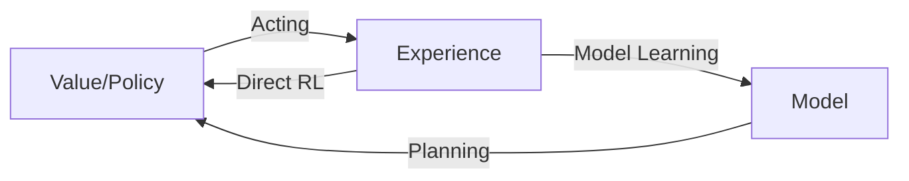

- Action $A$: set of actions that an agent can take
- State $S$: set of states
- Reward $R_{t}:S\times A\to \mathbb{R}$: scalar feedback given at step t.

At any time step t, Agents takes action $A_{t}$, observes $O_{t}$, and gets reward $R_{t}$. and similarly, environment receives action $A_{t}$, emits observation and reward. Thus, State $S_{t}=f(H_{t})$ can be represented as a function of history, i.e. set of actions, observations, and rewards $H_{t}=\{A_{t},O_{t},R_{t}\}$.

We can model two different states:
- Environment State $S_{t}^{e}$. Used to select the reward $R_{t}$. Invisible to the agent, contains irrelevant information.
- Agent state $S_{t}^{a}$. Agent's internal representation. Used to select next action.

**Markov State**: $P[s_{t+1}|s_{t}]=P[s_{t+1}|s_{1,\dots,t}]$. Sufficient statistic to model the future.

**MDP**: Fully observable environment leads to MDPs. When $S_{t}^{a}=S_{t}^{e}=O_{t}$, both the agent and environments state is aligned.

Components of an agent:
- Policy $\pi:S\to A$: agent's behavior function. Is used to determine the next action based on current state. Can be deterministic $\pi(s)=a$ or stochastic $\pi(a|s)=P[A=a|S=s]$.
- Value function $V$: how good is each state and/or action. Expectation of rewards based on current and next states.
	- $\upsilon_{\pi}(s)=E_{\pi}[R_{t}+\gamma R_{t+1}+\gamma^{2}R_{t+2}+\dots|S_{t}=s]$
- Model: agent's representation of the environment.

The agent with its virtue of taking actions and interacting with the environment, and the environment has the virtue of giving rewards on the basis of actions result in a sequence of State, Action, Reward tuples known as ***episodes*** (or *trial*, *trajectory*): $S_{0},A_{0},R_{1},S_{1},A_{1},R_{2},\dots$.

**Taxonomy of RL**
- Policy optimal
	- with value
	- or no value
- Value optimal
	- with no policy
	- with policy
- Actor Critic: Both policy and value function
- Model: whether depends on the representation of the environment
	- Model-free
	- Value and/or policy function

*
Taxonomy of RL methods. Source[^1]
*

> [!note] Exploitation v/s Exploration
> After partially exploring the environment, does the agent explore the environment more, or continue to exploit the current reward?

Reinforcement learning with/without Planning: Problems where a model is first trained with dynamics of the environment, and then placed into the environment to maximize the reward.

# 1 Markov Decision Processes

**Markov Process** is a tuple $(S,P)$, where S is finite set of states, and P is the state transition probability for any two state pairs.

For a Markov Process at any time step t, we can define **state transition probability** as $P_{ss'}=P[s_{t+1}=s'|s_{t}=s]$ and state transition matrix for a particular state $s$ and successor state $s'$ as

$$
\begin{equation}
P=	\left[\begin{matrix}
	P_{11} & \dots & P_{1n} \\
	\vdots & \ddots & \vdots \\
	P_{n1} & \dots & P_{nn}
	\end{matrix}\right]
\end{equation}
$$

**Markov Processes With Rewards** is the tuple $(S,P,R,\gamma)$ where $R=E[R_{t+1}|s_{t}=s]$ is a reward function which the agent gets on each state. The return $G_{t}$ is defined as total discounted rewards from time step $t$, $G_{t}=R_{t+1}+\gamma R_{t+2}+\gamma^{2}R_{t+3}+\dots=\sum_{k=0}^{\infty}\gamma^{k}R_{t+k+1}$.

**Markov Decision Processes**: An environment is fully described by MDPs when it's fully observable.
- defined as tuple $\{ S,A,\{ P_{sa} \},\gamma,R \}$.
- $P_{sa}$ are state transition probabilities, i.e. what state we'll be in if we take action a. For state S, and action A, it's the distribution over the state space.
- If the state includes all information about agent's past interaction with the environment, then it is said to have *Markov property*.
- $\gamma \in[0,1]$: Discount factor. Each new action into the future is discounted to give more weight to recent states.
- Most RL problems are defined using some form of MDPs like Continuous MDPs (Optimal control), Partial MDPs (Partially observable environments), Single state MDP (Bandits).

## 1.1 State-transition Probabilities

Finite MDPs are defined using discrete random variables $\mathcal{S,R}$, such that for a particular time step t, $R_{t}$ and $S_{t}$ take values $r,s$ depending on the values of the previous state and action. This can be defined using the dynamics function $p:\mathcal{S\times R\times S\times A}\to[0,1]$.

$$
p(s',r|s,a)=\Pr(S_{t}=s',R_{t}=r|S_{t-1}=s,A_{t-1}=a) \quad \forall s',s \in \mathcal{S},r\in \mathcal{R},a \in \mathcal{A}
$$

Using dynamics function, we define the state transition probabilities as sum of dynamic function over all possible rewards $p:\mathcal{S\times A\times S}\to \mathbb{R}$ as $$p(s'|s,a)=\Pr(S_{t}=s'|S_{t-1}=s,A_{t-1}=a)=\sum_{r\in \mathcal{R}}p(s'|s,a)$$

Expected reward for state-action pair is given by function $r:\mathcal{S\times A}\to \mathbb{R}$ as $$r(s,a)=\mathbb{E}[R_{t}|S_{t-1}=s,A_{t-1}=a]=\sum_{r \in \mathcal{R}}r\sum_{s' \in \mathcal{S}}p(s',r|s,a)$$

## 1.2 Policy

Take an agent with initial state $s_{0}$,
- it's **state transition** looks like: $s_{0}\overset{ a_{0} }{ \longrightarrow }s_{1}\overset{ a_{1} }{ \longrightarrow }s_{2}\overset{ a_{2} }{ \longrightarrow }\cdots$, and
- **Total reward** for the agent: $R(s_{0},a_{0})+\gamma R(s_{1},a_{1})+\gamma^{2}R(s_{2},a_{2})+\dots$.
- **Goal** is to maximise **expected value** of the reward payoff: $E[R(s_{0},a_{0})+\dots]$.

We solve finite state ($\lvert S\rvert<\infty$) MDPs, by modelling each state in the form of bellman equation. This gives a set of $\lvert S\rvert$ linear equations in $\lvert S\rvert$ variables, solution to which gives $V^{\pi}(s)$ for each state.

**Policy** $\pi:S\to A$ is a mapping from states to actions, and is usually stationary (time-independent).

Given an MDP $(S,A,P,R,\gamma)$ and a policy $\pi$,
- The sequence of states $S_{1},\dots$ is a Markov Process
- Sequence of states and rewards $S_{1},R_{1},S_{2},R_{2},\dots$ is Markov Reward Process $(S,P^{\pi},R^{\pi},\gamma)$ where $P^{\pi}_{ss'}=\sum_{a\in A}\pi(a|s)P^{a}_{ss'}$ and $R^{\pi}_{s}=\sum_{a\in A}\pi(a|s)R_{s}^{a}$.

## 1.3 Value Function

**Value function** is the expected discounted return from state s, $V(s)=E[G_{t}|s_{t}=s]$. It's the measure of total reward expected from state s. States that give more total rewards are preferred over other states.

$$
\begin{align}
V(s)&=E[R_{t+1}+\gamma R_{t+2}+\dots|s_{t}=s] \\
&=E[R_{t+1}+\gamma(R_{t+2}+\gamma R_{t+3}+\dots)|s_{t}=s] \\
&=E[R_{t+1}+\gamma G_{t+1}|s_{t}=s] \\
&=E[R_{t+1}+\gamma V(s_{t+1})|s_{t}=s] &\text{Law of Iterated Expectations} \\
&=R_{t+1}+\gamma E[V(s_{t+1})|s_{t}=s] &\text{$E[c]=c$}\\
&=R_{t+1}+\gamma \sum_{s'\sim P_{ss'}}P_{ss'}V(s') &\text{$E[f(x)]=\sum p(x)f(x)$}
\end{align}
$$

**Bellman Equations**: For a fixed policy $\pi$, its value function $V^{\pi}$ satisfies the bellman equations:
$$V^{\pi}(s)=R(s)+\gamma \sum_{s'\in S}P_{s\pi(s)}V^{\pi}(s')$$
First term is when the agent starts at state s, and the second term is expected sum of future discounted rewards starting in state $s'$ distributed according $P_{s\pi(s)}$ which is the distribution over the state where agent will end up after taking first step $\pi(s)$. It can also be written in expectation form as $E_{s'\sim P_{s\pi(s)}}[V^{\pi}(s')]$. In dynamic equation form,

$$
\begin{align}
v_{\pi}(s) &= \mathbb{E}*{\pi}[G*{t}|S_{t}=s] \\
 & =\mathbb{E}*{\pi}[R*{t+1}+\gamma G_{t+1}|S_{t}=s] \\
  & =\sum_{a}\pi(a|s)\sum_{s',r}p(s',r|s,a)[r+\gamma E_{\pi}[G_{t+1}|S_{t+1}=s']] \\
	 & =\sum_{a}\pi(a|s)\sum_{s',r}p(s',r|s,a)[r+\gamma v_{\pi }(s')]
\end{align}
$$

Written out in vector form for all states: $\upsilon=\mathcal{R}+\gamma P\upsilon$
$$
\begin{equation}
\left[\begin{matrix}
\upsilon(1) \\
\upsilon(2) \\
\vdots \\
\upsilon(n)
\end{matrix}\right]
=
\left[\begin{matrix}
R(1) \\
R(2) \\
\vdots \\
R(n)
\end{matrix}\right]
+\gamma\left[\begin{matrix}
	P_{11} & \dots & P_{1n} \\
	P_{21} & \cdots & P_{2n} \\
	\vdots & \ddots & \vdots \\
	P_{n1} & \dots & P_{nn}
	\end{matrix}\right]
\left[\begin{matrix}
\upsilon(1) \\
\upsilon(2) \\
\vdots \\
\upsilon(n)
\end{matrix}\right]
\end{equation}
$$

State-Value function according to policy is defined as $$\upsilon_{\pi}(s)=E_{\pi}[G_{t}|s_{0}=s,\pi]=E_{\pi}[R(s_{0})+\gamma R(s_{1})+\gamma^{2}R(s_{2})+\cdots|s_{0}=s,\pi]$$
Action-value function is the expected return started from state s and taking action a using policy $\pi$ defined as $q_{\pi}(s,a)=E_{\pi}[G_{t}|S_{t}=s,A_{t}=a]$.
- Bellman expected equation for $\upsilon_{\pi}(s)$ in terms of $q_{\pi}(s,a)$ is the expected return over all actions from state s: $\upsilon_{\pi}(s)=\sum_{a\in A}\pi(a|s)q_{\pi}(s,a)$
- Bellman expected equation for $q_{\pi}(s,a)$ in terms of $\upsilon_{\pi}(s)$ is the expected return when taking action a over all possible states: $q_{\pi}(s,a)=R_{s}^{a}+\gamma\sum_{s'\in S}P_{ss'}^{a}\upsilon_{\pi}(s')$
- Recursive equation for $v_{\pi}(s)=\sum_{a\in A}\pi(a|s)\left( R_{s}^{a}+\gamma \sum_{s'\in S}P_{ss'}^{a}v_{\pi}(s') \right)$
- Recursive equation for $q_{\pi}(s,a)=R_{s}^{a}+\gamma \sum_{s'\in S}P_{ss'}^{a}\sum_{a'\in A}\pi(a'|s')q_{\pi}(s',a')$.

**Optimal Value function** is the maximum possible expected reward attained by using any policy. Optimal state-value function defines the best possible policy that maximises the rewards of a state, and Optimal action-value function defines the best possible policy that maximises the rewards given that action a is being taken.
$$
\begin{align}
v^{*}(s)&=\max_{\pi}v_{\pi}(s) \\
q^{*}(s,a)&=\max_{\pi}q_{\pi}(s,a)
\end{align}
$$

So, optimal action-value function $q^{*}(s,a)$ is what we're aiming to solve, because knowledge of the best possible rewards that the agent can get from a particular state, taking action a, allows us to define the policy that exactly takes the action, i.e. for action that maximises action-value function $\pi(s)=\arg \underset{a\in A}{\max}q^{*}(s,a)$.

**Optimal Policy**: $\pi^{*}(s)=\arg \underset{_{a\in A}}{\max}q^{*}(s,a)$ such that $\pi^{*}(s)\geq \pi(s)$ when $v_{\pi^{*}}(s)\geq v_{\pi}(s), \forall\ s \in S$
- For MDPs, there always exists an optimal policy function.
- Optimal policy achieves optimal value function $v^{*}(s)=v_{\pi^{*}}(s)$, and $q^{*}(s,a)=q_{\pi^{*}}(s,a)$

Optimal State-value function in terms of Bellmans equations is  
$$
\begin{align}
v^{*}(s)&=\max_{a\in A}q^{*}(s,a)&=\max_{a\in A}R_{s}^{a}+\gamma \sum_{s'\in S}P_{ss'}^{a}v^{*}(s') \\
q^{*}(s,a)&=R_{s}^{a}+\gamma\sum_{s'\in S}P_{ss'}v^{*}(s')&=R_{s}^{a}+\gamma\sum_{s'\in S}P_{ss'}^{a} \max_{a'\in A}q^{*}(s',a') \\
\end{align}
$$

> [!question] Preliminary questions:
> - How does optimal value function calculation relate to transition probabilities $P_{sa}$ estimates might not be fully correct? Do we approximate these probabilities using different distributions?
> - If I know the policy, then value function is calculated by solving linear equations. What are the algorithms to solve Bellman optimality equation for value and policy functions?

# 2 Dynamic Programming

DP refers to algorithms that decompose a problem into subproblems and apply principle of optimality to each subproblem, i.e. solve each problem optimally and aggregate the solution with one condition that subproblems recursively overlap i.e. subproblem has identical or similar structure as the parent problem. MDPs satisfy the criteria required to apply DP solutions using Bellman equations. By computing the optimal value function and caching the information for solving the parent problem.

## 2.1 Policy Evaluation (prediction)

Given a policy $\pi$ and MDP $(\mathcal{S,A,R},P,\gamma)$, evaluating the state-value function $v_{\pi}$.

$$
\begin{align}
v_{\pi}(s) & =\mathbb{E}_{\pi}[R_{t+1}+\gamma v_{\pi}(S_{t+1})|S_{t}=s] \\
 & =\sum_{a}\pi(a|s)\sum_{s',r}p(s',r|s,a)[r+\gamma v_{\pi }(s')]
\end{align}
$$

*Iterative policy evaluation* refers to successively applying expected update using Bellman equation for $v_{\pi}$. On each successive approximation, the old value is replaced with the new value. This is the idea of **synchronous backups** where each sweep It can be shown that $v_{k}=v_{\pi}$ is a fixed point as $k\to \infty$, i.e. the sequence $\{ v_{k} \}$ converges to $v_{\pi}$.

$$
v_{1}\to v_{2}\to v_{3}\to \cdots\to v_{\pi} \ ;\ [v_{i}(s)\in \mathbb{R}]
$$

## 2.2 Policy Improvement
Our ultimate goal is to find better policies. During policy evalution, we can figure out the expected rewards from a given state by marginalising over all possible actions. But is there a better action to take, one that maximises the value function, i.e. $q_{\pi}(s,a)\geq v_{\pi}(s)$. If such an action exists, then following action a whenever s is achieved is optimal rather than to follow stochastic policy approach. Applying this to all states and defining $\pi'$ as the new policy, we find out $q_{\pi}(s,\pi'(s))\geq v_{\pi}(s)$. 

To prove this, let's take deterministic policy $\pi$ and identical policy $\pi'$ except, for particular state s $\pi'(s)=a\neq \pi(s)$. Then,

$$
\begin{align}
v_{\pi}(s) & \leq q_{\pi}(s,\pi'(s)) \\ \\
 & = \mathbb{E}_{\pi}[R_{t+1}+\gamma v_{\pi}(S_{t+1})|S_{t}=s,A_{t}=\pi'(s)] \\
 & =\mathbb{E}_{\pi'}[R_{t+1}+\gamma v_{\pi}(S_{t+1})|S_{t}=s] \\
  & \leq \mathbb{E}_{\pi'}[R_{t+1}+\gamma q_{\pi}(S_{t+1},\pi'(S_{t+1}))|S_{t}=s] \\
	 & =E_{\pi'}[R_{t+1}+\gamma R_{t+2}+\gamma^{2}v_{\pi}(S_{t+2})|S_{t}=s] \\
	  & =\vdots \\
		 & =v_{\pi'}(s)
\end{align}
$$

Extending this to all states, we can update policy $\pi$ by *greedily* selecting the action that maximises action-value function over all possible states. This leads to policy $\pi'$ that is as good or better than original policy $\pi$.

$$
\pi'(s)=\underset{ a }{ \arg \max }\ q_{\pi}(s,a)
$$

When $v_{\pi'}(s)=v_{\pi}(s)$, i.e. new policy is as good as old policy, then both policies are optimal policies and $v_{\pi}=v_{\pi'}=v_{*}$.
$$
\begin{align}
v_{\pi'}(s)=v_{*}(s)=\max_{a}q_{\pi}(s,a)=\max_{a}\mathbb{E}_{\pi}[R_{t+1}+\gamma v_{\pi}(S_{t+1})|S_{t}=s,A_{t}=a]
\end{align}
$$

**Policy Iteration**: We can use the new policy $\pi'$ to evaluate the value function and again get the new policy $\pi''$. We can apply this iteratively over course of evaluation and improvement to get the optimal policy and thus, optimal value function.

$$
\pi_{0}\overset{ E }{ \longrightarrow }v_{\pi_{0}}\overset{ I }{ \longrightarrow }\pi_{1}\overset{ E }{ \longrightarrow }v_{\pi_{1}}\overset{ I }{ \longrightarrow }\cdots\pi_{*}\overset{ E }{ \longrightarrow }v_{*}
$$

Algorithm:
1. Initialise
2. Policy Evaluation
	1. Fix threshold $\Delta \leftarrow0$
	2. Loop over all states
		1. Update V(s) by comparing with previous value
		2. Update threshold
3. Policy Improvement
	1. For each state:
		1. update $\pi(s)$ using GPI: $\pi(s)\leftarrow \arg\max_{a}\sum_{s',r}p(s',r|s,a)[r+\gamma V(s')]$
		2. Use tie breaker in case of equiprobable policy actions

**Value Iteration**: 
Policy iteration involves policy evaluation on each iteration which itself is an iterative computation requiring sweeps through entire state set. Using the principle of optimality, we can apply Bellman optimality equation for state-value function and update that iteratively. Instead of improving policy each time on policy evaluation, we can update value function for each state in one sweep, and recursively perform this until convergence.

> [!important] Principle of Optimality
> Any policy $\pi$ achieves optimal value from state s: $v_{\pi}(s)=v_{*}(s)$ iff for state s' reachable from s, $\pi$ achieves optimal value, i.e. $v_{\pi}(s')=v_{*}(s')$.

$$
\begin{align}
v_{k+1}(s) & =v_{k}^{*}(s) \\
 & =\max_{a}\mathbb{E}[R_{t+1}+\gamma v_{k}(S_{t+1})|S_{t}=s,A_{t}=a] \\
  & =\max_{a}\left(R_{s}^{a}+\gamma\sum_{s'}P(s'|s,a)v_{k}(s')\right)
\end{align}
$$

> [!warning] Value iteration may not correspond to any valid policy for intermediate value functions.

Algorithm:
1. Initialise threshold, value function for all states
2. Loop until convergence: $\lVert V_{k+1}-V_{k} \rVert_{\infty}\leq\epsilon$
	1. Record "update delta"
	2. For each state s:
		1. Take max of all action-value function from state s, and for each action take expectation of each possible state reachable from that action: $V(s)\leftarrow \max_{a}\left(R_{s}^{a}+\gamma\sum_{s'}P(s'|s,a) V(s')\right)$
		2. Update delta
3. After converging to $v_{*}$, use policy improvement to find optimal policy: $\pi_{*}(s)=\underset{a}{\arg\max}(R_{s}^{a}+\gamma\sum_{s'}P_{ss'}^{a} V(s'))$

Since each iteration of Policy iteration take max over all actions, it implicitly improves the policy in each iteration. Thus, we can think of policy iteration as combining one sweep of policy evaluation and improvement into one sweep.

**Comparison**

| Problem    | Method                                                   | Algorithm                   | Complexity            |
| ---------- | -------------------------------------------------------- | --------------------------- | --------------------- |
| Prediction | Bellman expectation equation                             | Iterative Policy Evaluation |                       |
| Control    | Bellman expectation equation + Greedy Policy improvement | Policy Iteration            |                       |
| Control    | Bellman optimality equation                              | Value Iteration             | $\mathcal{O}(mn^{2})$ |

> [!note] Same steps can be followed to find optimal action-value function $q^{*}(s,a)$,  but the complexity $\mathcal{O}(m^{2}n^{2})$ exceeds value iteration. Every sweep considers every action for every state recursively.

### 2.2.1 Asynchronous DP

Reduce computation by not iterating over the complete state set. It isn't necessary to use old value when performing a sweep of improvement, instead, in-place algorithms can update values of states in any order, using whatever value happens to be available. Asynchronous algorithms can be used in **real-time** during an episode, where each interaction updates the values, and the updated value is used for the next instance during the same episode.

Three algorithms available are:
- In-place DP
- Prioritized sweeping: $\left\lvert  \left( \max_{a}R_{s}^{a}+\gamma \sum_{s'}P_{ss'}^{a}V(s') \right)-V(s) \right\rvert$. Keep a priority queue of update deltas and update the state in order of highest delta.
- Real-time: backup states that agent actually visits and mark others as no-op.

Problem with DP:
- Requires full-width backups
- For backups, full observability of all states and actions, and the knowledge of transitions and reward functions is needed.
- Suffers from curse of dimensionality, number of states $n = |S|$ grows exponentially with number of state variables.

Solution: Sample backups
- Backups based on sampling using sample rewards and transitions. Consider each episode as a sample and learn from tuples: $(S,A,R,S')$
- Model-free: No advanced knowledge of MDP required.
- We need to use a function approximator for state-value function $\hat{v}(s,\mathbf{w})$

**GPI**: term used for any algorithm that iteratively improves a policy, and stabilises both value and policy function. Policy Iteration computes **infinite horizon** value of a policy while value iteration only performs one step of evaluation between each improvement. Asynchronous methods, evaluation and improvement can be interleaved. 

<em>Generalised Policy Iteration</em>

> [!question] Proof behind convergence to optimal value function and policy.

Consider the space of all value functions, we'll prove that the value function converges to a fixed point using [Contraction mapping theorem](https://en.wikipedia.org/wiki/Banach_fixed-point_theorem).

- Let Bellman expectation backup operator for a particular policy be defined as $T^{\pi}(v)=R^{\pi}+\gamma \sum_{s'}P^{\pi}(s'|s)V(s')$.
- Take any functions $u,v$ in the value function space, we can prove that Bellman backup operator is a contraction operator, i.e. $\lVert T^{\pi}(u)-T^{\pi}(v) \rVert_{\infty}\leq\gamma \lVert u-v \rVert_{\infty}$.
$$
\begin{align} \\
\lVert T^{\pi}(u)-T^{\pi}(v) \rVert_{\infty}  & =\left\lVert  \left( R^{\pi}+\gamma \sum_{s'}P(s'|s)u(s') \right) -\left( R^{\pi}+\gamma \sum_{s'}P(s'|s)v(s') \right) \right\rVert_{\infty} \\
 & =\left\lVert  \gamma \sum_{s'}P(s'|s)(u(s')-v(s'))  \right\rVert_{\infty} \\
  & \leq\gamma \left\lVert  \sum_{s'}P  \right\rVert \lVert u(s')-v(s') \rVert_{\infty}  \\
	 & =\gamma \lVert u-v \rVert_{\infty}
\end{align}
$$
- Thus, when $\gamma<1$, converges to a fixed point $v_{\pi}$.
- When *Bellman optimality backup operator* $T^{*}(v)=\max_{a}R^{a}+\gamma P^{a}v$ is used, then the fixed point is equal to the optimal value function $v_{*}$.

# 3 Model-Free Prediction

- Goal: compute optimal value and policy function when model is unknown.
- Major assumption from previous section is that environment is fully known, but that's untrue for most of the real-world scenarios. Instead we aim to learn directly from agent's experience.
- We'll break down the estimation again into model-free prediction and control.

## 3.1 Monte-Carlo Policy Evaluation

Idea is to use Monte-Carlo estimation to estimate $v_{\pi}(s)$ based on samples from experience. Can be done using two methods: *first-visit* MC or *every-visit* MC. As the name suggests, first-visit MC estimates the empirical mean following the first visit to s, and every-visit estimate the mean of return following all visits to s.

Algorithm first-visit MC:
1. Initialise value function for each state
2. Loop for each episode
	1. In each sample, for first-visit at each state:
		1. Update N(s)
		2. Increment total return
		3. Update expected value: V(s) = Returns / N(s)

$$
V^{\pi}(s)=V^{\pi}(s)\frac{N(s)-1}{N(s)}+\frac{G*{i,t}}{N(s)}=V^{\pi}(s)+\frac{1}{N(s)}(G_{i,t}-V^{\pi}(s))
$$

Updates can be applied incrementally depending on the learning rate $\alpha$ as $V^{\pi}(s_{it})=V^{\pi}(s_{it})+\alpha(G_{i,t}-V^{\pi}(s_{it}))$.

> [!question] What are the advantages of MC over Iterative policy evaluation?

> [!question]- Difference between Iterative policy evaluation and MC evaluation
> MC policy evaluation requires complete episodes (till terminating state) to backtrack and update the required state while Iterative policy evaluation just looks ahead one step and uses the environment knowledge to compute the value function at the next state.

Properties:
- First visit MC: $V^{\pi}$ is an unbiased estimator of true V. and by Law of Large numbers as $n\to \infty,V^{\pi}\to \mathbb{E}_{\pi}[G_{t}|S_{t}=s]$.
- Every-visit MC: $V^{\pi}$ is a biased estimator, but consistent estimator, and has better MSE.
- Incremental MC depends on learning rate $\alpha$

## 3.2 Temporal Difference Evaluation

Our goal is to learn directly from experience, but main difference over MC methods is that TD methods allows to learn from incomplete episodes using Bootstrapping. It can be seen as a combination of DP (bootstrapping) and MC (sampling).

> [!note] Bootstrapping and Sampling
> - Bootstrapping: Updating the estimate using a guess or previous estimate. When recursive update to the value is done using an estimate. TD and DP techniques bootstrap while MC doesn't.
> 	- Informally, If an agent has an incomplete episode, then the value of any subsequent state can be updated using an estimate of the state that the episode ended at. That way, even a guess works when incomplete episodes are available.
> - Sampling: Both TD and MC involves sampling an expectation, while DP (due to full knowledge of the model) require complete observability and full backups.

In MC, $V(S_{t})$ is updated towards actual return $G_{t}$: $$V(S_{t})\leftarrow V(S_{t})+\alpha[G_{t}-V(S_{t})]$$
In TD, $V(S_{t})$ is updated towards estimated return $$V(S_{t})\leftarrow V(S_{t})+\alpha[\underbrace{ R_{t+1}+\gamma V(S_{t+1}) }_{ \textsf{TD target} }-V(S_{t+1})]$$

**Sample Updates**: Both MC and TD updates are referred to as sample updates because updates to a state is based on successor states in a sample and value is calculated by looking ahead at the next successor and the reward along the way.

**TD error** is the error in the estimate made at each time: $\delta_{t}=R_{t+1}+\gamma V(S_{t+1})-V(S_{t})$. Note that $\delta_{t}$ depends on $R_{t+1},S_{t+1}$, and thus, is only available at time $t+1$.

**Bias-Variance tradeoff**
- MC return is an unbiased estimator of $v_{\pi}(S_t)$
- True TD target: $R_{t+1}+\gamma v_{\pi}(S_{t+1})$ is an unbiased estimator of $v_{\pi}(S_{t})$
- TD target is a biased estimator of $v_{\pi}(S_{t})$

MC and TD
- Why does TD target has lower variance than the return?
	- Because TD target only has randomness due to current return and next state, while MC return has accumulated randomness of all the intermediate random variables (rewards).
- What's the difference convergence properties of MC and TD?
	- MC always converges to solution that minimizes MSE
		- $\min_{V}\sum_{s}(G_{t}-V(s_{t}))^{2}$
		- Fit values directly to observed returns.
	- TD: from samples of experience, it builds a model of the MDP (transition probabilities $\hat{P}$ and rewards $\hat{R}$), and then solve the bellman equation of the MDP using the estimate. This is the concept of **Certainty Equivalence**.
	- $\hat{P}_{ss'}^{a}=\frac{1}{N(s,a)}\sum_{k=1}^{K}\sum_{t=1}^{T_{k}}\mathbb{1}(s_{t}^{k},a_{t}^{k},s_{t+1}^{k}=s,a,s')$
	- $\hat{R}_{s}^{a}=\frac{1}{N(s,a)}\sum_{k=1}^{K}\sum_{t=1}^{T_{k}}\mathbb{1}(s_{t}^{k},a_{t}^{k}=s,a)r_{t}^{k}$
	- Converges to solution of max likelihood Markov model or Certainty equivalence estimate.
- Markov property
	- TD exploits Markov property.
	- MC can work in Non-Markov environments.

## 3.3 N-step return

Generalizing TD(0) method to more than one step samples gives a whole spectrum of method with TD methods at one end and MC methods at other.

$$
\begin{array}{c}
n=1 \ &  (\text{TD})  & G_{t}^{(1)} =R_{t+1}+\gamma V(S_{t+1}) \\
n=2 &  & G_{t}^{(2)}=R_{t+1}+\gamma V(S_{t+1})+\gamma^{2}V(S_{t+1}) \\
\vdots &  & \vdots \\
n=\infty & (\text{MC}) & G_{t}^{(\infty)}=R_{t+1}+\gamma R_{t+2}+\dots+\gamma^{T-1}R_{T}
\end{array}
$$

We define the n-step return as $G_{t}^{(n)}=R_{t+1}+\gamma R_{t+2}+\dots+\gamma^{n-1}R_{t+n}+\gamma^{n}V(S_{t+n})$, and subsequently, define n-step TD learning as $$V(S_{t})=R_{t+1}+\alpha(G_{t}^{(n)}-V(S_{t}))$$

We can prove similar to TD(0) returns that $\max_{s}\lvert \mathbb{E}_{\pi}[G_{t}^{(n)}|S_{t}=s]-V_{\pi}(s)\rvert\leq\gamma^{n}\max_{s}\lvert V_{t+n-1}(s)-V_{\pi}(s)\rvert$ for all $n\geq1$. We can then prove that $v_{\pi}$ is the fixed point and n-step TD method converge using contraction mapping theorem.

## 3.4 $\text{TD}(\lambda)$ Returns
Averaging n-step updates produces new range of algorithms. $\lambda$-return $G_{t}^{\lambda}$ combines all n-step returns $G_{t}^{(n)}$. Using weight proportional to $\lambda^{n-1}$ and normalised by $(1-\lambda)$, resulting to $$G_{t}^{\lambda}=(1-\lambda)\sum_{n=1}^{T-t-1}\lambda^{n-1}G_{t}^{(n)}+\lambda^{T-t-1}G_{t}$$

Note that $\sum=1$. When $\lambda=1$, TD($\lambda$) turns to MC algorithm. When $\lambda=0$, updates happen according to one-step $\text{TD(0)}$.

Forward-view learning: $V(S_{t})\leftarrow V(S_{t})+\alpha(G_{t}^{\lambda}-V(S_{t}))$. Value function is updated using $\lambda$-return. Like MC learning needs complete episodes, but that is an issue when working with continuing tasks.

> [!note] Offline vs online updates
> - Offline updates: Updates happening at the end of the batch
> - Online updates: Updates happen at each time step

### 3.4.1 Backward view TD($\lambda$)

Problem with forward-view is that it needs to look into future steps to compute the expected rewards for state s at time t, and it needs complete episodes, and returns is compute multiple times for each step.

If we can push the updates backward in time, by maintaining a trace for each state 

Updates are made on-line i.e. at every step of an episode rather than the end. Since updates are happening at each step, computations are equally distributed in time, and algorithm can be applied to continuing tasks.

Eligibility Trace: Maintain a short term view of the updates per state, typically the length of an episode. Incremented on each time step by a quantity that signals recency of the state, and previous value is scaled by $\lambda$. This combines the recency and frequency heuristic about each state. 

$$
\begin{align}
e_{0}(s) & =0 \\
e_{t}(s) & =\gamma\lambda e_{t-1}(s)+\mathbb{1}(S_{t}=s)
\end{align}
$$

Value function for each state s is updated at each time step as

$$
\begin{align}
\delta_{t} & =R_{t+1}+\gamma V(S_{t+1})-V(S_{t}) \\
V(s) & \leftarrow V(s)+\alpha\delta_{t}e_{t}(s)
\end{align}
$$

- $\lambda=0$ is equivalent to $\text{TD}(0)$ update.
- $\lambda=1$, sum of TD errors telescope into MC error: $G_{t}-V(S_{t})$
	- TD(1) updates accumulates error online: $\sum_{t=1}^{T}\alpha\delta_{t}e_{t}(s)=\sum_{t=1}^{T}\gamma^{t-1}\delta_{t}=\alpha(G_{t}-V(St))$
	- TD(1) is roughly equivalent to every-visit MC, with the only difference that error is updated online per step. If the updates are offline, then it is exactly same as MC.

# 4 Model-free Control

When environment is too big to model, and our objective is to know the optimal behaviour of an agent.

> [!note] On-policy vs Off-policy learning
> - On-policy: Learn about policy $\pi$ while evaluating it and drawing samples from experience.
> - Off-policy: Learn about policy $\pi$ while experience drawn from another policy $\mu$.

In GPI, a given policy is improved by alternating between policy evaluation and policy iteration using greedy method. But in a model-free approach, we don't have transition probabilities to estimate the value function. So, instead of working with value function, we use action-value function $Q(s,a)$, and policy is updated as $\pi'(s,a)=\underset{a\in A}{\arg\max}Q(s,a)$. Then, the generalised policy iteration becomes

$$
\pi_{0}\overset{ E }{ \longrightarrow }q_{\pi_{0}}\overset{ I }{ \longrightarrow }\pi_{1}\overset{ E }{ \longrightarrow }q_{\pi_{1}}\overset{ I }{ \longrightarrow }\cdots\pi_{*}\overset{ E }{ \longrightarrow }q_{*}
$$

> [!question] What's the problem with greedy policy improvement?
> In a model-free environment, exploration becomes important because the agent doesn't know whether the current known states consists of optimal solution. And greedy policy improvement is an on-policy method that just selects the best action among the set of available actions, which may result in the unbiased estimator to get stuck at local maxima.

So, the solution is to perform exploration stochastically. Most of the time action with maximal estimated action value is chosen, but with probability $\epsilon$, policy prefers another action at random. All the non-greedy actions are given the minimal probability of selection, $\frac{\epsilon}{\lvert A(s)\rvert}$, and majority probability $1-\epsilon+\frac{\epsilon}{\lvert A(s)\rvert}$ is assigned to greedy action.
$$
\pi'(a|s)=
\begin{cases}
\frac{\epsilon}{m}+1-\epsilon & \arg\max_{a\in A}Q(s,a) \\
\frac{\epsilon}{m} & \text{Otherwise}
\end{cases}
$$

## 4.1 MC Control

Algorithm (first-visit MC control for $\epsilon$-soft policies):
1. Initialise policy $\pi$, action-value function $Q(s,a)$, Counter $C(s,a)$, 
2. Loop
	1. Generate an episode following $\pi:S_{0},A_{0},R_{1},\dots,S_{T-1},A_{T-1},R_{T}$
	2. G <- 0
	3. Loop for each step of episode: from $t=T-1,T-2,\dots,0$:
		1. $G\leftarrow\gamma G+R_{t+1}$
		2. Unless pair $S_{t},A_{t}$ appears in previous time steps:
			1. Update counter: $C(S_{t},A_{t})\leftarrow C(S_{t},A_{t})+1$
			2. Update action-value function: $Q(S_{t},A_{t})\leftarrow Q(S_{t},A_{t})+\frac{1}{C(S_{t},A_{t})}[G-Q(S_{t},A_{t})]$
			3. Update new optimal action: $A^{*}=\arg\max_{a}Q(S_{t},a)$
			4. Update policy with new optimal action. For all $a\in A(S_{t})$:
				1. $\pi(a|S_{t})=1-\epsilon+\frac{\epsilon}{\lvert A(S_{t})\rvert}$ if $a=A^{*}$
				2. $\frac{\epsilon}{\lvert A(S_{t})\rvert}$ if $a\neq A^{*}$

We can prove that $\epsilon$-greedy policy follows policy improvement theorem, i.e. the $\epsilon$-greedy policy $\pi'$ wrt $q_{\pi}$ is an improvement, $v_{\pi'}(s)\geq v_{\pi}(s)$ for all $s \in \mathcal{S}$.

$$
q_{\pi}(s,\pi'(s))\geq v_{\pi}(s)
$$

We can immediately take the current estimate and update the policy. Instead of performing updates offline after the whole batch, we can just take the Q after one episode, and improve the policy $\pi$ wrt q.

But the problem with $\epsilon$-greedy policy is that even after convergence, it continues to select random actions to explore, and that may not be necessary for an optimal policy. Instead, we need a schedule of $\epsilon_{k}$ such that it reaches $0$ when infinite number of episodes have been observed.

> [!note] **GLIE**: Greedy in the limit with Infinite Exploration
> - All state action pairs are explored infinite number of times: $\lim_{ k \to \infty }N_{k}(s,a)=\infty$
> - Policy converges on greedy policy: $\lim_{ k \to \infty }\pi_{k}(s|a)=\mathbb{1}(a=\underset{a'\in A}{\arg\max}Q_{k}(s,a'))$

GLIE-MC: We can choose $\epsilon_{k}=1/k$ to turn the MC control into GLIE-MC. Policy converges to greedy policy as $k\to \infty$.

## 4.2 TD Control

- Natural extension to MC control is to consider TD in our control loop. 
- Update the values of state-action pairs using TD(0): $Q(S_{t},A_{t})\leftarrow Q(S_{t},A_{t})+\alpha[R_{t+1}+\gamma Q(S_{t+1},A_{t+1})-Q(S_{t},A_{t})]$
- Gives rist to Sarsa (State-Action-Reward-State-Action $S_{t},A_{t},R_{t+1},S_{t+1},A_{t+1}$ quintuple) algorithm: on-policy TD control

Algorithm:
1. Initialise
2. Loop:
	1. Initialise S
	2. Choose A from S using policy
	3. For each step of episode:
		1. Take action A, observe R, S'
		2. Choose $A'\leftarrow \pi(S')$ from policy derived from Q
		3. Update $Q(S,A)\leftarrow Q(S,A)+\alpha[R+\gamma Q(S',A')-Q(S,A)]$
		4. S' <- S, A' <- A

Convergence of SARSA:
- GLIE sequence of policies $\pi_{t}(a|s)$
- Robbin's Monroe sequence of step sizes $\alpha_{t}$: $\sum_{t=1}\alpha_{t}=\infty$ and $\sum_{t=1}^{\infty}\alpha^{2}<\infty$

We can form a spectrum of TD control learning algorithms when increasing the estimation step size from 1 to infinity, ranging from SARSA to MC updates. Generalising this to n-steps: 
$$
\begin{align}
q_{t}^{(n)} & =R_{t+1}+\gamma R_{t+2}+\dots+\gamma^{n-1}R_{t+n}+\gamma^{n}Q(S_{t+n}) \\
Q(S_{t},A_{t}) & \leftarrow Q(S_{t},A_{t})+\alpha(Q_{t}^{(n)}-Q(S_{t},A_{t}))
\end{align}
$$ 

**Backward-view SARSA($\boldsymbol{\lambda}$)**:
- Eligibility trace: $e_{t}(s,a)=\gamma\lambda e_{t-1}(s,a)+\mathbb{1}(S_{t}=s,A_{t}=a)$
- TD-error: $\delta_{t}=R_{t+1}+\gamma Q(S_{t+1},A_{t+1})-Q(S_{t},A_{t})$
- Updates happen for each state-action pair: $Q(S_{t},A_{t})\leftarrow Q(S_{t},A_{t})+\alpha\delta_{t}e_{t}(s,a)$

# 5 Off-policy Learning

Idea: Evaluate *target policy* $\pi(a|s)$ to compute $v_{\pi},q_{\pi}$ while following *behaviour policy* $\mu(a|s)$. In on-policy approach, we're using a near-optimal policy to learn about optimal policy. But as the policy starts converging, exploration reduces that may lead to local maxima.

> [!question] What's the motivation behind off-policy learning?
> - Learning from observation of another agent 
> - Reusing old policy ($\pi_{1},\pi_{2},\dots,\pi_{t-1}$) to generate more optimal policy
> 	- Follow some other exploratory policy (like $\epsilon$-greedy policy) while learning about optimal policy (like deterministic policy)
> - Learn multiple policies while following one policy

## 5.1 Off-policy Learning Using Importance Sampling

To learn from a separate policy at each step, we have to use returns from $\mu$ to evaluate $\pi$. Returns $G_{t}$ are weighted according to similarity between policies.

$$
\begin{align}
G_{t}^{\pi/\mu} & =\frac{\pi(a_{t}|s_{t})}{\mu(a_{t}|s_{t})}\cdot \frac{\pi(a_{t+1}|s_{t+1})}{\mu(a_{t+1}|s_{t+1})}\dots \frac{\pi(a_{T-1}|s_{T-1})}{\mu(a_{T-1}|s_{T-1})}G_{t}=\rho_{1:T-1}G_{t} \\
V^{\pi}(s) & =\mathbb{E}[\rho_{t:T-1}G_{t}|S_{t}=s]=\frac{\sum_{t\in \tau(s)}\rho_{t:T-1}G_{t}}{\lvert \mathfrak{T}(s)\rvert }
\end{align}
$$
where, $\mathfrak{T}(s)$ is the number of visits to state s during the trajectory.

And the value function is updated with the weighted return: $V(S_{t})\leftarrow V(S_{t})+\alpha(G_{t}^{\pi/\mu}-V(S_{t}))$

> [!note] Importance Sampling
> $\mathbb{E}_{x\sim P(X)}[f(x)]=\sum_{x \in X} p(x)f(x)=\sum_{x \in X}\frac{p(x)}{q(x)}\cdot q(x)\cdot f(x)=\mathbb{E}_{x\sim Q(X)}\left[ \frac{P(X)}{Q(X)}f(X) \right]$

Above variant is called Ordinary Importance sampling. Evidently, it's an unbiased estimator, but has high variance due to unbounded.

Variants:
- Weighted Importance Sampling: $V^{\pi}(s)=\frac{\sum_{t\in \tau}\rho_{t:T-1}G_{t}}{\sum_{t\in \tau}\rho_{t:T-1}}$. Variance is much lower due to highest ratio of weights being 1, and converges to zero even if the variance of ratios is infinite.[^2]
Discounting-aware IS
Per-decision IS

Problems:
- $\mu$ has to be non-zero which happens in very limited cases because the probability of selecting an action in a policy can be zero for multiple actions and in multiple different states.
- No hidden confounding: all the features of the states must be known.
- Very high variance, i.e. for any sufficiently complex task, two policies might be vey different. As we reach end of the episode, relative probability can vanish.

**Off-policy TD**: Weight TD target by importance sampling. $V(S_{t})\leftarrow V(S_{t})+\alpha\left( \frac{\pi(A_{t}|S_{t})}{\mu(A_{t}|S_{t})}\left(R_{t+1}+\gamma V(S_{t+1})\right)-V(S_{t}) \right)$. Has lower variance than MC importance sampling.

## 5.2 Q-Learning
- No importance sampling
- Choose next action using behaviour policy: $A_{t+1}\sim \mu$
- Consider $A'\sim \pi(\cdot|S_{t})$ as alternate action
- Update Q-value: $Q(S_{t},A_{t})\leftarrow Q(S_{t},A_{t})+\alpha(R_{t+1}+\gamma Q(S_{t+1},A')-Q(S_{t},A_{t}))$
- At any time-step t, state-action value is updated in the direction of the alternate policy plus the reward obtained from following behaviour policy.

**Off-policy Control**:
- Target policy $\pi$ is greedy: $\pi(s_{t+1})=\underset{a'}{\arg\max}Q(S_{t+1},a')$
- Behaviour policy is $\epsilon$-greedy

Q-Learning target: $Q(S,A)\leftarrow Q(S_,A)+\gamma(R+\max_{a'}Q(S',a')-Q(S,A))$

$$
\begin{align}
G_{t} & =R_{t+1}+\gamma Q(S_{t+1},A') \\
 & =R_{t+1}+\gamma Q(S_{t+1},\arg \max_{a}Q(S_{t+1},a')) \\
  & =R_{t+1}+\gamma \max_{a'}Q(S_{t+1},a')
\end{align}
$$

Algorithm:
1. Initialise Q(S,A)
2. Loop for each episode:
	1. Initialise start state S
	2. Loop for each step of episode until terminal state
		1. Choose A from $\epsilon$-greedy policy derived from Q
		2. Take action A, observe reward R, state S'
		3. Update Q(S,A)
		4. Update S <- S'

| DP                                                                                | TD                                                                |
| --------------------------------------------------------------------------------- | ----------------------------------------------------------------- |
| Iterative Policy Evaluation: $V(S)\leftarrow \mathbb{E}[R+\gamma V(S') \lvert s]$ | TD Learning: $V(S)\overset{ \alpha }{ \leftarrow }R+\gamma V(S')$ |
| Q-Policy Iteration                                                                | SARSA                                                             |
| Q-Value Iteration                                                                 | Q-Learning                                                        |

*Relationship between full backup DP and sample backup TD methods*

# 6 Function Approximation

When $\lvert S\rvert$ is very large, tabular methods aren't feasible. We instead use parametrised form of functions with weight vector $\mathbf{w}\in \mathbb{R}^{d}$. 
- Value function for state s is approximated using the parametrised function with weight vector $\hat{v}(s,\mathbf{w})\approx v_{\pi}(s)$. 
- $\hat{q}(s,a,\mathbf{w})\approx q_{\pi}(s,a)$

Any kind of function approximator can work but we use Neural networks to estimate the function due to their generalisation and efficient learning (differentiable, Non-linear approximator) property. Typically, $d\ll \lvert S\rvert$, and changing one weight changes estimated value of many states. Indicatively, one change can *generalise* to other states which is a highly desirable property is massive state systems.

One straightforward way to use NNs is to treat each (state, action, return) tuple as training data and fit a neural network using Supervised Learning. One important property from approximator is to handle non-stationary data (training examples are acquired incrementally) and target functions (function that is constantly changing).

## 6.1 On-policy Prediction

**Prediction Objective** $\overline{\text{VE}}$

When state space is much larger than weights, making one state's estimate more accurate make other states' inaccurate. So, we need a state distribution $\mu(s),\sum_{s}\mu(s)=1$ on the states, representing how much we care about error in the state. Define VE as MSE on value function:
$$
\overline{\text{VE}}(\mathbf{w})=\sum_{s \in\mathcal{S}}\mu(s)[v_{\pi}(s)-\hat{v}(s,\mathbf{w})]^{2}
$$
Our goal is to minimise $\sqrt{ \overline{\text{VE}} }$. Often $\mu(s)$ is chosen to be the fraction of time spent in s, $\mu(s)=\frac{\eta(s)}{\sum_{s'} \eta(s')}$.

**Gradient Descent based updates**
- Define a differentiable function: $J(\mathbf{w})=\mathbb{E}_{\pi}\left[(v_{\pi}(s)-\hat{v}(s,\mathbf{w}))^{2}\right]$
- Find the gradient: $\nabla_{\mathbf{w}}J(\mathbf{w})=\left( \frac{ \partial f(\mathbf{w}) }{ \partial w_{1} },\frac{ \partial f(\mathbf{w}) }{ \partial w_{2} },\dots,\frac{ \partial f(\mathbf{w}) }{ \partial w_{d} } \right)^{\top}$
- To find the local minima, update the weight vector towards negative of the gradient: $\Delta \mathbf{w}=-\frac{1}{2}\alpha \nabla_{\mathbf{w}}J(\mathbf{w})$
- SGD sample one episode stochastically: $\Delta \mathbf{w}=\alpha \mathbb{E}_{\pi}[(v_{\pi}(s)-\hat{v}(S,\mathbf{w}))\nabla_{\mathbf{w}}\hat{v}(S,\mathbf{w})]$

**Feature Vector**: State value function is represented in terms of linear approximation of weights and features $\mathbf{x}(s)=(\mathbf{x}_{1}(s),\mathbf{x}_{2}(s),\dots,\mathbf{x}_{d}(s))^{\top}$. Each $\mathbf{x}_{i}(s)$ is called a basis function for linear methods as they form linear basis for the set of approximation function.
$$
\begin{align}
\nabla_{\mathbf{w}}\hat{v}(s,\mathbf{w})&=\mathbf{x}(s)\\
\Delta \mathbf{w}&=\alpha(U_{t}-\hat{v}(\mathbf{w},s))\mathbf{x}(s) \\
\mathbf{w}_{t+1} & =\mathbf{w}_{t}+\Delta \mathbf{w}
\end{align}
$$

Update can be interpreted as step-size x prediction-error x feature value.

> [!note] Currently, we're assuming that agent has access to an oracle true estimate $v_{\pi}$. Replacing the target with any other unbiased estimate, i.e. $\mathbb{E}[U_{t}|S_{t}=s]=v_{\pi}(s)$ for each t, then $\mathbf{w}_{t}$ is guaranteed to converge to local optimum under stochastic approximation conditions.

- For MC, target = $G_{t}$
- TD(0), target = $R_{t+1}+\gamma \hat{v}(s_{t+1},\mathbf{w})$
- TD($\lambda$), target = $G_{t}^{\lambda}$
	- Backward-view TD($\lambda$), $e_{t}=\gamma\lambda e_{t-1}+\mathbf{x}(s_{t})$ and $\delta_{t}=R_{t+1}+\gamma \hat{v}(S',\mathbf{w})-\hat{v}(S,\mathbf{w})$. Updates: $\Delta \mathbf{w}=\alpha\delta_{t}e_{t}$.

**Semi-gradient methods**: When a bootstrapping estimate is used for target, gradient methods are not guaranteed to converge. Bootstrapping targets like DP, TD, n-step target all depend on current value of weight vector $\mathbf{w}_{t}$ which implies they are biased. In semi-gradient methods, we're only considering the effect on the approximator $\hat{v}$, and ignoring the effect on the target.

Consider semi-gradient TD(0) algorithm under linear function approximation,
$$
\begin{align}
\mathbf{w}_{t+1}&=\mathbf{w}_{t}+\alpha(R_{t+1}+\gamma \mathbf{w}_{t}^{\top}\mathbf{x}*{t+1}-\mathbf{w}_{t}^{\top}\mathbf{x}*{t})\mathbf{x}_{t} \\
 & =\mathbf{w}_{t}+\alpha(R_{t+1}\mathbf{x}_{t}+\mathbf{x}_{t}(\mathbf{x}_{t}-\gamma \mathbf{x}_{t+1})^{\top}\mathbf{w}_{t})
\end{align}
$$

After reaching steady state, expected next weight vector can be written as $\mathbb{E}[\mathbf{w}_{t+1}|\mathbf{w}_{t}]=\mathbf{w}_{t}+\alpha(\mathbf{b}-\mathbf{A}\mathbf{w}_{t})$, where $\mathbf{b}=\mathbb{E}[R_{t+1}\mathbf{x}_{t}]\in \mathbb{R}^{d}$ and $\mathbf{A}=\mathbb{E}[\mathbf{x}_{t}(\mathbf{x}_{t}-\gamma \mathbf{x}_{t+1})^{\top}]\in \mathbb{R}^{d\times d}$. When the system converges, then $\mathbf{b}-\mathbf{A}\mathbf{w}_{\text{TD}}=0\implies \mathbf{w}_{\text{TD}}=\mathbf{A}^{-1}\mathbf{b}$. $\mathbf{w}_{\text{TD}}$ is called *TD fixed point*, and semi-gradient TD(0) converges to this point.

In fact, VE is within a bounded expansion of the lowest possible error, $\overline{\text{VE}}(\mathbf{w}_{\text{TD}})\leq \frac{1}{1-\gamma}\min_{\mathbf{w}}\overline{\text{VE}}(\mathbf{w})$. Usually, $\gamma$ is near 1, so this bound can be quite large and thus, the estimation error can be big. But usually, TD methods have reduced variance as compared to MC methods, and thus faster. Other analogous bounds can be fund for other on-policy bootstrapping methods.

Convergence:

| On/Off-policy | Algorithm     | Table lookup | Linear | Non-linear |
| ------------- | ------------- | ------------ | ------ | ---------- |
| On-Policy     | MC            | Y            | Y      | Y          |
| On-Policy     | TD(0)         | Y            | Y      | N          |
| On-Policy     | TD($\lambda$) | Y            | Y      | N          |
| Off-Policy    | MC            | Y            | Y      | Y          |
| Off-Policy    | TD(0)         | Y            | N      | N          |
| Off-Policy    | TD($\lambda$) | Y            | N      | N          |

## 6.2 On-policy Control

For control, we used action-value function Q(s,a):
- $\Delta \mathbf{w}=\alpha(q_{\pi}(s,a)-\hat{q}(s,a,\mathbf{w}))\Delta_{\mathbf{w}}\hat{q}(s,a,\mathbf{w})$
- Feature vector: $(\mathbf{x}_{1}(s,a),\dots,\mathbf{x}_{d}(s,a))=\mathbf{x}(S,A)$
- SGD update is applied to a sample
$$
\begin{align}
\nabla*{\mathbf{w}}\hat{q}(s,a,\mathbf{w})&=\mathbf{x}(S,A) \\
\Delta \mathbf{w} & =\alpha(U_{t}-\hat{q}(s,a,\mathbf{w}))\mathbf{x}(s,a)
\end{align}
$$
- MC: target = $G_{t}$ (unbiased)
- TD(0): $R_{t+1}+\gamma \hat{q}(S_{t+1},A_{t+1},\mathbf{w})$
- Forward-view TD($\lambda$): $q_{t}^{\lambda}$
- Backward-view TD($\lambda$): $\delta_{t}=R_{t+1}+\gamma \hat{q}(S_{t+1},A_{t+1},\mathbf{w})-\hat{q}(S_{t},A_{t},\mathbf{w})$, $e_{t}=\gamma\lambda e_{t-1}+\nabla_{\mathbf{w}}\hat{q}(S_{t},A_{t},\mathbf{w})$ and $\Delta \mathbf{w}=\alpha\delta_{t}e_{t}$

Convergence of control algorithms (`()` means chatters around non-optimal value function):         

| Algorithm           | Table lookup | Linear | Non-linear |
| ------------------- | ------------ | ------ | ---------- |
| MC                  | Y            | (Y)    | N          |
| Sarsa               | Y            | (Y)    | N          |
| Q-Learning          | Y            | N      | N          |
| Gradient Q-Learning | Y            | Y      | N          |

## 6.3 Deadly Triad

> [!todo] write more

## 6.4 DQN

One issue mentioned in [[#Function Approximation]] is an approximator that works with both non-stationary data and non-iid samples. Q-Learning with VFA can diverge due to precisely these reasons. DQN by [Mnih et al.](https://www.nature.com/articles/nature14236) proposed two main improvements:
- Experience Replay: Store dataset called **Replay buffer** of tuples $(s,a,r',s')$ from prior experience. During learning, samples are drawn uniformly from the dataset and the target value is computed for the sampled s.
- Fixed Q-targets: Target weights are held fixed for multiple updates (C steps) that is updated as a hyperparameter.

> [!question] What's the utility of replay buffer in DQN? What are its disadvantages? What are it's improvements?
> - Breaks temporal correlation.
> - Turns data to IID samples.
> - Variance reduction and improved efficiency using mini-batch gradient descent updates.
> - Off-policy learning.
> Improvements done by improved sampling instead of uniform from the buffer like Prioritised Experience replay.

Loss function is written as MSE between Q-learning target and old value:
$$
\mathcal{L}(\mathbf{w}_{i})=\mathbb{E}_{s,a,r,s'\sim \mathcal{D}_{i}}[(r+\gamma \max_{a'}Q(s',a',\mathbf{w}_{i}^{-})-Q(s,a,\mathbf{w}_{i}))^{2}]
$$

## 6.5 Least Squares Prediction
- We are currently using gradient descent for each time step and each episode.
- Q: Can we use training data in the form of episodes: $\mathcal{D}=\langle  (s,v_{1}^{\pi}),(s_{2},v_{2}^{\pi}),\dots(s_{T},v_{T}^{\pi})\rangle$, and learn the best fitting parameters $\mathbf{w}$ for value function $\hat{v}(s,\mathbf{w})$.
- Goal is to find $\mathbf{w}$ minimising sum-squared error. $\text{LS}(\mathbf{w})=\sum_{t=1}^{T}(v_{t}^{\pi}-\hat{v}(s,\mathbf{w}))^{2}=\mathbb{E}_{\mathcal{D}}[(v^{\pi}-\hat{v}(s,\mathbf{w}))^{2}]$.
- Linear function approximation can be used to find Least square solution in closed-form $\mathbf{w}=\mathbf{A}^{-1}\mathbf{b}$, where $\mathbf{A}=\sum_{t=1}^{T}\mathbf{x}(S_{t})\mathbf{x}(S_{t})^{\top}$ and $\mathbf{b}=\sum_{t=1}^{T}\mathbf{x}(S_{t})v_{t}^{\pi}$
- $v_{t}^{\pi}$ is approximated differently for MC, TD, TD($\lambda$).

**Action-value Function approximation**: Our goal is to approximate $q_{\pi}(s,a)$ such that $\hat{q}(s,a,\mathbf{w})=\mathbf{x}(s,a)^{\top}\mathbf{w}\approx q_{\pi}(s,a)$ by minimising Least square error $(q_{\pi}(s,a)-\hat{q}(s,a,\mathbf{w}))^{2}$ from experience generated using policy $\pi$ consisting of state-action-value pairs $\langle ((s_{1},a_{1}),q_{1}^{\pi}),((s_{2},a_{2}),q_{2}^{\pi}),\dots\rangle$.

Policy improvement: since the experience is generated from many policies stored in training data. This is effectively off-policy. Using Q-Learning:
- use state action tuple: $(S_{t},A_{t},R_{t+1},S_{t+1})\sim \pi_{\text{old}}$
- sample new action from new policy $A'_{t+1}\sim \pi_{\text{new}}(S_{t+1})$
- $\delta=R_{t+1}+\hat{q}(S_{t+1},A'_{t+1},\mathbf{w})-\hat{q}(S_{t},A_{t},\mathbf{w})$ and $\Delta w=\alpha\delta \mathbf{x}(S_{t},A_{t})$

LSTDQ algorithm: solve for expected total update $\mathbb{E}[\Delta \mathbf{x}]=0$.
$$
\begin{align}
0 & =\sum_{t=1}^{T} \alpha(R_{t+1}+\gamma \hat{q}(S_{t+1},\pi(S_{t+1}),\mathbf{w})-\hat{q}(S_{t},A_{t},\mathbf{w}))\mathbf{x}(S_{t},A_{t}) \\
w & =\left( \sum_{t=1}^{T} \mathbf{x}(S_{t},A_{t})(\mathbf{x}(S_{t},A_{t})-\gamma\mathbf{x}(S_{t+1},\pi(S_{t+1})))^{\top} \right)^{-1}\sum_{t=1}^{T} \mathbf{x}(S_{t},A_{t})R_{t+1}
\end{align}
$$

Convergence of Control Algorithms:

| Algorithm  | Table lookup | Linear | Non-Linear |
| ---------- | ------------ | ------ | ---------- |
| MC         | Y            | (Y)    | N          |
| Sarsa      | Y            | (Y)    | N          |
| Q-Learning | Y            | N      | N          |
| LSPI       | Y            | (Y)    | -          |

# 7 Policy Gradient Methods

So far we have worked with methods that approximate value functions, using which we generate a deterministic (greedy) or stochastic ($\epsilon$-greedy) policy. In this section, we look at methods that learn a parametrised policy. A direct advantage to learning policy is that agent doesn't have to consult value function for selecting action. Value function may be used to learn the policy parameters but is not required for action selection. Another advantage is parametrised policy is effective in high-dimensional or continuous action space. We write a parametrised policy as $\pi(a|s,\boldsymbol{\theta})=\Pr\{ A_{t}=a|S_{t}=s,\theta_{t}=\theta \}$ where $\theta \in \mathbb{R}^{d'}$.

> [!question] What are the scenarios where learned parametrised value function converges faster than policy-based gradient methods and vice-versa as well?

> [!note] Deterministic vs Stochastic policy
> An optimal deterministic policy always exist for an MDP (completely observable), but when only partially observable MDP or feature space (function approximation) exist, a deterministic policy might not enable exploration, and thus stochastic policy might be better.

**Policy Objective Function**
Given policy $\pi_{\theta}(s,a)$ with parameter $\theta$ and state space $\mathcal{S}$, find best $\theta$. Before that, we need a performance objective to measure the quality of $\pi_{\theta}$.
- In episodic, measure the reward from start value: $J(\theta)=V^{\pi_{\theta}}(s_{1})=\mathbb{E}_{\pi_{\theta}}(V_{1})$
- In continuing environment, use average value: $J_{\text{av}V}(\theta)=\sum_{s}d^{\pi_{\theta}}(s)V^{\pi_{\theta}}(s)$ or average reward per time step: $\sum_{s}d^{\pi_{\theta}}\sum_{a}\pi_{\theta}(s,a)R_{s}^{a}$, where $d^{\pi_{\theta}}(s)$ is stationary (state) distribution: $\sum_{t}P(S_{t}=s|\pi_{\theta})$ of Markov chain for $\pi_{\theta}$
	- $d^{\pi_{\theta}}(s)$ can be interpreted as how often you visit state s following policy $\pi_{\theta}$.
	- **Q**: When is average reward better than average value? In continuing environment, when there's no end state, calculating reward from each state might be more efficient.

Policy can be parametrised in many ways, with the only condition that objective function and policy is differentiable (i.e. $\nabla_{\theta}\pi(a|s,\theta)$ exists) with respect to parameters. We can apply optimisation methods like gradient descent directly: find $\theta$ that maximises $J(\theta)$.  Searching for local maximum in $J(\theta)$ by ascending the gradient of the policy wrt $\theta$: $\Delta\theta=\alpha \nabla_{\theta}J(\theta)$, where $$\nabla_{\theta}J(\theta)=\left( \frac{ \partial J(\theta) }{ \partial \theta_{1} },\frac{ \partial J(\theta) }{ \partial \theta_{2} },\dots,\frac{ \partial J(\theta) }{ \partial \theta_{n} } \right)^{\top}$$ and $\alpha$ is the step-size parameter.

> [!note] Compute gradients by Finite difference
> For each dimension $k\in[1,n]$
> - Estimate kth partial derivative of objective function wrt $\theta$
> - Perturb $\theta$ by small amount $\epsilon$ in kth dimension: $\frac{ \partial J(\theta) }{ \partial \theta_{k} }\approx \frac{J(\theta+\epsilon \mathrm{u}_{k})-J(\theta)}{\epsilon}$, where $u_{k}$ is a kth unit vector.
> - Inefficient, and high variance, but work for non-differentiable policies

$V(s_{0})$ can also be written as $\sum_{\tau}P(\tau;\theta)R(\tau)$, where $\tau=(s_{0},a_{0},r_{1},s_{1},a_{1},\dots,s_{T})$ is the trajectory.
- $R(\tau)$: trajectory return: $\sum_{t=1}^{T}R_{t}(s_{t},a_{t})$
- $P(\tau;\theta)$: Probability of entire trajectory happening under policy $\pi_{\theta}$ which equals $p(s_{0})\prod_{t=1}^{T}\pi_{\theta}(a_{t}|s_{t})P(s_{t+1}|s_{t},a_{t})$

Reinterpreting the objective function as weigh each state's value by how much an agent visits it.
$$
\begin{align}
J(\theta) & =\mathbb{E}_{\pi_{\theta}}[V(s_{0})] \\
 & =\mathbb{E}_{\pi_{\theta}}[R]=\mathbb{E}_{\pi_{\theta}}\left[ \sum_{t=1}^{T}R(s_{t},a_{t}) \right] & (\text{Undiscounted returns}) \\
  & =\sum_{t=1}^{T} \mathbb{E}_{\pi_{\theta}}[R(s_{t},a_{t})]=\sum_{t=1}^{T} \sum_{s}P(S_{t}=s)\mathbb{E}[R_{t}|S_{t}=s] \\
	 & =\sum_{s}d_{\pi_{\theta}}(s)V_{\pi_{\theta}}(s)
\end{align}
$$

Expanding further, $$J(\theta)=\sum_{s}d_{\pi_{\theta}}(s)\sum_{a}\pi(a|s)Q_{\pi_{\theta}}(s,a)$$

Objective is defined as expected Q-value under state distribution and action distribution from each state.

Consider the case of one step MDPs (MDPs where terminal state is next state):
$$
\begin{align}
J(\theta)&=\mathbb{E}_{\pi_{\theta}}[r]=\sum_{s}d(s)\sum_{a}\pi_{\theta}(a|s)R_{s}^{a} \\
\nabla_{\theta}J(\theta) &= \sum_{s}d(s)\sum_{a}\pi_{\theta}(a|s)\nabla_{\theta}\log \pi_{\theta}(a|s)R_{s}^{a}  & \text{(using Likelihood ratio)}\\
 & =\mathbb{E}_{\pi_{\theta}}[\nabla_{\theta}\log \pi_{\theta}(a|s)r] & \text{score function =}\nabla_{\theta}\log \pi_{\theta}(s,a) \\
 \end{align}
$$

Policy Gradient theorem generalises this to multi-step MDP, replacing instantaneous reward with long term value $Q_{\pi}(s,a)$. We want to update the policy in direction that has **high expected future reward**.

> [!note] Policy Gradient theorem
> For any differentiable policy $\pi_{\theta}(s,a)$, for any of the policy objective function $J=J_{1}$ (episodic), $J_{\text{avg}R}$ (average reward per time step) or $\frac{1}{1-\gamma}J_{\text{av}V}$, the policy gradient is
> $$\nabla_{\theta}J(\theta)=E_{\pi_{\theta}}[\nabla_{\theta}\log \pi_{\theta}(s,a)Q_{\pi_{\theta}}(s,a)]$$

> [!todo] write full proof of Policy gradient theorem from S&B 13.2

Taking example of Softmax, and Gaussian Policies where the score function can be easily calculated:
- Softmax policy
	- Weight actions using linear combination of features $\phi(s,a)^{\top}\theta$. 
	- Probability of action is proportional to exponentiated weight: $\pi_{\theta}(s,a)=\frac{e^{\phi(s,a)^{\top}\theta}}{\sum_{a}e^{\phi(s,a)^{\top}\theta}}$. 
	- The score function can be simply calculated as $\phi(s,a)-\mathbb{E}_{\pi_{\theta}}[\phi(s,\cdot)]$
- Gaussian Policy: Used in continuous action spaces.
	- Mean $\mu$ is a linear combination of state features: $\mu(s)=\phi(s)^{\top}\theta$, and variance can be fixed or parametrised.
	- Score function is $\nabla_{\theta}\log \pi_{\theta}(s,a)=\frac{(a-\mu(s))\phi(s)}{\sigma^{2}}$, where policy is Gaussian: $a\sim \mathcal{N}(\mu(s),\sigma^{2})$.

## 7.1 REINFORCE (MC Policy Gradient)

One way to estimate returns is to take episode samples, and use the returns $G_{t}$ to update the policy parameters as per policy gradient theorem. Expectation of the sample gradient equals actual gradient.

$$
\begin{align}
\nabla J(\theta) & \propto \sum_{s}\mu(s)\sum_{a}q_{\pi}(s,a)\nabla \pi(a|s,\theta) \\
 & =\mathbb{E}_{\pi}\left[ \sum_{a}q_{\pi}(S_{t},a)\nabla \pi(a|S_{t},\theta) \right] & \text{(Sum over state to expectation under policy $\pi$)} \\
  & =\mathbb{E}_{\pi}\left[ \sum_{a}\pi(a|S_{t},\theta)q_{\pi}(S_{t},a)\frac{\nabla \pi(a|S_{t},\theta)}{\pi(a|S_{t},\theta)} \right] \\
	 & =\mathbb{E}_{\pi}[q_{\pi}(S_{t},A_{t})\nabla \log \pi(A_{t}|S_{t},\theta)] & \text{(Sum over actions to joint expectation)} \\
	  & =\mathbb{E}_{\pi}[G_{t}\nabla \log \pi(A_{t}|S_{t},\theta)] & (\mathbb{E}_{\pi}[G_{t}|S_{t},A_{t}]=q_{\pi}(S_{t},A_{t}))
\end{align}
$$

Take a real sample, measure return $G_{t}$, and move towards direction in parameter space that increases the probability of taking the action $A_{t}$ in future visits to state $S_{t}$. Increment is proportional to return and inversely proportional to action probability. Reason for latter is because otherwise action with high probability are favoured over low probability actions.

Algorithm:
1. Input: policy $\pi(a|s,\theta)$, step-size $\alpha$
2. Initialise parameter $\theta \in \mathbb{R}^{d'}$
3. Loop for each episode
	1. Generate an episode following policy $\pi_{\theta}$
	2. For each step of episode
		1. Calculate return: $G\leftarrow \sum_{k=t+1}^{T}\gamma^{k-t-1}R_{k}$
		2. Update policy parameters: $\theta\leftarrow\theta+\alpha\gamma^{t}G\nabla \log \pi(A_{t}|S_{t},\theta)$

## 7.2 Actor-Critic Methods

To mitigate high variance of value functions from single step as seen in MC policy evaluation methods, Actor-Critic algorithm estimate both action-value function $Q_{w}(s,a)\approx Q^{\pi_{\theta}}(s,a)$ using *critic* and policy using *actor*. The actor wants to solve: $$\nabla_{\theta}J(\theta)=E_{\pi_{\theta}}[\nabla_{\theta}\log \pi_{\theta}(s,a)Q_{\pi_{\theta}}(s,a)]$$

But MC estimates for $Q^{\pi_{\theta}}(s,a)$ are high variance, and that is solved using critic that learns a low-variance, bootstrapped estimate of assessing policy $\pi_{\theta}$ under parameters $\theta$.

Simple algorithm: Using linear function approximation for $Q_{\mathbf{w}}(s,a)=\phi(s,a)^{\top}\mathbf{w}$. Critic updates $\mathbf{w}$ by TD(0), and actor updates $\theta$ by policy gradient.
1. Initialise
2. Sample $a\sim \pi_{\theta}$
3. for each step of the episode:
	1. Sample reward: $R^{a}_{s}$ and state $s'\sim P_{ss'}^{a}$
	2. Sample action $a'\sim \pi_{\theta}(a'|s')$
	3. $\delta=r+\gamma Q_{\mathbf{w}}(s',a')-Q_{\mathbf{w}}(s,a)$
	4. $\theta=\theta+\alpha \nabla_{\theta}\log \pi_{\theta}(s,a)Q_{\mathbf{w}}(s,a)$
	5. $w\leftarrow w+\beta\delta \phi(s,a)$
	6. $a\leftarrow a',s\leftarrow s'$

**Baseline**: Policy gradient methods use a single step return that has high variance as seen in [[#Policy Evaluation (prediction)]]. We can use baseline $b(s)$ to reduce variance:
$$
\nabla J(\theta)\propto \mathbb{E}_{\pi}\left[ \sum_{a}(q_{\pi}(s,a)-b(s))\nabla \pi (a|s,\theta)\right]
$$
We can see that subtracting any baseline, even a random variable (with the only condition that it does not vary with $a$), because bias remains same.

$$
\sum_{a}b(s)\nabla \pi(a|s,\theta)=b(s)\nabla\sum_{a}\pi(a|s,\theta)=b(s)\nabla1=0
$$

It can be proven that the baseline that minimises the variance is the state value function $b(s)=V^{\pi_{\theta}}(s)$. We can now rewrite the policy gradient using the advantage function 
$$
\begin{align}
A^{\pi_{\theta}}(s,a)&=Q^{\pi_{\theta}}(s,a)-V^{\pi_{\theta}}(s,a) \\
\nabla J(\theta) & =E_{\pi_{\theta}}[\nabla_{\theta}\log \pi_{\theta}(s,a)A^{\pi_{\theta}}(s,a)]
\end{align}
$$

Actors and critic can then be approximated using different mechanism (MC, TD(0), TD($\lambda$)) as learned in previous sections. First note that, TD error $\delta^{\pi_{\theta}}=r+\gamma V^{\pi_{\theta}}(s')-V^{\pi_{\theta}}(s)$ is an unbiased estimate of the advantage function, i.e. $\mathbb{E}_{\pi_{\theta}}[\delta^{\pi_{\theta}}|s,a]=A^{\pi_{\theta}}(s,a)$. So, we can use TD error in place of advantage function in policy gradient, and approximate TD error using $\delta_{\mathbf{w}}=r+\gamma V_{\mathbf{w}}(s')-V_{\mathbf{w}}(s)$, using just one set of parameters instead of 2.

Policy gradient $\nabla_{\theta}J(\theta)$ has many forms:
- REINFORCE: $E_{\pi_{\theta}}[\nabla_{\theta}\log \pi_{\theta}(s,a)V_{t}]$
- Q AC: $E_{\pi_{\theta}}[\nabla_{\theta}\log \pi_{\theta}(s,a)Q_{\mathbf{w}}(s,a)]$
- Advantage actor critic: $E_{\pi_{\theta}}[\nabla_{\theta}\log \pi_{\theta}(s,a)A^{\mathbf{w}}(s,a)]$
- TD actor-critic: $E_{\pi_{\theta}}[\nabla_{\theta}\log \pi_{\theta}(s,a)\delta]$
- TD($\lambda$) actor-critic: $E_{\pi_{\theta}}[\nabla_{\theta}\log \pi_{\theta}(s,a)\delta e]$

## 7.3 Problems

Major problems with policy gradient methods:
- Sample inefficiency: We're throwing away trajectories as soon as we get one, update the policy, and sample new trajectories. To mitigate this, we need to use rollouts collected from most recent policy as efficiently as possible.
- Optimisation: Gradient methods take steps in parameter steps rather than policy space. A big consequence of this is unstable and non-interpretable learning rates. Tuning the hyperparameter is difficult. Large learning rates can cause performance collapse due to moving to bad policy space, and small learning rate can cause slow learning. Update rule needs to respect distance between different policies.

Our goal is to evaluate performance of another target policy $\pi'$ while learning from current policy $\pi$.

## 7.4 PPO

Performance difference Lemma: $J(\pi')-J(\pi)=\mathbb{E}_{\tau\sim \pi'}\left[ \sum_{t=0}^{\infty}\gamma^{t}A^{\pi}(s_{t},a_{t}) \right]$, where $d^{\pi}(s)=(1-\gamma)\sum_{t=0}^{\infty}\gamma^{t}P(s_{t}=s)$ is the discounted future state distribution.

> [!note] Prove difference of objective of two policies is equal to expected advantage function generated from policy $\pi$, but trajectories still sampled from $\pi'$.
> $$
> J(\pi')-J(\pi)=E_{\tau\sim \pi'}\left[ \sum_{t=0}^{\infty}\gamma^{t}A^{\pi}(s_{t},a_{t}) \right]=\frac{1}{1-\gamma}\mathbb{E}_{s\sim d^{\pi'}, a\sim \pi'}[A^{\pi}(s,a)]
> $$

Further extending, $J(\pi')-J(\pi)=\frac{1}{1-\gamma}\mathbb{E}_{s,a\sim d^{\pi'},\pi}\left[ \frac{\pi'(a|s)}{\pi(a|s)}A^{\pi}(s,a) \right]$. So actions are now sampled from $\pi$ using importance sampling, but state distribution is still from $\pi'$. 

If the policies are close to each other such that state distribution doesn't change much between successive learning steps, we can use current policy's state distribution as an approximation for simplification. This gives $$L_{\pi}(\pi')=\frac{1}{1-\gamma}\mathbb{E}_{s,a\sim d^{\pi},\pi}\left[ \frac{\pi'(a|s)}{\pi(a|s)}A^{\pi}(s,a) \right]\approx J(\pi')-J(\pi)$$

[Achiam et al., 2017](https://arxiv.org/abs/1705.10528) proposed relative policy performance bounds which gives an upper bound of the approximation error by KL divergence between the two policies. Lowering the upper bound gives an objective which allows to measure new policy's performance using trajectories from current policy. $$\lvert J(\pi)-(J(\pi')+L_{\pi'}(\pi))\rvert \leq C\sqrt{ \mathbb{E}_{s\sim d^{\pi}}[D_{\text{KL}}(\pi'\|\pi)][s] }$$

[TRPO](https://arxiv.org/abs/1502.05477) used a similar modified objective to perform on-policy learning by enforcing a KL divergence constraint to work as a regulariser for penalising size of policy update. TRPO maximises the following objective

$$J(\theta)=\mathbb{E}_{s\sim d^{\pi},a\sim \pi}\left[ \frac{\pi'(a|s)}{\pi(a|s)}\hat{A}^{\pi}(s,a) \right]$$

subject to KL constraint: $\mathbb{E}_{s\sim d^{\pi}}[D_{\text{KL}}(\pi(\cdot|s)\|\pi'(\cdot|s))]\leq\delta$. Old and new policies are allowed to stay within a region controlled by a hyperparameter while guaranteeing monotonic policy improvement.

Problem with TRPO is that the ratio of the new and old policies can be inflated arbitrarily leading to unstable parameter updates by modifying the KL constraint only by the logarithmic factor.

**PPO**: Proposed by [Schulman et al. 2017](https://arxiv.org/abs/1707.06347), simplifies the problems associated with TRPO. The objective function used by on-policy TRPO becomes: $J(\theta)=\mathbb{E}_{s,a\sim d^{\pi},\pi}[r(\theta)\hat{A}_{\theta}(s,a)]$ where $r(\theta)=\frac{\pi_{\theta'}(a|s)}{\pi_{\theta}(a|s)}$. PPO proposes two variants:
- Adaptive KL penalty: penalty term is used as a regulariser in optimisation objective.
$$
\begin{align}
\theta_{k+1}&=\arg \max_{\theta}\mathcal{L}_{\theta_{k}}(\theta)-\beta_{k}D_{\text{KL}}(\theta\|\theta_{k}) \\
D_{\text{KL}}(\theta\|\theta_{k})&=\mathbb{E}_{s\sim d^{\pi_{k}}}[D_{\text{KL}}(\pi_{\theta_{k}}(\cdot|s)\|\pi_{\theta}(\cdot|s))]
\end{align}
$$
- Clipped objective: Uses a clipping function $\text{clip}(r(\theta),1-\epsilon,1+\epsilon)$ to prevent vanishing or exploding parameter updates for state-action pairs of uneven importance ratios.
$$
\begin{align}
\mathcal{L}_{\theta_{k}}^{\text{clip}}(\theta)&=\mathbb{E}_{\tau\sim \pi_{k}}\left[ \sum_{t=0}^{\infty} \left(\min(r_{t}(\theta)\hat{A}_{t}^{\pi_{k}},\text{clip}(r_{t}(\theta),1-\epsilon,1+\epsilon)\hat{A}_{t}^{\pi_{k}})\right) \right] \\
\theta_{k+1}&=\arg \max \mathcal{L}_{\theta_{k+1}}^{\text{clip}}
\end{align}
$$

PPO has several advantages, particularly:
- Utilises old policy data, and takes several gradient steps before gathering more data from policy.
- Uses clipping to increase likelihood of monotonic improvement.
- Converges to local optima.

> [!question] PPO
> - What are the shortcomings of PPO? Where does it not work as expected?
> - How to make it work with continuous action spaces?

**Generalised Advantage Estimation**: We can calculate policy ratio in above objective, but true advantage function is unknown. We can use similar techniques as used in function approximation. Consider n-step estimates:

$$
\begin{align}
\hat{A}_{t}^{(1)} & =r_{t}+\gamma V(s_{t+1})-V(s_{t}) \\
\hat{A}_{t}^{(2)} & =r_{t}+\gamma r_{t+1}+\gamma^{2}V(s_{t+2}-V(s_{t})) \\
\vdots  & \\
\hat{A}_{t}^{(n)} & =\sum_{l=0}^{n-1}\gamma^{l}r_{t+1}+\gamma^{n}V(s_{t+n})-V(s_{t})
\end{align}
$$

Writing TD errors: $\delta_{t}^{V}=r_{t}+\gamma V(s_{t+1})-V(s_{t})$, and telescoping the sum, $\hat{A}^{(n)}_{t}=\sum_{l=0}^{n-1}\lambda^{l}\delta_{t+l}^{V}$

[Schulman et al, 2015](https://arxiv.org/abs/1506.02438) introduced GAE estimate is exponentially weighted average n-step estimate: 
$$
\begin{align}
\hat{A}_{t}^{\text{GAE}(\gamma,\lambda)} & =(1-\lambda)\sum_{l=0}^{\infty}\lambda^{l}\hat{A}_{t+l}^{(l+1)} \\
 & =\sum_{t=0}^{\infty}(\gamma\lambda)^{l}\delta_{t+l}^{V}
\end{align}
$$

PPO uses truncated version of GAE: $\hat{A}_{t}=\sum_{l=0}^{T-t-1}(\gamma\lambda)^{l}\delta_{t+l}^{V}$. It only runs the update till T steps before updating the improved estimate of the gradient.

**Monotonic Improvement Theory**: From policy performance bounds, we can write: $$J(\pi')-J(\pi)\geq \mathcal{L}_{\pi}(\pi')-C\sqrt{ E_{s\sim d^{\pi}}[D_{\text{KL}}(\pi'\|\pi)[s]] }$$

As long as the lower bound is maximized, $\pi'$ improves on each update. To see that:

$$
\begin{align}
\mathcal{L}_{\pi_{k}}(\pi_{k}) & =\frac{1}{1-\gamma}\mathbb{E}_{s\sim d^{\pi_{k}},a\sim \pi_{k}}\left[ \frac{\pi_{k+1}(a|s)}{\pi_{k}(a|s)}A^{\pi_{k}}(s,a) \right] \\
 & \frac{1}{1-\gamma}\mathbb{E}_{s\sim d^{\pi_{k}}}\left[ \sum_{a}\pi_{k}(a|s) A^{\pi_{k}}(s,a)\right] \\
  & \frac{1}{1-\gamma}\mathbb{E}[\pi_{k}(a|s)[\pi_{k}(a|s)(Q^{\pi_{k}}-V^{\pi_{k}}(s))] \\ \\
	 & =0
	\end{align}
$$

Thus, RHS = 0 when $\pi_{k}=\pi_{k+1}$ And optimal value = $\arg\max_{\pi'}(\text{objective})$. Thus, objective(optimal value) >= 0 which implies $J(\pi')\geq J(\pi)$.

# 8 Imitation Learning

In some cases, we already know the near optimal policy and our goal is to learn from it and automate this process function for future learning. Imitation learning allows to learn from set of one or more expert demonstrations $(s_{0},a_{0},s_{1},a_{1},\dots)$

Input:
- state, action space
- Transition model $P(s'|s,a)$
- **No** reward function R
- Set of one or more expert demonstrations

Three ideas:
- Behavioural Cloning: directly learn expert's policy using supervised Learning.
- Inverse RL: Learn reward function R
- Apprenticeship learning using IRL: learn R, use R to generate good $\pi$

## 8.1 Behavioural Cloning

Reduce problem to standard SL by converting demonstrations to training examples: $(s_{0},a_{0}),(s_{1},a_{1}),\dots$.

### 8.1.1 DAGGER (Dataset Aggregation)

Problem: SL learning assumes non-iid data which means no temporal structure in learning examples. We desire that if error at time $t\leq\epsilon$, then $\mathbb{E}[\text{total error}]\leq\epsilon T$, but due to training data being sampled from expert policy $\text{train}\sim D_{\pi^{*}}$, and test being sampled from different learned policy $\text{test}\sim D_{\pi_{\theta}}$, expected total error compounds: $\mathbb{E}[\text{total error}]\leq\epsilon(T+(T-1)+\dots)\leq\epsilon T^{2}$.[^2]

Algorithm:
1. Initialise $D=\emptyset$
2. Initialise: $\hat{\pi}$, to any policy in $\prod$
3. For i = 1 to n, do
	1. $\pi_{i}=\beta_{i}\pi^{*}+(1-\beta_{i})\hat{\pi}_{i}$
	2. sample T-step trajectory using $\pi_{i}$
	3. Get dataset $D_{i}=(s_{i},\pi^{*}(s_{i}))$ using visited states of $\tau_{i}$ and $\pi^{*}$
	4. Aggregate dataset $D=D\cup D_{i}$
	5. Train classifier: $\hat{\pi}_{i+1}$ on D
4. Return best $\hat{\pi}_{i}$ by testing on validation data.

Problem with learning policy directly is that the training examples might not cover complete state action distribution, and the policy generated might not be able to generalise states beyond training data.

## 8.2 Reward Learning

Generate the reward function R by parameterising and using ideas similar to Value Function approximation (like DQN).

Consider linear set of features-weight vectors for rewards: $R(s)=w^{\top}\mathbf{x}(s)$, where $w\in \mathbb{R}^{n},\mathbf{x}(s):S\to \mathbb{R}^{n}$. Our goal is to learn the weight vectors given a set of demonstrations. Express value function as

$$
\begin{align}
V^{\pi}(s_{0}) & =\mathbb{E}_{s\sim \pi}\left[ \sum_{t=0}^{\infty} \gamma^{t}R(s_{t})|s_{0} \right]=\mathbb{E}_{s\sim{\pi}}\left[ \sum\gamma \mathbf{w}^{\top}\mathbf{x}(s_{t})|s_{0} \right] \\
 & =\mathbf{w}^{\top}\mathbb{E}\left[ \sum_{t=0}^{\infty} \gamma^{t}\mathbf{x}(s_{t})|s_{0} \right]=\mathbf{w}^{\top}\boldsymbol\mu_{\pi}(s)
\end{align}
$$

where $\mu_{\pi}(s)$ is defined as discounted summed expected features under policy $\pi$. 

For an optimal policy $\pi^{*}$, $V^{*}=\mathbb{E}_{s\sim \pi^{*}}\left[ \sum\gamma^{t}R^{*}(s_{t})|s_{0} \right]\geq V^{\pi}=\mathbb{E}_{s\sim \pi}\left[ \sum\gamma^{t}R^{*}(s_{t})|s_{0} \right]$. Thus, it is optimal to find $w^{*}$ such that $w^{*^{\top}}\mu_{\pi^{*}}(s)\geq w^{*^{\top}}\mu_{\pi}(s),\ \forall \pi\neq \pi^{*}$. So, for any policy $\pi$ to match optimal policy $\pi$, it is sufficient to match the discounted summed feature expectations. If $\lVert \mu(\pi^{*})-\mu(\pi) \rVert\leq\epsilon$, then for all w with $\lVert w \rVert_{\infty}\leq_{1}$, $\lvert \mathbf{w}^{\top}\mu(\pi^{*})-\mathbf{w}^{\top}\mu(\pi)\rvert\leq\epsilon$ using Holder's inequality.

But there are still inifinite reward functions under optimal policy and infinite policies that match feature count (discounted, weighted expectation). Approaches to select correct policies:
- Max entropy inverse RL ([Ziebart et al. AAAI 2008](https://cdn.aaai.org/AAAI/2008/AAAI08-227.pdf))
- Generative Adversarial Imitation Learning ([Ho and Ermon, NeurIPS 2016](https://arxiv.org/abs/1606.03476))

### 8.2.1 Max Entropy Inverse RL

Assume reward is linear function of weights and feature vectors: $r(s)=\mathbf{w}^{\top}\mathbf{x}(s)$. Then, according to principle of Max entropy, probability distribution that best explain current data is the one that maximises entropy, given the constraints of precisely stated prior data.

Objective finds the policy that maximises the entropy given the constraints that feature expectations match the expert's feature $D$ (due to linear reward function case), and P is a probability distribution.

$$
\max_{P}-\sum_{\tau} P(\tau)\log P(\tau) \  \text{s.t.} \ \sum P(\tau)\mu(\tau)=\frac{1}{\lvert D\rvert }\sum_{\tau_{i}\in D}\mu(\tau_{i}),\sum P(\tau)=1
$$

We can this to expected rewards for linear rewards:

$$\max_{P}-\sum_{\tau} P(\tau)\log P(\tau) \  \text{s.t.} \ \mathbb{E}_{\tau\sim p}[r_{\phi}(\tau)]=\mathbb{E}_{\tau\sim \hat{p}}[r_{\phi}(\tau)],\sum P(\tau)=1
$$

Solving this optimisation problem with Lagrange multipliers and taking the gradient wrt $P(\tau)$, we get $P(\tau)\propto \exp(r_{\phi}(\tau))=\exp(w^{\top}\mu_{\phi}(\tau))\exp(\alpha-1)$. Using normalising constraint, 
$$P(\tau)=\frac{\exp(w^{\top}\mu(\tau))}{\sum \exp(w^{\top}\mu(\tau))}=\frac{\exp(r_{\phi}(\tau))}{Z_{\phi}(\tau)}$$.

We arrive at the conclusion to give exponentially more probabilities to trajectories that generate higher reward. 

**Log likelihood** of expert demonstrations: 
- Suppose we have dataset $D=\{ \tau^{(1)},\tau^{(2)},\dots \}$.
- Log-likelihood = $\log \mathcal{L}(\phi)=\sum_{\tau^{(i)}\in D}\log P(\tau^{(i)})$
- Substituting $P(\tau^{(i)})$ and maximising log likelihood wrt $\phi$

$$
\nabla_{\phi}\mathcal{L}(\phi)=\sum_{\tau \in D}\nabla_{\phi}r_{\phi}(\tau)-\lvert D\rvert \sum_{\tau}\underbrace{ \frac{\exp(r_{\phi}(\tau))}{\sum_{\tau}\exp(r_{\phi}(\tau))} }_{ P(\tau|\phi) }\nabla_{\phi}r_{\phi}(\tau)
$$

For linear rewards, $\nabla r_{\phi}(\tau)=\mathbf{x}(s)$, $\nabla \mathcal{L}(\phi)=\hat{\mu}-\sum_{t}P(\tau|\phi)\mu_{\tau}$, where $\hat{\mu}=\frac{1}{N}\sum_{\tau_{i}\in D}\mu(\tau_{i})$ mean frequency of states from expert's trajectory dataset.

Simplifying from trajectories to states, the gradient is difference between empirical expected feature counts and the learner's expected feature counts, which is expressed using state visitation frequencies.

$$
\sum_{s\in \tau_{i}\in D}\nabla r_{\phi}(s)-\lvert D\rvert\sum_{s}p(s|\tau,\phi)\nabla r_{\phi}(s) =\tilde{\mu}-\sum_{s_{i}}D(s_{i})\mathbf{x}(s_{i})
$$

IRL algorithm:
1. Initialise parameter $\phi$, gather expert demonstrations
2. Initialise reward model $r_{\phi}(s)$
3. Loop till convergence
	1. Solve for optimal policy using Policy gradient or value iteration methods (we have state transition function, action and state spaces, reward function).
	2. Solve for state visitation frequency $p(s|\phi)$
	3. Compute gradient step
	4. update $\phi$

To compute state visitation frequencies $D^{\pi}(s)=\sum_{t=0}^{T}P(s_{t}=s|\pi)$
1. Initialise $d_{0}(s)=P(s_{0})$
2. Recurse: $d_{t+1}(s')=\sum_{s}d_{t}(s)\sum_{a}\pi(a|s)P(s'|s,a)$, where $P(s'|s,a)$ is the dynamics model assumed to be known.
3. $D^{\pi}(s)=\sum_{t=0}^{T}\gamma^{t}d_{t}(s)$

Assumptions:
- Dynamics model $P(s'|s,a)$ is known
- States are finite so that state frequency algorithm can run efficiently
- Access to expert trajectories.

### 8.2.2 Guided Cost Learning

> [!todo] Learn about GCL

## 8.3 Preference Learning

Amount of human input required for learning can be measured on multiple dimension in a spectrum. One of that is human effort which has DAGGER style constant teaching on one end, and expert demonstrations gathered once on the other. Preference learning finds a sweet middle spot by turning the preferences into probability distribution that can be used as labeled examples for learning.

Bradley-Terry Model: To model the preference of K actions: $b_{1},\dots b_{k}$ with no state/context, the probability of preferring $b_{i}\succ b_{j}$ as $P(b_{i}\succ b_{j})=\sigma(r(b_{i})-r(b_{j}))$, where $\sigma$ is the softmax function. We can fit the model by maximising likelihood with binary cross entropy: $$\mathcal{L}=-\sum_{(b_{_{i}},b_{j},\mu)\in D}\mu(1)\log P(b_{i}\succ b_{j})+(1-\mu(1)\log P(b_{j}\succ b_{i}))$$

This can be generalised to trajectories $\tau_{1},\tau_{2}$, where $R^{(i)}=\sum_{i=0}^{t-1}r_{i}$ as the sum of rewards along the trajectory as $$\hat{P}(\tau_{1}\succ \tau_{2})=\sigma\left( \sum_{i=0}^{t-1} r_{1,i}-\sum_{i=0}^{t-1} r_{2,i} \right)$$

### 8.3.1 RLHF & DPO

Human feedback is used to steer a model to output depending on the preference of the user. RLHF is performed in three steps, with the input being a large unsupervised pre-trained model:
1. **Supervised fine-tuning** on tailored examples. Usually, this can be generated from a human or even another previous family of models.
2. Several model outputs are sampled and a labeller ranks the output based on the preferences, and a **reward model** is trained that outputs a scalar expressing the optimal reward of the input.
3. Optimal policy is learned by performing PPO against the reward model.

Reward is optimised using following objective by creating a copy $p_{\theta}^{\text{RL}}$ of pretrained model, $\text{RM}_{\phi}(s)-\beta \log(\frac{p_{\theta}^{\text{RL}}(s)}{p^{\text{PT}}(s)})$.

**DPO**: It's main contribution is learning directly using policy based objective that gives a closed-form optimal policy solution targeting the instability during reward model learning and making it more efficient. Performing the three steps of RLHF requires copying the model's parameters each time, and modifying some of the layers to create new models (SFT, RM, PPO). DPO aims to simplify the whole process by removing the reward model, and instead creating a simple classification objective that returns an optimal policy in closed form.

We start from RLHF objective that says focus on getting higher rewards while staying close to the reference model:

$$
\max_{\pi}\mathbb{E}_{x\sim D}[\mathbb{E}_{y\sim \pi}[r(x,y)]]-\beta D_{\text{KL}}(\pi(\cdot|x)\|\pi_{\text{ref}}(\cdot|x))
$$

This result decouples over each input x as

$$
\max_{\pi}\sum_{y}\pi(y|x)r(x,y)-\beta\sum_{y}\pi(y|x)\log \frac{\pi(y|x)}{\pi_{\text{ref}}(y|x)}
$$

with constrained optimisation that enforces $\sum\pi(y|x)=1$. Using the lagrangian

$$
\mathcal{L}=\sum_{y}\pi(y)r(y)-\beta \sum_{y}\pi(y)\log\left( \frac{\pi(y)}{\pi_{\text{ref}}(y)} \right)+\lambda\left( \sum_{y}\pi(y)-1 \right)
$$

Differentiation wrt $\pi(y)$,

$$
\begin{align}
\frac{ \partial \mathcal{L} }{ \partial \pi(y) }=0 & =r(y)+\beta\left(\log \frac{\pi(y)}{\pi_{\text{ref}}(y)}\right)+1+\lambda \\
 \pi(y)&=\pi_{\text{ref}}(y)\exp\left( \frac{1}{\beta}r(y) \right) \cdot C \\
 \pi^{*}(y) & =\frac{1}{Z(x)}\pi_{\text{ref}}(y)\exp\left( \frac{1}{\beta}r(y) \right) & (Z(x)=\text{Partition Function})
\end{align}
$$

Thus, the optimal policy is the one that takes the reference model, and skew it exponentially towards high reward outputs.

Now, we can rearrange the above to get implicit reward function as function of optimal policy:

$$
r(x,y)=\beta \log\left( \frac{\pi^{*}(y|x)}{\pi_{\text{ref}}(y|x)} \right)+\beta \log Z(x)
$$

Using Bradley-Terry model for modelling preferences:

$$
\begin{align}
\mathcal{L}_{R}(r,D)&=-\mathbb{E}_{(x,y_{w},y_{l})\sim D}[\log\sigma(r(x,y_{w})-r(x,y_{l}))] & (\text{Bradley-Terry Model}) \\
r_{\pi_{\theta}}(x,y) & =\beta \log\left( \frac{\pi_{\theta}(y|x)}{\pi_{\text{ref}}(y|x)} \right)+\beta \log Z(x) \\
\mathcal{L}_{\text{DPO}}(\pi_{\theta};\pi_{\text{ref}}) & =-\mathbb{E}_{(x,y_{w},y_{l})\sim D}\left[ \log\sigma\left( \beta \underbrace{ \log \frac{\pi_{\theta}(y_{w}|x)}{\pi_{\text{ref}}(y_{w}|x)} }_{ \substack{\text{reward from} \\ \text{positive examples}} }-\beta \underbrace{ \log \frac{\pi_{\theta}(y_{l}|x)}{\pi_{\text{ref}}(y_{l}|x)} }_{ \substack{\text{reward from} \\ \text{negative examples}} } \right) \right]
\end{align}
$$

The log-term with intractable partition function cancels out, and we get the binary cross-entropy loss function that maximises reward from positive examples $y_{w}$ and minimises reward from negative examples $y_{l}$.

# 9 Multi-Armed Bandits

> [!note] Exploration vs Exploitation
> 

*Multi-Armed Bandit* is a tuple $(A,R)$, with $A$ as the set of actions and $R_{s}^{a}=P(r|a)$ is the probability distribution over rewards. At each time step, the agent selects action $a_{t}$ and generates reward $r_{t}$. The goal is to maximise *cumulative reward* $\sum_{t=1}^{T-1}r_{t}$.

Action-value function is the expected reward for action a: $Q(a)=\mathbb{E}[r|a]$, and the optimal value $V^{*}=Q(a^{*})=\max_{a}Q(a)$.

*Regret* is defined as opportunity loss for one step: $I_{t}=\mathbb{E}[V^{*}-Q(a_{t})]$, and *total regret* is the total opportunity loss: $L_{t}=\mathbb{E}\left[ \sum_{l=1}^{t}V^{*}-Q(a_{l}) \right]$. Maximising cumulative reward is equivalent to minimising total regret.

Gap is the difference between value of an action a and optimal action: $\Delta_{a}=V^{*}-Q(a)$. Regret can then be defined in terms of count which is the expected number of selections for action a $N_{t}(a)=\mathbb{E}[\mathbf{1}(a_{t}=a)]$, and gaps:

$$
\begin{align}
L_{t}&=\mathbb{E}\left[ \sum_{l=1}^{t}V^{*}-Q(a_{l}) \right] \\
 & =\sum_{a\in A}\mathbb{E}[N_{t}(a)](V^{*}-Q(a_{})) \\
  & = \sum_{a\in A}\mathbb{E}[N_{t}(a)]\Delta_{a}
\end{align}
$$

Finding an optimal algorithm for maximising value implies small counts for large gaps. If an algorithm forever explores or never explores, it will have linear total regret.
- Greedy: Greedy never explores and lock onto suboptimal action forever.
- $\epsilon$-greedy: forever explores, leading to linear regret: $I_{t}\geq \frac{\epsilon}{\lvert A\rvert}\sum_{a\in A}\Delta_{a}$
- Decaying $\epsilon_{t}$-greedy algorithm initialises a decaying schedule for $\epsilon$, then using incremental MC evaluation, we get $\hat{Q}_{t}(a_{t})=\hat{Q}_{t-1}+\frac{1}{N_{t}(a_{t})}(r_{t}-\hat{Q}_{t-1})$, but this can still be suboptimal for exploration.

Lai and Robbins established a lower bound on the asymptotic total regret. Similarity between optimal arm and other arm with different means determines how hard is it to choose an action. For example: optimal arm and other arm having gap of 0.1 with a difference of 10 in their means. Defined formally using gap and similarity between distribution $KL(R^{a}\|R^{a^{*}})$.

$$
\lim_{ t \to \infty } L_{t}\geq \log t\sum_{a|\Delta_{a}>0}\frac{\Delta_{a}}{D_{\text{KL}}(R^{a}\|R^{a^{*}})}
$$

## 9.1 UCB

**Optimism in the face of uncertainty** says to pick the action that you're most uncertain about because it gives maximum bits of information from the environment and might turn out to be the best action.

Measuring the uncertainty of the estimate of the variable defines the action selection criteria. Let $\hat{U}_{t}(a)$ be the estimated upper confidence for each action value, such that $Q(a)\leq \hat{Q}_{t}(a)+\hat{U}_{t}(a)$ with very high probability. Then according to optimism in uncertainty principle, we select action maximising upper bound, $a_{t}=\underset{a\in A}{\arg\max}\ \hat{Q}_{t}(a)+\hat{U}_{t}(a)$. When $N_{t}(a)$ is high, we have high confidence about estimated value and thus, $\hat{U}_{t}(a)$ is small and vice-versa.

In frequentist approach, we treat data as random variable and parameter as constant. Since we're constantly sampling from our dataset, we need to build a confidence bound about the mean from our sampling distribution.

> [!note] Hoeffding's Inequality
> Let $X_{1},\dots X_{t}$ be i.i.d. random variables in [0,1], and let $\bar{X}_{t}=\frac{1}{t}\sum_{l=1}^{t}X_{l}$ be the sample mean, then $P[\mathbb{E}[X]>\bar{X}_{t}+u]\leq e^{-2tu^{2}}$

We can apply Hoeffding's Inequality to rewards of the bandit, $P[Q(a)>\hat{Q}_{t}(a)+U_{t}(a)]\leq e^{-2N_{t}(a)U_{t}(a)^{2}}$. Calculating upper bound probability can be done by picking a probability p that true value exceeds upper confidence bound, 

$$
\begin{align}
e^{-2N_{t}(a)U_{t}(a)^{2}}&=p \\
U_{t}(a) & =\sqrt{ \frac{-\log t}{2N_{t}(a)} }
\end{align}
$$

By setting $p\propto t^{-n}$, e.g. $p=t^{-4}$, then confidence upper bound reduces as $t\to \infty$, $U_{t}=\sqrt{ 2\log t / N_{t}(a)}$.

**UCB1 algorithm**: Select optimal action using the maximum variance action-value: $\underset{a\in A}{\arg\max}Q(a)+\sqrt{ \frac{2\log t}{N_{t}(a)} }$. It can be proven that UCB1 algorithm achieves logarithmic asymptotic total regret.

$$
\lim_{ t \to \infty } L_{t}\leq 8\log t\sum_{a|\Delta_{a}>0}\Delta_{a}
$$

> [!todo] Learn more about other inequalities: Bernstein's, Empirical Bernstein's, Chernoff, Azuma

> [!todo] UCB regret bounds

## 9.2 Bayesian Bandits

Assume prior knowledge $p[R^{a}]$, and compute posterior distribution of rewards: $p[R|h_{t}]$, where $h_{t}=(a_{1},r_{1},a_{2},\dots,a_{t-1},r_{t-1})$ is the history.

Given observations, the posterior is updated using Bayes' Rule:

$$
p(\theta_{i}|r_{i})=\frac{p(r_{i}|\theta_{i})p(\theta_{i})}{\int_{\theta_{j}}p(r_{j}|\theta_{j})p(\theta_{j})}
$$

But this is computationally tractable only when likelihood-prior are conjugate (e.g. Exponential families like Beta-Bernoulli, Gaussian-Gaussian, etc.).

As an example, consider Bandit problem where the reward of an arm is a binary outcome sampled from Bernoulli distribution with parameter $\theta$. We know that Beta distribution is conjugate for Bernoulli distribution, so we assume prior over parameters as Beta($\alpha,\beta$) distribution and posterior is computed as $p(\theta|\alpha,\beta)=\theta^{\alpha-1}(1-\theta)^{\beta-1}\frac{\Gamma(\alpha+\beta)}{\Gamma(\alpha)\Gamma(\beta)}$, where $\Gamma$ is the gamma family.

After the reward $r_{i}\in\{ 0,1 \}$ is observed, parameters is updated using posterior as Beta($r+\alpha,1-r+\beta$). So, $\alpha'$ counts the number of time 1 is observed, and $\beta'$ counts 0 as reward.

Use posterior to guide exploration by two ways:
- UCB (Bayesian UCB)
- Probability Matching (Thompson Sampling)

**Bayesian UCB1**:

*
Bayesian UCB1 [^3]
*

Example:
- consider gaussian prior on rewards, $R_{a}(r)=\mathcal{N}(r;\mu,\sigma^{2})$. 
- Using bayes law, the posterior $p(\mu,\sigma^{2}|R_{1},\dots R_{t})=p(\mu,\sigma^{2})\prod_{t|a_{t}=a}\mathcal{N}(r_{t};\mu_{a},\sigma^{2}_{a})$
- pick action that maximises standard deviation: $a_{t}=\underset{a\in A}{\arg\max}\mu_{a}+\frac{c\sigma_{a}}{\sqrt{ N(a) }}$

**Probability Matching**: Instead of upper bounds, we use knowledge from posterior over action values to choose best value action. So, we create a policy using $p(Q|R_{1},\dots R_{t})$.

$$
\pi(a|h_{t})=P(Q(a)=\max_{a'}Q(a')\ ,\forall a\neq a'|)
$$

**Thompson Sampling**: Implements probability matching by selecting action with maximum action-value at each time step. 
1. Initialise prior over each arm: $p(R^{a})$
2. For each iteration:
	1. For each arm, sample a reward from posterior
	2. Compute action-value function $Q(a)=\mathbb{E}[R^{a}]$
	3. Choose action $a_{t}=\arg\max_{a}Q(a)$ from policy: $\pi(a)=\mathbb{E}_{R|h_{t}}\left[ \boldsymbol{1}(a=\arg\max_{a}Q(a)) \right]$.
	4. Observe reward r
	5. Update posterior $p(R^{a})$ using Bayes rule

Sampling from the posterior induces probability matching because posterior estimations are equivalent to probability that the corresponding action is optimal given the history. 

Unlike fixed but unknown parameters in Frequentist approach, parameters follow a probability distribution in Bayesian approach. So, Bayes regret is expectation over parameters of frequentist regret. Frequentist regret denotes expectation with respect to history of actions taken and rewards observed given an algorithm A. And Bayesian regret assumes a prior over the parameters.

$$
\text{BayesRegret}(A,T;\theta)=\mathbb{E}_{\theta\sim p_{\theta}}\left[ \mathbb{E}_{\tau}\left[ \sum_{t=1}^{T}Q(a^{*})-Q(a)|\theta \right] \right]
$$

## 9.3 Information State space

> [!question] How to estimate the value of information? 
> You should only explore when exploration value is estimated and balance between exploration and exploitation is optimal.

Let's view Bandits as sequential decision making problems as opposed to single decision-making problems. Turn the simple one-step decision process $(A,R)$ into an MDP over information state $\tilde{S}$, where $\tilde{s}=f(h_{t})$ is sufficient statistic of the history, summarising all information collected so far. Each action transitions to a new information state $\tilde{s}'$ with probability $\tilde{P}_{\tilde{s}\tilde{s}'}^{a}$. Thus, the MDP is defined as $\tilde{M}=(\tilde{S},A,\tilde{P},R,\gamma)$.

Example: Consider Bernoulli bandits $R^{a}=\mathcal{B}(\mu_{a})$, and the goal is to find highest $Q(a)$. Information state $\tilde{s}=(\alpha,\beta)$, where $\alpha_{a}$ counts the pulls of an arm with no reward, and $\beta_{a}$ counts pull with reward 1.

We can apply familiar model-free (Q-Learning) approach to solve MDP. Here, we will look at Bayesian model-based RL which finds Bayes-optimal exploration/exploitation trade-off wrt prior.

As an example, let's look at Bayes-adaptive Bernoulli Bandits.
- Start with $\theta_{a}\sim \text{Beta}(\alpha_{a},\beta_{a})$ conjugate prior and likelihood of reward given by Bernoulli distribution.
- Then for each action, we update posterior using Beta prior: Beta($\alpha_{a}+1,\beta_{a}$) or Beta($\alpha_{a},\beta_{a}+1$) depending on the observed reward. $\theta_{a}|h_{t}\sim\text{Beta}(\alpha_{a}+\text{\#success},\beta_{a}+\text{\#failures})$.
- Information state $(\alpha,\beta)$ is defined using reward model parameters Beta($\alpha,\beta$). And the posterior defines state representation.
- After taking an action, posterior changes $p(\theta|h_{t})\to p(\theta|h_{t},a,r)$ after taking action and observing reward r.

Exact solution can be done using Dynamic Programming, provided by *Gittins Index*.

## 9.4 Contextual Bandits
Definition:
- Contextual bandits is a tuple $(A,S,R)$, where
	- A: known set of actions
	- S: unknown distribution of states $P[s]$
	- R: unknown distribution over rewards: $R_{s}^{a}(r)=P[r|s,a]$
- At each step:
	- Environment genreates states $s_{t}\sim S$
	- Agent select action $a_{t}\sim A$
	- Environment gerneates reward $r_{t}\sim R_{s_{t}}^{a_{t}}$
- Goal: maximise cumulative reward: $\sum_{t=1}^{T}r_{t}$

We can use function approximation techniques from MDP to estimate value function, $Q(s,a)=\mathbb{E}[r|s,a]$ which is the expected reward for state s and action a. 

Consider the case of Linear function approximation. Estimating value function as linear function of parameters by $Q_{\theta}(s,a)=\phi(s,a)^{\top}\theta \approx Q(s,a)$. Using squares regression, we can estimate the parameters:
- $A_{t}=\sum_{l=1}^{t}\phi(s_{l},a_{l})\phi(s_{l},a_{l})^{\top}$
- $b_{t}=\sum_{l=1}^{t}\phi(s_{l},a_{l})r_{l}$
- $\theta_{t}=A_{t}^{-1}b_{t}$

**Linear UCB**: To estimate the best value action, we approximate both the mean and variance:
- Mean is linear in feature, $Q_{\theta}(s,a)=\phi(s,a)^{\top}\theta$
- Variance is quadratic using parameter covariance $A^{-1}$ as $\sigma^{2}_{\theta}(s,a)=\phi(s,a)^{\top}A^{-1}\phi(s,a)$
- UCB is $Q_{\theta}(s,a)+c\sqrt{ \phi(s,a)^{\top}A^{-1}\phi(s,a) }$
- Select action that maximises UCB: $$a_{t}=\arg \max_{a\in A}Q_{\theta}(s,a)+c\sqrt{ \phi(s,a)^{\top}A^{-1}\phi(s,a) }$$

## 9.5 MDPs

The same principles of exploration/exploitation used in bandits applies to MDPs as well:
- Optimistic Initialisation
- Optimism in the face of uncertainty
- Probability Matching
- Information State Search

First we'll state PAC framework in RL, and prove simulation lemma.

### 9.5.1 PAC Framework

An MDP is defined as tuple $(S,A,P,R,\gamma)$. We define an $\epsilon$-optimal policy $\pi$ such that $V^{\pi}(s)\geq V^{*}(s)-\epsilon,\ \forall s$. We say that an algorithm is PAC-MDP if for any $\epsilon,\delta$ with probability $1-\delta$, the number of time steps where the policy is not $\epsilon$-optimal is bounded by $$\text{poly}\left( \lvert S\rvert,\lvert A\rvert, \frac{1}{\epsilon}, \frac{1}{(1-\gamma)}, \log\left( \frac{1}{\delta} \right) \right)$$

In other words, in a PAC algorithm, you are allowed to explore for some time: $\text{Bad}_{\epsilon}:\{ t:V^{\pi}(s_{t})<V^{*}(s_{t})+\epsilon \}$, but after sufficient time steps $\lvert \text{Bad}_{\epsilon}\rvert$, you behave optimally $\lvert \text{Bad}_{\epsilon}\leq \text{poly}(\epsilon,\delta)\rvert$ with probability $1-\delta$.

### 9.5.2 Simulation Lemma

Our goal is to bound value function $|V_{1}^{\pi}-V_{2}^{\pi}|$ due to error in reward and dynamics model. We take two MDPs with difference rewards and dynamics, $M_{1}=(S,A,P_{1},R_{1},\gamma)$ and $M_{2}=(S,A,P_{2},R_{2},\gamma)$ such that $\lvert R_{1}(s,a)-R_{2}(s,a)\rvert\leq\alpha$ and $\lVert P_{1}(\cdot|s,a)-P_{2}(\cdot|s,a) \rVert_{1}\leq\beta$.

$$
\begin{align}
\lvert Q_{1}^{\pi}-Q_{2}^{\pi} \rvert  & =  \left\lvert  R_{1}-R_{2}+\gamma\sum_{s'}(P_{1}(s'|s,a)V_{1}^{\pi}(s,a)-P_{2}(s'|s,a)V_{2}^{\pi}(s,a)) \right\rvert  \\
 & \leq\lvert R_{1}-R_{2}\rvert + \gamma \left\lvert  \sum_{s'}P_{1}V_{1}-\sum_{s'}P_{1}V_{2}+\sum_{s'}P_{1}V_{2}-\sum_{s'}P_{2}V_{2} \right\rvert  & (\text{Triangle Inequality}) \\
  & \leq \alpha+\gamma \left\lvert  \sum_{s'}P_{1}(V_{1}-V_{2})\right\rvert+\gamma\left\lvert\sum_{s'}V_{2}(P_{1}-P_{2}) \right\rvert  \\
	 & \leq \alpha+\gamma\Delta+\gamma \left\lvert  \sum_{s'}V_{2}(P_{1}-P_{2}) \right\rvert  & \left( \left\lvert  \sum P_{1}(V_{1}-V_{2}) \right\rvert\leq \lVert V_{1}-V_{2} \rVert_{\infty}=\Delta  \right) \\
	  & \leq\alpha+\gamma\Delta+\gamma\beta V_{\max} & \left( \left|\sum V_{2}(P_{1}-P_{2})\right|\leq \lVert P_{1}-P_{2} \rVert V_{\max}\leq\beta V_{\max} \right) \\
\end{align}
$$

Solving the inequality, we get $\Delta \leq \frac{1}{1-\gamma}(\alpha+\gamma\beta V_{\max})$, where $\Delta:=\max_{s}\lvert V_{1}^{\pi}-V_{2}^{\pi}\rvert$.

### 9.5.3 MDPs

- Model-based RL: We estimate reward and dynamics from known state and actions. So, we can follow the optimistic initialisation by initialising the states with $r_{\max}$ reward, and solve the MDP with any model-based algorithm (policy iteration, value iteration).
- Model-free RL: 
	- For prediction, we maximise UCB and follow action accordingly.
	- For control, uncertainty from policy evaluation and policy improvement make it tricky.

**Bayesian MDPs**
Similar to bandits case, we maintain posterior over MDP models (each state-action pair), and estimate rewards and dynamics, $p(P,R|h_{t})$, where $h_{t}=(s_{1},a_{1},r_{1},s_{2},\dots)$ is the history. Use posterior to guide exploration. This is done in two ways (similar to bandits): UCB or Probability matching.

The main differences from bandits case is after sampling from the posterior (i.e. we know the reward and transition probabilities), we still don't know what the optimal action is in a particular state. So we have to solve the MDP using any of our favourite planning algorithm to get $Q^{*}(s,a)$, and select optimal action based on Probability Matching: $a_{t}=\arg\max_{a}Q^{*}(s_{t},a)$. The conjugate priors also change due to multiple state-action pairs, so we can use priors like Dirichlet-Multinomial models.

# 10 References
- [A (Long) Peek into Reinforcement Learning \| Lil'Log](https://lilianweng.github.io/posts/2018-02-19-rl-overview/)
- [All About Backup Diagram \| Towards Data Science](https://towardsdatascience.com/all-about-backup-diagram-fefb25aaf804/): Backup Diagrams source
- [\[1506.02438\] High-Dimensional Continuous Control Using Generalized Advantage Estimation](https://arxiv.org/abs/1506.02438)
- [\[1502.05477\] Trust Region Policy Optimization](https://arxiv.org/abs/1502.05477)
- [\[1705.10528\] Constrained Policy Optimization](https://arxiv.org/abs/1705.10528)
- [\[1707.06347\] Proximal Policy Optimization Algorithms](https://arxiv.org/abs/1707.06347)
- [\[2305.18290\] Direct Preference Optimization: Your Language Model is Secretly a Reward Model](https://arxiv.org/abs/2305.18290)

[^1]: [RL Course by David Silver - Lecture 1: Introduction to Reinforcement Learning - YouTube](https://youtu.be/2pWv7GOvuf0)
[^2]: [Precup et al, "Off-Policy Temporal-Difference Learning with Function Approximation"](http://incompleteideas.net/papers/PSD-01.pdf)
[^3]: [David Silver's UCL RL lectures: exploration and exploitation](https://davidstarsilver.wordpress.com/wp-content/uploads/2025/04/lecture-9-exploration-and-exploitation.pdf)