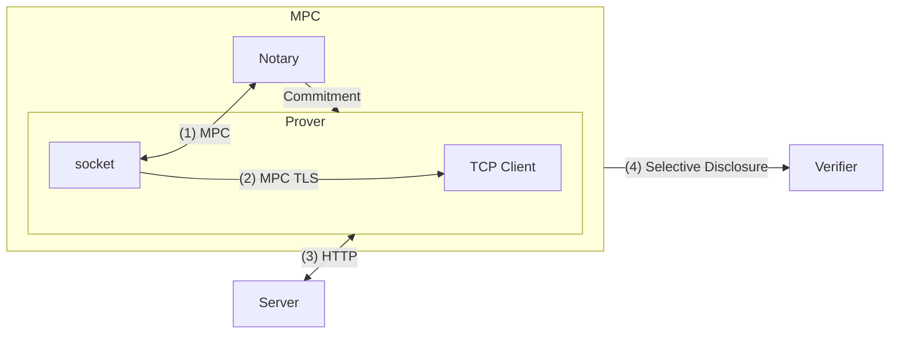

A primer on [TLSN][tlsn].

[[tls|TLS]] provided integrity and secrecy in untrusted channels on [[pk-encryption|PKE]], which allowed 2 parties to communicate over the internet securely, TLSN takes it a step further. Anyone can now prove that the messages exchanged between two parties are valid. 

TLSN introduces a new party called *notary*, analogous to CA in [[signatures#PKI]] setting. Notary attests and produce proofs of the transcript between a server and a client. Can be described by 4 properties:[^1]
- Provenance: verifying the server's public key using CA chain verification.
- Privacy: TLS (key exchange, encrypt, authenticate, decrypt) is done using [[mpc]] with notary, so that notary never observes the client/server messages in plaintext.
- Authenticity: notary uses *blind signatures* to produce commitments on client's messages so that client can't change transcript later.
- Non-Proprietary: transcript can be produced by any notaries, and not just trusted ones.

In other words, protocol can be divided into two phases:
- Online phase: MPC TLS connection between notary and Prover, and communication with Server.
- Offline phase: transcript verification by verifier

## Questions

- If the motivation is Non-repudiation, why doesn't signatures work directly?
	- Server doesn't sign the data, so there's no way for client to repudiate the claim they're making to a third party. Even if they do, Privacy isn't guaranteed. Selective disclosure of data is important to safeguard the private contents of data returned by the server.
- What's the role of Notary?
	- Notary is just an additional participant in the protocol which the verifier delegates the work of secure TLS computation with the Prover.
	- responsible for Key exchange, encryption, authentication, decryption part of TLS, signs commitment to Prover's request messages using blind signatures
	- Not necessary, if the MPC TLS protocol is run between prover and verifier.
- Difference between notary and verifier?
	- Verifier can be anyone who wishes to verify the transcript between Server/Prover, and can be done in offline phase.
	- Notary needs to participate in online phase, where multi-party computation for TLS happens between prover and notary.
- Bandwidth overhead for MPC?
- Is bandwidth overhead constrained at Prover's side or notary's side?
- Verifier time and constraints?
- you're making a wrapper on top of the APIs provided by the companies? How do you plan to play the cat-mouse game? What happens when responses change? Or request changes?
- 

## Next steps

- Read [TLSN](https://discovery.ucl.ac.uk/id/eprint/10182343/1/2017-578.pdf) in depth
- Why moving to [Origo](https://eprint.iacr.org/2024/447.pdf)
	- [Thor's](https://hackmd.io/jsRFD1IORCGveQlzRBwwnA) [notes](https://hackmd.io/xdGO4XX7QpaItSZ4e1Snaw?view)
- Read other approaches.
	- [DECO](https://dl.acm.org/doi/pdf/10.1145/3372297.3417239)
	- [Janus](https://eprint.iacr.org/2023/1377)
	- [Lightweight Authentication of Web Data via Garble-Then-Prove](https://eprint.iacr.org/2023/964.pdf)
	- [Proxying is Enough: Security of Proxying in TLS Oracles and AEAD Context Unforgeability](https://eprint.iacr.org/2024/733)
	- [DiStefano](https://eprint.iacr.org/2023/1063)
- TLSN new approach: VOLE based SNARKs
- [OLE](https://eprint.iacr.org/2019/273)
- [VOLE based SNARKs](https://eprint.iacr.org/2023/857.pdf)
- [SoK: Data sovereignty](https://eprint.iacr.org/2023/967)

## Projects & Use cases

- zkEmail
- zkPassport
- web proofs

This paves the way for countless Web3 applications:
​
-  Identity authentication
-  Resolution in prediction markets
-  Mixed Web2-Web3 loyalty and incentive program
-  Privacy-focused verifiable assets
-  Tokenising Domain
-  On-Chain Attestations of Off-Chain Activity
-  DeFi protocols with undercollateralised loans
-  Verification and claims in insurance 
-  Shared electronic medical records 
-  Secure, private e-commerce 
-  Payment attestations for on/off ramp
-  Interoperable social media platforms 
-  Verified gaming history 
-  AI collaboration with zkLLM
-  Machine verification in DePIN
-  Secure digital voting
-  Encrypted mempools

<https://x.com/Euler__Lagrange/status/1829064325224407061>
<https://x.com/richardzliang/status/1828992045844746727>
<https://x.com/Flynnjamm/status/1828888256035074357>
<https://x.com/Euler__Lagrange/status/1828969800783065203>
<https://x.com/sina_eth_/status/1828566424232829087>
<https://x.com/zkJyu/status/1828888929103417622>
<https://x.com/nico_mnbl/status/1829484200694571101>

## References

- [zkTLS](https://telah.vc/zktls)
- [zkPass](https://x.com/zkPass)
- [Opacity Network: Trust but Verify](https://paragraph.xyz/@vinny/opacity-network-deepdive)
- [Reclaim](https://docs.reclaimprotocol.org/)
- [zkP2P](https://zkp2p.xyz/)
- [Twitter thread: zkTLS / zkEmail is an underrated category in crypto. Here are some intriguing real world use cases. What else are people building?](https://x.com/DarenMatsuoka/status/1817942291899932785)
- [thought: you could build a trustless esports gambling website on-chain by using zk proofs of SSL responses for gaming APIs to ensure the outcomes similar to what](https://x.com/DeanEigenmann/status/1815558833022128518)
- [Of Proofs and Purpose](https://mirror.xyz/0xB6e55d484Fd2EcB9167A8bcc31931f4C51733Ab5/Ua0KVL9GD03RV1kinnauMfrUBQ4uRn9dnWJKDmpPCic)
- [zkp2p-tlsn-whitepaper](https://github.com/zkp2p/zkp2p-tlsn-whitepaper)
- [The Future of Fiat-to-Crypto: zkP2P](https://fenbushicapital.medium.com/the-future-of-fiat-to-crypto-zkp2p-e317f09b7c1e)
- [noir zktls](https://github.com/mabbamOG/zktls)
- [Crypto’s AirTag Moment: Unlocking Mass Adoption with Web Proofs](https://www.nascent.xyz/idea/cryptos-airtag-moment)
- [TLS Oracles (zkTLS): Liberating Private Web Data with Cryptography](https://bwetzel.medium.com/tls-oracles-liberating-private-web-data-with-cryptography-e66e5fad7c34)
- [TLSNotary Updates](https://mirror.xyz/privacy-scaling-explorations.eth/T4MR2PgBzBmN2I3dhDJpILXkQsqZp1Bp8GSm_Oo3Vnw)
- [The zk in zkTLS](https://blog.reclaimprotocol.org/posts/zk-in-zktls)

[tlsn]: <https://github.com/tlsnotary/tlsn>

[^1]: [Pluto's: How TLSNotary Works](https://pluto.xyz/blog/how-tlsnotary-works)