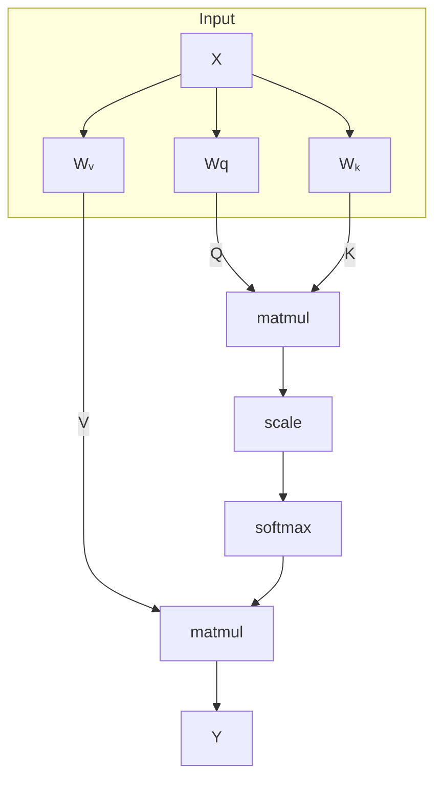

> [!tip] what's the limitation of CNNs?
> No global state due to local patches.

**Tokens**
- vector of neurons encapsulating bundle of information. Any type of multimodal input (natural language, audio, image, video) can be tokenised into d-dimensional vectors.
- Concatenated together to form a matrix $\mathbf{X}\in \mathbb{R}^{N\times D}$ where N is the number of tokens and D is dimension of each token or channels, with each row denoting the encoding for input sequence.

**Transformer architecture**

A single transformer layer comprises two stages: Attention mechanism that mixes the context from features in different token vectors, and second stage that transforms the features within each token vector. After converting each input sequence into token embeddings, transformers determine the similarity, correlation, alignment between each token using *alignment scores* which is then converted into probability distribution using a softmax function known as *attention weights*. Using attention weights, some part of information is highlighted and model can make predictions by focusing or ignoring information.

- Linear combination of neurons or Linear layer: $X_{\text{out}}[i,:]=\sum_{j=1}^{N}a_{ij}X_{\text{in}[j,:]}$ or $X_{\text{out}}=AX_{\text{in}}$, where A is the attention coefficient matrix of size NxN.
	- Linear combination in transformers is a **low rank** operation as each element in a token is getting multiplied by same weights.
	- To distribute attention between different input tokens, following constraints are added: $a_{ij}\geq 0,\sum_{j=1}^{N}a_{ij}=1$.

**Self-attention**: Determining the attention weights is done by using the same input token to calculate the *queries, keys and values* vector.
- *Query* $Q=XW^{(Q)}\in \mathbb{R}^{N\times D_{k}}$: Input token is converted into information intent inducing vector where $W^{(Q)}$ is the learned parameter of size $D\times D_{k}$. Informally, Query represents "what information a token is seeking".
- *Key* $K=XW^{(K)}\in \mathbb{R}^{N\times D_{k}}$: Each token contains implicit information represented using key where $W^{(K)}$ is the learned parameter of size $D\times D$. Informally, key vector of an input token defines what information does the token hold.
- *Value* $V=XW^{(V)}\in \mathbb{R}^{N\times D_{v}}$: Extracts the relevant information from input tokens where $W^{(V)}$ is the learned parameter of size $D\times D_{v}$.

For a single query $q_{i}$:
- Compute alignment score using dot-product: $\text{score}_{j}=Q_{i}\cdot K_{j}$
- Normalise with a probability distribution: $a_{j}=\text{softmax}\left( \frac{\text{score}_{j}}{\sqrt{ d }} \right)$
- Output attention: $y_{j}=\sum_{j}a_{j}v_{j}$

In matrix form: $\mathbf{Y}=\text{Softmax}\left[ \frac{\mathbf{Q}\mathbf{K}^{T}}{\sqrt{ D_{k} }} \right]\mathbf{V}$, where $\mathbf{QK}^{T}\in \mathbb{R}^{N\times N}$ and $\mathbf{V}\in \mathbb{R}^{N\times D_{v}}$.

Q and K are learned in the same vector space, which is used by the dot product to compute the similarity score, and V vector is learned in a potentially different space. Computing the attention then means that values are projected in Q-K space weighted by the similarity scores.

*
Attention Head
*

> [!note] Reason for normalizing with $\frac{1}{\sqrt{ D_{k} }}$
> Assume $Q_{i}, K_{j}$ are i.i.d. with $\mu=0,\sigma=1$, then $E[Q_{i}K_{j}]=0$ and $\sigma[Q_{i}K_{j}]=D_{k}$. So, as dimension increase, dot products can be large in magnitude that saturates softmax and gradients becomes exponentially small. We want $\sigma\left[ \frac{Q_{i}K_{j}}{c} \right]=1\implies c=\sqrt{ D_{k} }$.

*
Attention matrices [^1]
*

> [!note] History
> Attention was first introduced by @bahdanau2014neural which used additive attention which used vectors of different tokens (and not the input token as done in self-attention) as key vectors. @luong2015effective introduced multiplicative or dot-product to calculate the alignment scores.
>
> @vaswani2017attention introduced Transformer architecture that removed <>, self-attention mechanism, normalized alignment score and positional encoding of the input tokens.

**Multi-head Attention**: What we described so far can be termed as an Attention head. We can use multiple attention heads to learn multiple patterns. Formally, suppose we have H heads, then $Y_{h}=\text{Attention}(Q_{h},K_{h},V_{h})$ and $Y=\text{concat}[Y_{1},\dots,Y_{H}]W^{(o)}$, where each $Q_{i},K_{i},V_{i}$ have same dimension, and $W^{(o)}\in \mathbb{R}^{HD_{v}\times D}$.

All attention head outputs are still linear combinations and a function of input. Softmax induces non-linearity, but output space is still a subspace of the space spanned by inputs. To introduce non-linearity, transformer architecture uses standard feed-forward NN or MLPs.

Non-Linearity: $Y_{\text{out}}=\left[F_{\theta}(Y_{\text{in}}[0,:]),F_{\theta}(Y_{\text{in}}[1,:]),\dots,F_{\theta}(Y_{\text{in}}[N-1,:])\right]^{T}$, where $F_{\theta}$ can be an MLP.

Transformer architecture also uses residual or skip connections and LayerNorms to improve training efficiency.
> [!todo] Add more on the reason for LayerNorms and skip connections later.

**Computational complexity**
- Attention
	- Compute $Q,K,V=XW$: $\mathcal{O}(ND^{2})$
	- Evaluating dot-product: $\mathcal{O}(N^{2}D)$
	- softmax: $\mathcal{O}(N^{2})$
	- Multiply with V: $\mathcal{O}(N^{2}D)$
- Feedforward network: D-dimensional inputs and D-dimensional outputs for N inputs: $\mathcal{O}(ND^{2})$
- Depending on the task, either of attention layer or feedforward layer can be computationally expensive. Generally, attention layer is more expensive due to quadratic proportional dependence to length of input token sequence.

Now, we can stack multiple layers on top of each other to create a deep Transformer neural network.

> [!question] Think about the similarities between GNN and Transformers. Why is a transformer is similar to a fully connected GNN?

> [!todo]
> - Efficient Transformers

## Positional Encoding and Embeddings

**Positional encoding**: Convince yourself that vanilla transformer architecture is equivariant to input permutations, i.e. permuting the input permutes the output. This can be mitigated by assigning a unique position to each input token in the input itself. Modifying the input vectors by adding the position vectors onto the token vectors give $\tilde{x}_{n}=x_{n}+p_{n}$, where p is the positional encoding of the input token in the data.

> [!question] Why does adding a new vector to the input vector not corrupt the information?
> Because randomly sampled two vectors in a high dimensional space tend to be nearly orthogonal implying that model can process token information and token position separately even when they're added in a single entity.

Approach proposed in @vaswani2017attention is based on Fourier basis where for a given position n the associated position encoding vector is:

$$
p_{j}=\begin{cases}
p_{j,2i}=\sin\left( \frac{j}{L^{i/D}} \right),& \text{if $i$ is even,} \\
p_{j,2i+1}=\cos\left( \frac{j}{L^{(i-1)/D}} \right),& \text{if $i$ is odd,}
\end{cases}
$$

One nice property of sinusoidal representation is that relative positions $p_{j+k}$ is a linear function of $p_{j}$ and can be encoded using a rotation matrix. To see this (referenced from [^2]), let's take a two dimensional position vector, $p_{j},p_{j+k}$:

$$
\begin{align}
p_{j,0}&=\sin\left( \frac{j}{L^{2\cdot0/D}} \right) &=\sin(j) \\
p_{j,1}&=\cos\left( \frac{j}{L^{2\cdot0/D}} \right)&=\cos(j) \\
p_{j+k,0}&=\sin\left( \frac{j+k}{L^{2\cdot0/D}} \right)&=\sin(j+k) \\
p_{j+k,1} &=\cos\left( \frac{j+k}{L^{2\cdot0/D}} \right)&=\cos(j+k)
\end{align}
$$

Using trigonometric identities, $\sin(j+k)=\sin(j)\cos(k) + \cos(j)\sin(k)$ and $\cos(j+k)=\cos(j)\cos(k) - \sin(j)\sin(k)$, we can write:
$$
\begin{align}
\sin(j+k)&=\sin(j)\cos(k)+\cos(j)\sin(k)&=p_{j,0}\cos(k)+p_{j,1}\sin(k) \\
\cos(j+k)&=\cos(j)\cos(k)-\sin(j)\sin(k)&=p_{j,1}\cos(k)-p_{j,0}\sin(k) \\
\end{align}
$$

Thus, we can write $p_{j+k}$ as linear function of $p_{j}$ with a rotation matrix:
$$
\begin{equation}
\begin{bmatrix}
p_{j+k,0} \\
p_{j+k,1}
\end{bmatrix}
=
\begin{bmatrix}
\cos(k) & \sin(k) \\
-\sin(k) & \cos(k)
\end{bmatrix}
\begin{bmatrix}
p_{j,0} \\
p_{j,1}
\end{bmatrix}
\end{equation}
$$

Problems with sinusoidal position encodings:
- Relative positions are easier to encode but harder to learn due to direction of the sinusoidal representations being jagged. This indicates that model might have to devote a large time of its finite training schedule to attend to learning relative positions.
- Additive: TODO

> [!question] How do you handle a continuous input like image or audio or video for transformers? Think about tokenisation, embedding and positional encoding.
- Image: Divide the input image into patches. taking an example of greyscale image of 100x100 size. then it can be flattened into 10,000 sized vector. Tokenisation and embedding is done in one go, and positional encoding can be applied same as transformer paper (sinusoidal) or maybe RoPE.
	- For images: we can create patches of say 5x5 like a CNN and then use the attention layers to learn about spatial relationships rather than just flattening the vector. Patches can be concatenated in a batch to allow for flexible learning.
- Audio: divide the the audio signal into discrete patches at fixed length (say 0.1ms) and record the signal at that position. Concatenating the sequence as a vector, and we have the input embedding.
	- For audio: if you take fixed windows (like 0.1 ms), what structure are you assuming about the signal? Do raw waveform chunks behave like good tokens, or would something like **time-frequency representations (e.g., spectrograms)** give better inductive bias?
- How to detect if there is a need for separate embedding function or if we can use the pixel values or waveform amplitude as embeddings directly?
- You mentioned positional encoding—good—but ask yourself: for images and audio, is **1D positional encoding sufficient**, or do you need something that captures **2D (images) or continuous time structure (audio)** more explicitly?
> [!question] Why is transformer sinusoidal positional encoding using alternating sines and cosines? And why is RoPE applying the same rotation matrix to the query vector?
- 2D encodings for images

## References

- [You could have designed state of the art positional encoding](https://huggingface.co/blog/designing-positional-encoding)

[^1]: [What is an attention mechanism? \| IBM](https://www.ibm.com/think/topics/attention-mechanism)
[^2]: [Aakash Kumar Nain - Rotary Position Encoding](https://aakashkumarnain.github.io/posts/ml_dl_concepts/rope.html#rotary-position-encoding-the-easy-way)