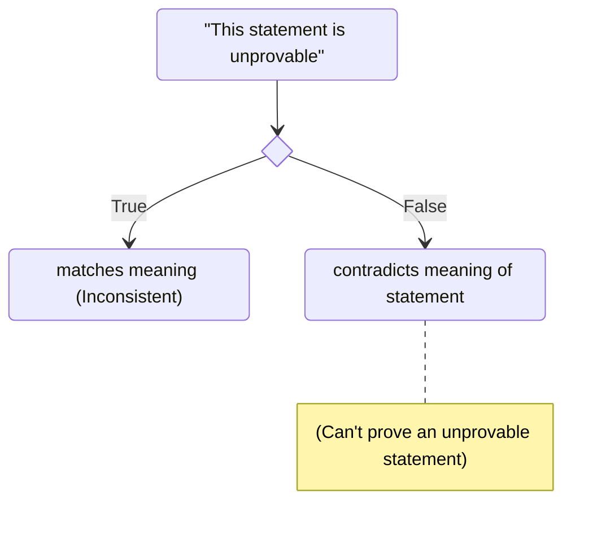

# Gödel's Incompleteness Theorem

Things you need to understand:
- **Axioms** (Statements)
	- Are axioms assumed to be true? or are they proven as well?

> [!question] Difference between definitions and axioms?
> Definitions describe what the object is, while Axioms describe how the object will behave.
- **Model** (System/Example)
	- How to create a model?

> [!example] **Group** in abstract algebra is a "set" with axioms that are assumed to be true when instantiating a Group. We don't care if it's numbers, shapes, functions, matrices, etc. as long as it satisfy group axioms.
- **Truth** (Decidable)
- **Proof** (Complete): A *model* is *complete*, if anything that can be stated, can be proved.
	- What's the difference between being true and being provable?
- **Consistent** (Meaning?): Model is consistent if there's no contradiction, i.e. you can't prove a statement and it's opposite.
- **Contradictions** (Paradoxes): Wrong axioms lead to behavior that isn't allowed by the axioms leading to either new axioms or disproven theories.

> [!tldr] High-School Explanation
> Mathematics is not an all-being language. With a set of true statements (axioms), as simple as axioms that describe Integer arithmetic, then the set of axioms cannot be both consistent and complete.

What godel was trying to prove?
- Can I prove that math is consistent?
- If I have a true statement, can I prove that it's true?

> [!info] First Incompleteness Theorem
> In a consistent-logical system, with axioms (that are as simple as arithmetic-derivable), then there are statements in that system which are unprovable using only the system axioms.

This means there are statements in mathematics whose validity can't proved, i.e. mathematics is **incomplete**.

Peano arithmetic: Natural number axioms that Gödel based his theorem on.
- Has only one number `0`
- Presence of a "successor" function: $S(x)\to y$
	-  $S(0)=1,S(1)=2,\dots$

How did Gödel prove this?
- Created a number coding that converted any statement into a number
	- This allowed him to convert any non-mathematical statement into just numbers, which can be reasoned with Peano arithmetic.
	- represented by gödel number: $G(x)$
- Consider the statement: $\text{Unprovable}(y)$, which means if $y$ is the Gödel number of a statement, then there doesn't exist a gödel number $x$ for the proof of the statement.
	- Informally, $\text{Unprovable}$ allows us to create mathematical analogue of "This statement is unprovable"
- We can prove this statement using *diagonalisation* lemma, that allows us to create statement which is true iff it's diagnolisation is true as well.
> [!note] [Diagnolisation Lemma](https://qubd.github.io/files/FixedPointLemma.pdf)
> Trick is to create a self-referential statement that is true if and only if it's diagnolisation is true. Consider the following function $D(x)$, that takes a variable $x$, and converts it into $D(D(x))$.
> 
> Diagnolisation of $\text{Alice is reading the statement}$ is $\text{Alice is reading the diagnolisation of 'Alice is reading the statement'}$, which would expand to $\text{Alice is reading 'Alice is reading the statement'}$.
- Using diagonal lemma, he created a statement $S$ that is true if and only if $\text{Unprovable}(G(S))$ is true. If $S$ can be proved true, implies $\text{Unprovable}(G(S))$ is true, implying $S$ is not provable in the mathematical system, but we just proved validity of $S$, creating a **contradiction**.

Programmatically, let's assume we have a list of all single variable functions $F_i(x)$. We evaluate each of these functions on all inputs, and lay it out in a table.

| $F$      | $x=1$      | $x=2$      | $\dots$  | $x=j$      |
| -------- | ---------- | ---------- | -------- | ---------- |
| $F_{1}$  | $F_{1}(1)$ | $F_{1}(2)$ | $\dots$  | $F_{1}(j)$ |
| $F_{2}$  | $F_{2}(1)$ | $F_{2}(2)$ | $\dots$  | $F_{2}(j)$ |
| $\vdots$ | $\vdots$   | $\vdots$   | $\vdots$ | $\vdots$   |
| $F_{i}$  | $F_{i}(1)$ | $F_{i}(2)$ | $\dots$  | $F_{i}(j)$ |

Let's take a function $Q_i(j)=F_i(j)+1$, i.e. take the value along the diagonal and add 1 to it. This function is clearly not in the table, because it wouldn't match the diagonal entry of that row.
But this contradicts our initial assumption of taking all the single variable functions, and thus, it's unprovable that $Q$ exists inside the initial list.

> [!note] Important thing to note is list of axioms taken for a system has to be **effective**, i.e. can be enumerated by a machine, otherwise we arrive at Turing's halting problem.

> [!info] Second Incompleteness Theorem
> TODO

# Turing's Halting Problem

- Starts with [David Hilbert's](https://en.wikipedia.org/wiki/Hilbert%27s_problems) *Entscheidungsproblem* (Decision problem).
- Problem: Take any first-order logic statement, and decide whether it's universally valid?
	- Q: What's universally valid?
		- Valid on every input in the model/system
	- Q: What's first-order logic statement?
		- Formalises real-world problem statements using quantifiers, methods and variables. Example: statement "for every dog, that is running, is not wagging its tail" can be formalised into $\forall \ y: C(y)\implies !D(y)$, where $y$ is a variable for a dog, $C,D$ stands for running and wagging method, $\forall,!$ are quantifiers used to embed meaning into variables and methods.
- Turing became interested in this problem during his PhD at Princeton.
- To solve this, he needs to define problem into an algorithm. What he came up with defined the bedrock of computer science.

## Turing Machine
<https://medium.com/@martalokhova/why-would-you-care-about-the-halting-problem-593cc27c943d>
<https://medium.com/@oliverlenton/turing-machines-and-reductions-from-the-halting-problem-e79b269638d7>
<https://dgrozev.wordpress.com/2021/03/08/turing-vs-godel/>

TODO

# Curry-Howard-Lambed Correspondence
- <https://web2.qatar.cmu.edu/cs/15317/lectures/04-curryhoward.pdf>
- 

# Questions
- What are other paradoxes or incomplete theorems or [Logic puzzles](http://en.wikipedia.org/wiki/Raymond_Smullyan#Logic_puzzles) in Mathematics?
- Goldbach's conjecture
- Riemann Hypothesis
- Richard's Paradox

# References
- ["To infinity and beyond: The struggle to save arithmetic", Andrés E. Caicedo](https://andrescaicedo.wordpress.com/2010/08/23/to-infinity-and-beyond-the-struggle-to-save-arithmetic/)
- ["Incompleteness and Halting. Gödel and Turing.", Danielle Fong](https://daniellefong.com/2008/01/28/incompleteness-and-halting-godel-and-turing/)
- ["Did Turing prove the undecidability of the halting problem?"](https://news.ycombinator.com/item?id=40853620)
	- [J.D Hamkins blog](https://jdh.hamkins.org/turing-halting-problem/)
- ["The Halting Problem"](https://voegelinview.com/the-halting-problem/)
- <https://cs.uwaterloo.ca/~a23gao/cs245_f17/notes/undecidability_solutions.pdf>
- ["Computational Lens on Gödel's Incompleteness Theorems, Part 1", Anıl Ada](https://www.pandanotes.org/servers/anil/chapters/Godel_1/)
- ["The nature and significance of Gödel’s incompleteness theorems", Solomon Feferman](https://math.stanford.edu/~feferman/papers/Godel-IAS.pdf)
- ["Gödel’s Incompleteness Theorem for Computer Users", Stephen A. Fenner](https://cse.sc.edu/~fenner/papers/incompleteness.pdf)
- [Harvard CS125: Lec7](https://people.seas.harvard.edu/~cs125/fall16/lec17.pdf)